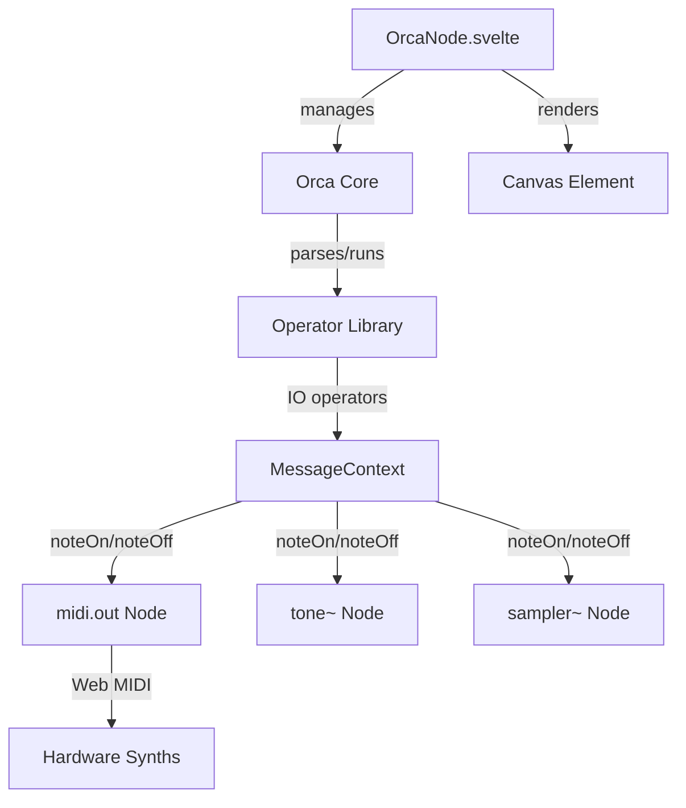

# Orca Livecoding Node Implementation

## Overview

Implement an `orca` node by porting the **JavaScript/Electron Orca** implementation from `.references/Orca/desktop/`. This is the production version used by livecoding artists worldwide, featuring a pure JavaScript operator system. We'll make it **output-agnostic** - emitting standard Patchies messages instead of directly controlling MIDI hardware.

## Implementation Strategy

**Copy, don't rewrite**: ~1160 lines of battle-tested core logic can be brought over as-is with just TypeScript conversion. Only UI integration and I/O need adaptation.

**Effort breakdown**:

- ✅ **Copy AS-IS**: 4 files, ~1160 lines (Orca, Operator, library, transpose)
- 🔄 **Adapt I/O**: 5 files, ~400 lines (60-80% reuse, replace Web MIDI calls, keep Web Worker timing)
- 🔨 **New code**: 2 files, ~300 lines (Svelte UI, presets)

**Total**: ~1860 lines (62% copied, 22% adapted, 16% new)

## Why JavaScript Orca (not Uxn Orca)

There are three Orca implementations:

1. **JavaScript/Electron** (Desktop) ← **This is what people use**
2. Uxntal (orca-toy) - Experimental version for "small computers"
3. C - Terminal version

We're implementing #1 because:

- ✅ Production-ready and widely used
- ✅ Pure JavaScript (no VM needed)
- ✅ Browser-compatible
- ✅ Simpler integration with Patchies
- ✅ Smaller bundle size
- ✅ Output-agnostic (just emits messages)

## Architecture



**Key Design**: Orca is **completely output-agnostic**. It only emits Patchies messages. Users connect Orca to:

- `midi.out` → Hardware/software synths
- `tone~` → Patchies synthesizers  
- `sampler~` → Sample playback
- Any node expecting MIDI messages

## File Strategy

Based on analysis of the ~4KB JavaScript implementation, files are categorized:

### ✅ Copy AS-IS (with MIT attribution)

Pure logic, no external dependencies - **~1160 lines**:

- `core/library.js` (~750 lines) - All 26 operators + symbols
- `core/operator.js` (~130 lines) - Base Operator class
- `core/orca.js` (~220 lines) - Core grid engine
- `core/transpose.js` (~60 lines) - Note conversion table

**Action**: Copy directly, convert to TypeScript, add attribution header

### 🔄 Adapt for Patchies (refactor I/O)

Reusable logic but needs message output instead of Web MIDI - **~410 lines, 60-80% reuse**:

- `core/io/midi.js` (~245 lines) - Keep stack management, replace Web MIDI calls
- `core/io/cc.js` (~40 lines) - Keep logic, replace device calls
- `core/io/mono.js` (~55 lines) - Keep monophonic logic, replace trigger calls
- `core/io.js` (~70 lines) - Keep coordinator pattern, adapt to MessageContext

**Action**: Port structure, replace `device.send()` with `MessageContext.send()`

### 🔨 Rewrite for Patchies (Svelte/UI)

Tightly coupled to Electron/DOM - **~870 lines new code**:

- `client.js` → `OrcaNode.svelte` - Canvas rendering, event handling
- `clock.js` → `Clock.ts` - Keep Web Worker timing, adapt to TypeScript
- `cursor.js` → Part of OrcaNode.svelte - Selection/editing
- `commander.js` → Optional command system

**Action**: Build new Svelte components using original logic as reference, keep Web Worker for precise timing

### ❌ Skip (not needed)

- `lib/acels.js`, `lib/history.js`, `lib/source.js`, `lib/theme.js` - Electron-specific
- `core/io/osc.js`, `core/io/udp.js` - Future features

## Implementation Plan

### Phase 1: Port Core Engine (AS-IS Files)

**1.1 Copy Orca Core** ([`ui/src/lib/orca/Orca.ts`](ui/src/lib/orca/Orca.ts))**Source**: `.references/Orca/desktop/sources/scripts/core/orca.js` (~220 lines)**Action**: Copy directly, convert to TypeScript, add MIT license header

```typescript
/**
    * Orca - Esoteric Programming Language
    * Original implementation: https://github.com/hundredrabbits/Orca
    * License: MIT
    * Copyright (c) Hundred Rabbits
 */

export class Orca {
  keys = '0123456789abcdefghijklmnopqrstuvwxyz'.split('');
  
  w: number; // Width
  h: number; // Height
  f: number; // Frame
  s: string; // Grid string (single string, not 2D array)
  
  locks: boolean[];      // Prevent multiple writes per cell
  runtime: Operator[];   // Active operators (created fresh each frame)
  variables: Record<string, string>; // V operator storage
  
  // Core methods
  run(): void;           // Parse & operate each frame
  reset(w?: number, h?: number): void;
  load(w: number, h: number, s: string, f?: number): Orca;
  write(x: number, y: number, g: string): boolean;
  
  // Operators
  parse(): Operator[];   // Parse grid into operators
  operate(operators: Operator[]): void;
  
  // Grid access
  glyphAt(x: number, y: number): string;
  valueOf(g: string): number;  // Base-36: 0-9=0-9, a-z=10-35
  keyOf(v: number): string;    // Inverse of valueOf
  lockAt(x: number, y: number): boolean;
  lock(x: number, y: number): void;
  release(): void;     // Clear all locks
  
  // Output
  format(): string;    // Format as string with newlines
  toString(): string;
}
```

**Key implementation notes:**

- **Grid storage**: Single string, not 2D array (use `indexAt(x,y)` to calculate position)
- **Operators**: Created fresh each frame during `parse()`
- **Base-36 values**: `0-9` = 0-9, `a-z` = 10-35 (via `valueOf()`/`keyOf()`)
- **Lock system**: Prevents operators from overwriting each other's output in same frame
- **Variables**: `V` operator stores/retrieves values in `variables` object

**1.2 Copy Operator Base Class** ([`ui/src/lib/orca/Operator.ts`](ui/src/lib/orca/Operator.ts))**Source**: `.references/Orca/desktop/sources/scripts/core/operator.js` (~130 lines)**Action**: Copy directly, convert to TypeScript, add MIT license header

```typescript
/**
    * Operator Base Class
    * Original implementation: https://github.com/hundredrabbits/Orca
    * License: MIT
    * Copyright (c) Hundred Rabbits
 */

export class Operator {
  name: string;
  x: number;
  y: number;
  passive: boolean;  // Uppercase = runs every frame, lowercase = needs bang
  draw: boolean;     // Same as passive
  glyph: string;
  info: string;      // Help text
  ports: Record<string, Port>;
  
  constructor(orca: Orca, x: number, y: number, glyph: string, passive: boolean);
  
  // Core
  run(force?: boolean): void;
  operation(force?: boolean): any;  // Override in subclasses
  
  // I/O
  listen(port: Port, toValue?: boolean): string | number;
  output(g: string, port?: Port): void;
  bang(b: boolean): void;
  
  // Helpers
  lock(): void;
  replace(g: string): void;
  erase(): void;
  explode(): void;
  move(x: number, y: number): void;
  hasNeighbor(g: string): boolean;
  
  // Docs (for help system)
  getPorts(): Array<[number, number, number]>;
  getRect(): { x: number; y: number; w: number; h: number };
  docs(): string;
}

interface Port {
  x: number;         // Relative position from operator
  y: number;
  clamp?: { min?: number; max?: number };  // Value constraints
  default?: string;  // Default if cell is empty
  output?: boolean;  // Is output port
  bang?: boolean;    // Can be banged
  reader?: boolean;  // Reads value
  sensitive?: boolean; // Affects operator behavior
}
```

**1.3 Copy Transpose Table** ([`ui/src/lib/orca/transpose.ts`](ui/src/lib/orca/transpose.ts))**Source**: `.references/Orca/desktop/sources/scripts/core/transpose.js` (~60 lines)**Action**: Copy directly as TypeScript const

```typescript
/**
    * Orca Note Transpose Table
    * Original implementation: https://github.com/hundredrabbits/Orca
    * License: MIT
    * Copyright (c) Hundred Rabbits
 */

export const transposeTable: Record<string, string> = {
  A: 'A0', a: 'a0', B: 'B0', C: 'C0', c: 'c0',
  D: 'D0', d: 'd0', E: 'E0', F: 'F0', f: 'f0',
  G: 'G0', g: 'g0', H: 'A0', h: 'a0', I: 'B0',
  J: 'C1', j: 'c1', K: 'D1', k: 'd1', L: 'E1',
  M: 'F1', m: 'f1', N: 'G1', n: 'g1', O: 'A1',
  o: 'a1', P: 'B1', Q: 'C2', q: 'c2', R: 'D2',
  r: 'd2', S: 'E2', T: 'F2', t: 'f2', U: 'G2',
  u: 'g2', V: 'A2', v: 'a2', W: 'B2', X: 'C3',
  x: 'c3', Y: 'D3', y: 'd3', Z: 'E3',
  // Catch e, l, s, z (movement operators)
  e: 'F0', l: 'F1', s: 'F2', z: 'F3',
  // Catch b, i, p, w (movement operators)
  b: 'C1', i: 'C1', p: 'C2', w: 'C3'
};
```

### Phase 2: Port Operator Library (AS-IS)

**2.1 Copy Library** ([`ui/src/lib/orca/library.ts`](ui/src/lib/orca/library.ts))**Source**: `.references/Orca/desktop/sources/scripts/core/library.js` (~750 lines)**Action**: Copy directly, convert to TypeScript, add MIT license headerThis file contains all operator implementations. Keep the original structure:

```typescript
/**
    * Orca Operator Library
    * Original implementation: https://github.com/hundredrabbits/Orca
    * License: MIT
    * Copyright (c) Hundred Rabbits
 */

import { Operator } from './Operator';
import type { Orca } from './Orca';

export const library: Record<string, typeof Operator> = {};

// All operators defined here...
```

**2.2 Operator reference** (from original library.js):**Basic operators (A-H):**

- `A` add - Outputs sum
- `B` subtract - Outputs difference
- `C` clock - Outputs modulo of frame
- `D` delay - Bangs on modulo
- `E` east - Moves east
- `F` if - Bangs if equal
- `G` generator - Writes operands with offset
- `H` halt - Halts southward operand

**Advanced operators (I-P):**

- `I` increment
- `J` jumper
- `K` konkat
- `L` less
- `M` multiply
- `N` north
- `O` read
- `P` push

**Special operators (Q-Z):**

- `Q` query
- `R` random
- `S` south
- `T` track
- `U` uclid (Euclidean rhythm!)
- `V` variable
- `W` west
- `X` write
- `Y` jymper
- `Z` lerp

**Symbols:**

- `*` **bang** - Triggers adjacent passive operators
- `#` **comment** - Ignored by parser

**2.3 Verify all operators are included**

The library.js file should contain all operators. No need to organize into separate files - keep the original monolithic structure for easier maintenance and attribution.

**Note**: IO operators (`:`, `%`, `!`, `?`) are part of library.js but call IO system methods.

- `:` **MIDI** - Sends MIDI note (channel, octave, note, velocity, length)
- `%` **MONO** - Monophonic MIDI
- `!` **CC** - MIDI Control Change
- `?` **PB** - MIDI Pitch Bend (future)
- `;` **UDP** - Sends UDP message (future)
- `=` **OSC** - Sends OSC message (future)
- `$` **SELF** - Internal Orca commands (play, stop, tempo)

### Phase 3: Adapt Message Output System

**3.1 Adapt IO system** ([`ui/src/lib/orca/IO.ts`](ui/src/lib/orca/IO.ts))

**Source**: `.references/Orca/desktop/sources/scripts/core/io.js` (~70 lines)

**Action**: Keep coordinator structure, replace `client` with `MessageContext`

Simplified to only handle message output - no Web MIDI device management:

```typescript
export class IO {
  private messageContext: MessageContext;
  
  midi: MidiMessageHandler;
  cc: CCMessageHandler;
  mono: MonoMessageHandler;
  // udp/osc can be added later if needed
  
  start(): void;
  clear(): void;
  run(): void;        // Process each frame, emit messages
  silence(): void;    // Send noteOff for all active notes
}
```

**3.2 Adapt MIDI Message Handler** ([`ui/src/lib/orca/io/MidiMessageHandler.ts`](ui/src/lib/orca/io/MidiMessageHandler.ts))

**Source**: `.references/Orca/desktop/sources/scripts/core/io/midi.js` (~245 lines)

**Action**: Keep stack management logic (~70%), replace Web MIDI API calls with MessageContext

Based on original but **only emits messages** (no device management):

```typescript
export class MidiMessageHandler {
  private messageContext: MessageContext;
  private stack: MidiNote[] = [];
  
  push(channel: number, octave: number, note: string, velocity: number, length: number): void {
    // Add to stack
    const item = { channel, octave, note, velocity, length, isPlayed: false };
    this.stack.push(item);
  }
  
  run(): void {
    for (const item of this.stack) {
      if (!item.isPlayed) {
        this.press(item);
      }
      if (item.length < 1) {
        this.release(item);
      } else {
        item.length--;
      }
    }
  }
  
  private press(item: MidiNote): void {
    const midiNote = this.orcaNoteToMidi(item.note, item.octave);
    
    // Emit noteOn message (standard Patchies format)
    this.messageContext.send({
      type: 'noteOn',
      note: midiNote,
      velocity: Math.floor((item.velocity / 16) * 127),
      channel: item.channel
    });
    
    item.isPlayed = true;
  }
  
  private release(item: MidiNote): void {
    const midiNote = this.orcaNoteToMidi(item.note, item.octave);
    
    // Emit noteOff message
    this.messageContext.send({
      type: 'noteOff',
      note: midiNote,
      channel: item.channel
    });
    
    // Remove from stack
    const index = this.stack.indexOf(item);
    if (index > -1) this.stack.splice(index, 1);
  }
  
  private orcaNoteToMidi(note: string, octave: number): number {
    // Convert Orca note format (C, c, D, d, etc.) to MIDI number
    // Using transpose table from original Orca
    const noteValue = transposeTable[note];
    // Calculate MIDI note number
    return (octave * 12) + noteValue + 24;
  }
  
  silence(): void {
    // Send noteOff for all active notes
    for (const item of this.stack) {
      if (item.isPlayed) {
        this.release(item);
      }
    }
  }
}

interface MidiNote {
  channel: number;
  octave: number;
  note: string;
  velocity: number;
  length: number;
  isPlayed: boolean;
}
```

**3.3 Adapt CC Message Handler** ([`ui/src/lib/orca/io/CCMessageHandler.ts`](ui/src/lib/orca/io/CCMessageHandler.ts))

**Source**: `.references/Orca/desktop/sources/scripts/core/io/cc.js` (~40 lines)

**Action**: Keep stack logic (~60%), replace device.send() calls

```typescript
export class CCMessageHandler {
  private messageContext: MessageContext;
  stack: Array<{ type: string; channel: number; knob?: number; value?: number }> = [];
  
  clear(): void;
  run(): void;  // Process stack, emit messages via MessageContext
  setOffset(offset: number): void;
}
```

**3.4 Adapt Mono Message Handler** ([`ui/src/lib/orca/io/MonoMessageHandler.ts`](ui/src/lib/orca/io/MonoMessageHandler.ts))

**Source**: `.references/Orca/desktop/sources/scripts/core/io/mono.js` (~55 lines)

**Action**: Keep monophonic logic (~80%), replace MIDI trigger calls

```typescript
export class MonoMessageHandler {
  private messageContext: MessageContext;
  stack: Record<number, MidiNote> = {};  // One note per channel
  
  clear(): void;
  run(): void;
  push(channel: number, octave: number, note: string, velocity: number, length: number): void;
  silence(): void;
}
```

**3.5 Standard Patchies Message Format**

Orca emits messages compatible with existing Patchies MIDI nodes:

```typescript
// Note messages
{ type: 'noteOn', note: 60, velocity: 127, channel: 1 }
{ type: 'noteOff', note: 60, channel: 1 }

// Control change
{ type: 'controlChange', channel: 1, control: 1, value: 64 }

// Pitch bend (future)
{ type: 'pitchBend', channel: 1, value: 100 }
```

These work with:

- `midi.out` → Hardware synths via Web MIDI
- `tone~` → Tone.js synthesizers (see `tone.preset.ts`)
- `sampler~` → Sample triggering
- Any custom audio node

### Phase 4: Build Svelte Component (NEW CODE)

**4.1 Create OrcaNode.svelte** ([`ui/src/lib/components/nodes/OrcaNode.svelte`](ui/src/lib/components/nodes/OrcaNode.svelte))

**Reference**: `.references/Orca/desktop/sources/scripts/client.js` (~470 lines)

**Action**: Build new Svelte component, use client.js rendering logic as reference

Layout:

```javascript
┌─────────────────────────────────┐
│ [orca] [▶] [■] [BPM] [⚙]       │
│ ┌─────────────────────────────┐ │
│ │                             │ │
│ │   Orca Grid Canvas          │ │
│ │   (monospace chars)         │ │
│ │                             │ │
│ └─────────────────────────────┘ │
│ [MIDI Output indicator]         │
└─────────────────────────────────┘
```

Features:

- **Canvas rendering** - Monospace grid with syntax colors
- **Keyboard input** - Type operators directly
- **Cursor** - Arrow keys, selection
- **Clock controls** - Play/pause, BPM, frame counter
- **Message outlet** - Outputs noteOn/noteOff/CC messages
- **Import/Export** - Load/save .orca files (future)

**No MIDI device selection** - Orca is output-agnostic. Connect outlet to:

- `midi.out` node for hardware
- `tone~` or audio nodes for synthesis

**4.2 Rendering System**

**Reference**: client.js `drawProgram()`, `drawSprite()`, `makeTheme()` methods

Based on original rendering logic:

- Monospace font (Monaco, Courier)
- Color-coded operators:
- Passive (uppercase) - bright
- Active (lowercase) - medium
- Bang (*) - highlighted
- Comments (#) - dimmed

**4.3 Build Clock System** ([`ui/src/lib/orca/Clock.ts`](ui/src/lib/orca/Clock.ts))

**Reference**: `.references/Orca/desktop/sources/scripts/clock.js` (~170 lines)

**Action**: Port timing system, **keep Web Worker for precise timing**

```typescript
export class Clock {
  isPaused: boolean;
  isPuppet: boolean;  // External MIDI clock control
  speed: { value: number; target: number }; // BPM with smooth transitions
  private worker: Worker | null;
  private ticks: number[];  // For MIDI clock output
  
  start(): void;
  play(msg?: boolean, midiStart?: boolean): void;
  stop(msg?: boolean): void;
  togglePlay(msg?: boolean): void;
  touch(): void;  // Single frame advance
  
  // Speed control
  setSpeed(value?: number, target?: number, setTimer?: boolean): void;
  modSpeed(mod: number, animate?: boolean): void;
  
  // Frame management
  setFrame(f: number): void;
  
  // External clock (MIDI clock input)
  tap(): void;
  untap(): void;
  
  // Internal
  private createWorker(): Worker;
  private setTimer(bpm: number): void;
  private clearTimer(): void;
}
```

**Web Worker Implementation** (keep from original):

```typescript
private createWorker(): Worker {
  const script = `
    let intervalId = null;
    onmessage = (e) => {
      if (intervalId) clearInterval(intervalId);
      intervalId = setInterval(() => {
        postMessage(true);
      }, e.data);
    };
  `;
  const blob = new Blob([script], { type: 'text/javascript' });
  return new Worker(URL.createObjectURL(blob));
}

private setTimer(bpm: number): void {
  if (bpm < 60) return;
  this.clearTimer();
  this.worker = this.createWorker();
  this.worker.postMessage((60000 / bpm) / 4); // 4 ticks per quarter note
  this.worker.onmessage = () => {
    // Trigger Orca frame
    this.onTick();
  };
}
```

**Why Web Worker**: Runs in separate thread for **precise musical timing**, prevents drift when main thread is busy. Critical for livecoding!

**4.4 Input System** (Part of OrcaNode.svelte)

**Reference**: `.references/Orca/desktop/sources/scripts/cursor.js` (~230 lines)

**Action**: Implement keyboard/mouse input for grid editing

Features needed:

- Arrow key navigation
- Direct character typing
- Selection (click/drag)
- Copy/paste
- Insert mode toggle

**Note**: Can simplify compared to original - skip advanced features like "commander mode" initially

### Phase 5: Integration

**5.1 Register node**[`ui/src/lib/nodes/node-types.ts`](ui/src/lib/nodes/node-types.ts):

```typescript
import OrcaNode from '$lib/components/nodes/OrcaNode.svelte';
// ...
orca: OrcaNode
```

**5.2 Default node data**[`ui/src/lib/nodes/defaultNodeData.ts`](ui/src/lib/nodes/defaultNodeData.ts):

```typescript
.with('orca', () => ({
  grid: DEFAULT_ORCA_PATTERN,
  width: 64,
  height: 16,
  bpm: 120,
  frame: 0
}))
```

**5.3 Create example patterns** ([`ui/src/lib/orca/patterns.ts`](ui/src/lib/orca/patterns.ts))

```typescript
export const ORCA_PATTERNS = {
  hello: '...\nD8...C4...\n...\n',
  midi: '...\n:04C...\n...\n',
  // More patterns from examples/
};
```

**5.4 Connection Examples**Show users how to connect Orca to different outputs:

```javascript
┌──────┐     ┌──────────┐     ┌──────────┐
│ orca ├────→│ midi.out ├────→│ Hardware │
└──────┘     └──────────┘     └──────────┘

┌──────┐     ┌───────┐     ┌─────────┐
│ orca ├────→│ tone~ ├────→│ Audio   │
└──────┘     └───────┘     └─────────┘

┌──────┐     ┌───────────┐     ┌─────────┐
│ orca ├────→│ sampler~  ├────→│ Audio   │
└──────┘     └───────────┘     └─────────┘
```

Users can split the outlet to send to multiple destinations!

### Phase 6: Presets

**6.1 Create preset file** ([`ui/src/lib/presets/orca.presets.ts`](ui/src/lib/presets/orca.presets.ts))

```typescript
export const ORCA_PRESETS = {
  'orca.hello': {
    type: 'orca',
    data: {
      grid: HELLO_PATTERN,
      width: 32,
      height: 16,
      bpm: 120
    }
  },
  'orca.midi': {
    type: 'orca',
    data: {
      grid: MIDI_DEMO_PATTERN,
      width: 32,
      height: 16,
      bpm: 140
    }
  },
  'orca.euclidean': {
    type: 'orca',
    data: {
      grid: EUCLIDEAN_PATTERN,
      width: 48,
      height: 16,
      bpm: 160
    }
  }
};
```

**6.2 Register presets**[`ui/src/lib/presets/presets.ts`](ui/src/lib/presets/presets.ts):

```typescript
import { ORCA_PRESETS } from './orca.presets';
// ...
export const PRESETS = {
  ...ORCA_PRESETS,
  // ...
};
```

### Phase 7: Documentation

**7.1 Update README.md**

```markdown
### `orca`: Orca Livecoding Environment

Live coding environment for procedural sequencers where every letter is an operation.

- 26 letter operators (A-Z) + special symbols
- Message output (noteOn, noteOff, CC)
- Euclidean rhythms (U operator)
- Variables, loops, conditionals
- Real-time pattern editing
- Direct keyboard input
- BPM control and frame counter

#### Operators

- **A-Z**: Mathematical, logical, movement, I/O operations
- **:**: MIDI notes (channel, octave, note, velocity, length)
- **%**: Monophonic MIDI
- **!**: MIDI Control Change
- **U**: Euclidean rhythm generator
- **V**: Variables
- **R**: Random values

#### Output & Integration

Orca is **output-agnostic** - it emits standard Patchies messages. Connect to:

1. **`midi.out` node** → Send to hardware/software synths via Web MIDI
2. **`tone~` node** → Drive Tone.js synthesizers
3. **`sampler~` node** → Trigger samples
4. **Custom audio nodes** → Any node accepting MIDI messages

Example patch:
```

[orca] → [midi.out] → Hardware synth→ [tone~]     → Speakers

```javascript

Split the outlet to send to multiple destinations!

#### Examples

See the preset library for:
- Hello World pattern
- MIDI sequencing
- Euclidean rhythms
- Generative music
- Multi-destination routing
```

**7.2 Create tutorial** ([`docs/orca-tutorial.md`](docs/orca-tutorial.md))

- Basic operators
- Creating sequences
- MIDI output
- Euclidean rhythms
- Variables and logic
- Integration with Patchies audio

## Technical Details

### Operator System

**Passive vs Active:**

- **Lowercase** (passive): Runs only when banged (*)
- **Uppercase** (active): Runs every frame

**Bang system:**

```javascript
D8.*.  <- D operator bangs every 8 frames
....   <- * triggers adjacent operators
A12.   <- A operator receives bang
```

### MIDI Note Format

Orca MIDI: `:25C` = C note, octave 5, channel 2Converts to MIDI: `note_on(channel=2, note=60, velocity=127)`

### Grid String Format

Grid stored as single string:

```javascript
"..D8..\n...*..\nA12..."
```

Each operator parses its neighbors by calculating positions relative to grid width.

### Frame System

- Clock runs at configurable BPM
- Each frame: `parse()` → `operate()` → `render()`
- Operators can read/write to grid
- Locks prevent multiple writes to same cell

## File Structure

```javascript
ui/src/lib/orca/
├── Orca.ts                      # ✅ AS-IS: Core engine (~220 lines)
├── Operator.ts                  # ✅ AS-IS: Base class (~130 lines)
├── library.ts                   # ✅ AS-IS: All operators (~750 lines)
├── transpose.ts                 # ✅ AS-IS: Note table (~60 lines)
├── Clock.ts                     # 🔄 ADAPT: Keep Web Worker timing (~110 lines)
├── IO.ts                        # 🔄 ADAPT: Coordinator (~50 lines)
├── io/
│   ├── MidiMessageHandler.ts   # 🔄 ADAPT: Keep stack logic (~170 lines)
│   ├── CCMessageHandler.ts     # 🔄 ADAPT: Keep structure (~25 lines)
│   └── MonoMessageHandler.ts   # 🔄 ADAPT: Keep logic (~45 lines)
├── patterns.ts                 # 🔨 NEW: Example patterns
└── types.ts                    # 🔨 NEW: TypeScript interfaces

ui/src/lib/components/nodes/
└── OrcaNode.svelte             # 🔨 NEW: Main component (~300 lines)

ui/src/lib/presets/
└── orca.presets.ts             # 🔨 NEW: Pattern presets
```

**Legend**:

- ✅ AS-IS: Copy from reference, convert to TypeScript
- 🔄 ADAPT: Port structure, keep timing/stack logic, replace device I/O calls
- 🔨 NEW: Write for Patchies

**Total**: ~1160 lines copied, ~400 lines adapted, ~300 lines new = ~1860 lines

**Note**: No UDP/OSC handlers in initial implementation. Focus on message output that works with existing Patchies infrastructure.

## Testing

**Test operators:**

- [ ] Basic math (A, B, M)
- [ ] Clock/delay (C, D)
- [ ] Movement (E, N, S, W)
- [ ] Conditionals (F)
- [ ] Euclidean (U)
- [ ] Variables (V)
- [ ] Random (R)

**Test message output:**

- [ ] Note on/off messages
- [ ] Multiple channels
- [ ] Velocity control
- [ ] Note length/duration
- [ ] Monophonic mode
- [ ] CC messages

**Test integration:**

- [ ] Connect Orca → midi.out → hardware
- [ ] Connect Orca → tone~ → audio
- [ ] Connect Orca → sampler~ → audio
- [ ] Split outlet to multiple destinations
- [ ] Multiple Orca instances
- [ ] Verify message format matches existing nodes

## Attribution

Original Orca by Hundred Rabbits:

- Repository: https://github.com/hundredrabbits/Orca
- License: MIT
- Copyright (c) Hundred Rabbits

**Required attribution header for copied files**:

```typescript
/**
 * [File description]
 * 
 * Original implementation from Orca by Hundred Rabbits
 * Repository: https://github.com/hundredrabbits/Orca
 * License: MIT
 * Copyright (c) Hundred Rabbits
 * 
 * Adapted for Patchies with TypeScript and MessageContext integration
 */
```

Include attribution in:

- Each ported source file header
- OrcaNode UI (small "powered by Orca" credit)
- README.md documentation

## Future Enhancements

1. **File I/O**

- Load/save .orca files
- Drag-and-drop patterns
- Pattern library browser

2. **Additional Message Types**

- OSC messages (via custom Patchies node)
- UDP messages (via custom Patchies node)
- Program change
- Pitch bend

3. **Advanced Features**

- Multi-bank patterns
- Pattern chaining
- Recording/playback
- Velocity curves
- Swing/humanize

4. **Performance**

- Optimize grid parsing
- Webworker for heavy patterns
- Canvas optimization