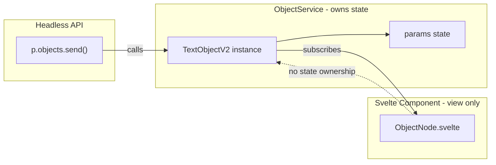
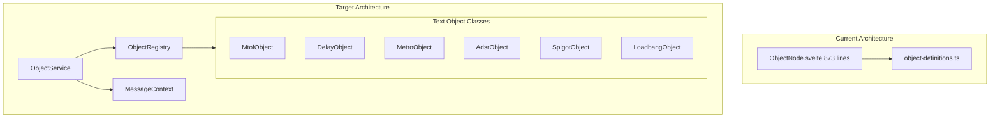

# Text Object V2 Migration

## Key Architectural Requirement: UI-Independent State

**Critical**: Text object state must be stored **outside** of Svelte components (in `ObjectService`), not tied to component lifecycle. This enables:

1. **Headless patcher usage** - Run patches without DOM or with custom UI (see [spec 47](docs/design-docs/specs/47-modular-patchies-api-design.md) goal #4: `p.objects.add({x, y, type: 'glsl'})`)
2. **Nested patches / sub-patching** - Objects continue handling messages even when nested patch is not visible (see [spec 47](docs/design-docs/specs/47-modular-patchies-api-design.md) goal #5)
3. **Future plugin marketplace** - Third-party objects work identically regardless of UI layer

The Svelte component (`ObjectNode.svelte`) becomes a **view layer only** - it subscribes to object state but does not own it. Object instances live in `ObjectService.objectsById` and persist independently of DOM mounting.




## Architecture Overview




## New Files

| File | Purpose ||------|---------|| `lib/objects/v2/interfaces/text-objects.ts` | `TextObjectV2` interface || `lib/objects/v2/ObjectService.ts` | Service for managing text object instances || `lib/registry/ObjectRegistry.ts` | Registry for text object classes || `lib/objects/v2/nodes/MtofObject.ts` | mtof implementation || `lib/objects/v2/nodes/DelayObject.ts` | delay implementation || `lib/objects/v2/nodes/MetroObject.ts` | metro implementation || `lib/objects/v2/nodes/AdsrObject.ts` | adsr implementation || `lib/objects/v2/nodes/SpigotObject.ts` | spigot implementation || `lib/objects/v2/nodes/LoadbangObject.ts` | loadbang implementation || `lib/objects/v2/nodes/index.ts` | Registration barrel file |

## Interface Design

```typescript
// lib/objects/v2/interfaces/text-objects.ts
export interface TextObjectV2 {
  readonly nodeId: string;
  params: unknown[];

  // Lifecycle
  create?(params: unknown[]): void | Promise<void>;
  destroy?(): void;

  // Messaging - receives messages from inlets
  onMessage?(data: unknown, meta: MessageMeta): void;

  // Callback for UI sync (optional, set by Svelte component)
  // Enables view to subscribe to state changes without owning state
  onParamsChange?: (params: unknown[]) => void;
}

// Constructor receives MessageContext for sending messages
export type TextObjectConstructor = new (
  nodeId: string,
  messageContext: MessageContext
) => TextObjectV2;

export type TextObjectClass = {
  type: string;
  description?: string;
  inlets?: ObjectInlet[];
  outlets?: ObjectOutlet[];
} & TextObjectConstructor;
```

**Constructor pattern**: Similar to audio nodes receiving `AudioContext`, text objects receive `MessageContext`:

```typescript
constructor(nodeId: string, messageContext: MessageContext) {
  this.nodeId = nodeId;
  this.messageContext = messageContext;
}
```

**State ownership pattern**: The object class calls `this.onParamsChange?.(this.params)` when params change. The Svelte component subscribes via `object.onParamsChange = (p) => updateNodeData(nodeId, { params: p })`. This keeps the object functional in headless mode (callback is simply not set).

## System Separation

Text objects and audio objects are managed by **separate services**:

- **ObjectService** → text objects (mtof, delay, metro, adsr, spigot, loadbang) - pure message-based
- **AudioService** → audio objects (osc~, gain~, dac~, etc.) - Web Audio API based

No cross-system routing needed. When user types `osc~ 440` in ObjectNode, it detects the audio object type and calls `AudioService.createNode()` directly. Text objects go to `ObjectService.createObject()`

## Example Node Implementations

### Simple stateless object (mtof)

```typescript
// lib/objects/v2/nodes/MtofObject.ts
export class MtofObject implements TextObjectV2 {
  static type = "mtof";
  static description = "Converts MIDI note to frequency";
  static inlets: ObjectInlet[] = [
    { name: "note", type: "float", description: "MIDI note (0-127)" },
  ];
  static outlets: ObjectOutlet[] = [{ name: "frequency", type: "float" }];

  readonly nodeId: string;
  params: unknown[] = [];
  private messageContext: MessageContext;

  constructor(nodeId: string, messageContext: MessageContext) {
    this.nodeId = nodeId;
    this.messageContext = messageContext;
  }

  onMessage(data: unknown, meta: MessageMeta): void {
    if (meta.inlet === 0 && typeof data === "number") {
      const freq = 440 * Math.pow(2, (data - 69) / 12);
      this.messageContext.send(freq);
    }
  }
}
```


### Stateful object with timer (metro)

```typescript
// lib/objects/v2/nodes/MetroObject.ts
export class MetroObject implements TextObjectV2 {
  static type = "metro";
  static inlets: ObjectInlet[] = [
    { name: "message", type: "message", description: "start/stop/bang" },
    { name: "interval", type: "int", defaultValue: 1000 },
  ];
  static outlets: ObjectOutlet[] = [{ name: "out", type: "bang" }];

  readonly nodeId: string;
  params: unknown[] = [null, 1000];
  onParamsChange?: (params: unknown[]) => void;

  private messageContext: MessageContext;
  private intervalId: number | null = null;

  constructor(nodeId: string, messageContext: MessageContext) {
    this.nodeId = nodeId;
    this.messageContext = messageContext;
  }

  onMessage(data: unknown, meta: MessageMeta): void {
    match([meta.inlet, data])
      .with([0, { type: "start" }], () => this.start())
      .with([0, { type: "stop" }], () => this.stop())
      .with([0, { type: "bang" }], () =>
        this.intervalId ? this.stop() : this.start()
      )
      .with([1, P.number], ([, ms]) => this.setInterval(ms));
  }

  private start(): void {
    this.stop();
    const ms = this.params[1] as number;
    this.intervalId = window.setInterval(() => {
      this.messageContext.send({ type: "bang" });
    }, ms);
  }

  private stop(): void {
    if (this.intervalId) {
      clearInterval(this.intervalId);
      this.intervalId = null;
    }
  }

  private setInterval(ms: number): void {
    this.params[1] = ms;
    this.onParamsChange?.(this.params);
    if (this.intervalId) this.start(); // Restart with new interval
  }

  destroy(): void {
    this.stop();
  }
}
```


## Migration Phases

### Phase 1: Infrastructure

- Create `TextObjectV2` interface
- Create `ObjectRegistry` (mirror of `AudioRegistry`)
- Create `ObjectService` with `createObject()`, `removeObject()`, `send()`
- Update `getCompatMetadata()` to check ObjectRegistry

### Phase 2: Simple Objects

- Migrate `mtof` (stateless, pure transformation)
- Migrate `loadbang` (simple, sends on create)

### Phase 3: Stateful Objects

- Migrate `metro` (timer state)
- Migrate `delay` (timeout state)

### Phase 4: Complex Objects

- Migrate `adsr` (envelope generation)
- Migrate `spigot` (gate logic)

### Phase 5: Cleanup

- Remove V1 definitions from `objectDefinitionsV1`
- Slim down `ObjectNode.svelte` to ~200 lines (UI only)

## ObjectNode.svelte Changes

After migration, `ObjectNode.svelte` becomes a **view layer only**:

1. Call `ObjectService.createObject()` on mount (object may already exist in headless mode)
2. Subscribe to param changes: `object.onParamsChange = (p) => updateNodeData(nodeId, { params: p })`
3. Forward messages via `ObjectService.send(nodeId, message, meta)`
4. Handle only UI concerns (editing, autocomplete, rendering)
5. On unmount: **do NOT destroy object** - just unsubscribe. Object persists for nested patches.

The `handleMessage` match block (lines 245-319) will be replaced with:

```typescript
const handleMessage: MessageCallbackFn = (message, meta) => {
  objectService.send(nodeId, message, meta);
};


```