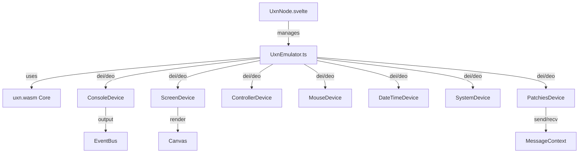

# Uxn Node Implementation

## Overview

Port the **entire uxn5 codebase** (MIT licensed) to TypeScript and integrate it into Patchies as a `uxn` node. uxn5 already uses **uxn.wasm** (remko's WebAssembly core), so we can copy the code and modify only the parts that interface with DOM/events to work with Patchies.**Strategy**: Copy `.references/uxn5/src/` → `ui/src/lib/uxn/`, convert to TypeScript, and modify only:

- DOM interactions (console, canvas access)
- Event listeners (keyboard, mouse)
- ROM loading (from node data instead of file/URL)

**Goal**: Run standard Uxntal ROMs with full Varvara device compatibility, identical behavior to [Varvara Emulator](https://rabbits.srht.site/uxn5/).**License**: MIT (ISC) - see `.references/uxn5/LICENSE`.Credit: Devine Lu Linvega / Hundred Rabbits.

## Why Uxn Node

Uxn is a minimal virtual machine with a rich ecosystem:

- Run general Uxntal programs
- Interactive visual programs
- Custom tools and games
- Low-level system programming
- Educational purposes

## Architecture




## Implementation Plan

### Phase 1: Copy and Convert

**1.1 Install uxn.wasm package**Install Remko's official uxn.wasm package from npm (see [uxn.wasm README](https://raw.githubusercontent.com/remko/uxn.wasm/refs/heads/main/README.md)):

```bash
cd ui && bun add uxn.wasm
```

This provides:

- `Uxn` class (WebAssembly core) - drop-in replacement for uxn5's vanilla JS core
- `util` submodule with utilities (`asm`, `mux`, `LogConsole`, etc.)

**1.2 Copy uxn5 source files**Copy from `.references/uxn5/src/` to `ui/src/lib/uxn/`:

- `uxn.js` → `uxn.ts` (vanilla JS fallback - keep for compatibility)
- ~~`uxn-wasm.js`~~ → **Use `uxn.wasm` npm package instead** (import `{ Uxn } from "uxn.wasm"`)
- `emu.js` → `UxnEmulator.ts` (convert to class)
- `boot.js` → `boot.ts` (constants)
- `devices/*.js` → `devices/*.ts` (all devices)

**1.3 Convert to TypeScript**Convert each file:

1. Add TypeScript types
2. Convert function constructors to classes
3. Add type annotations
4. Keep logic identical

**1.4 Copy LICENSE**Copy `.references/uxn5/LICENSE` → `ui/src/lib/uxn/LICENSE.uxn5`**Directory structure:**

```javascript
ui/src/lib/uxn/
├── LICENSE.uxn5 (copied)
├── uxn.ts (converted from uxn.js - vanilla JS fallback)
├── UxnEmulator.ts (converted from emu.js)
├── boot.ts (converted from boot.js)
├── utils.ts (peek16, poke16 helpers)
└── devices/
    ├── SystemDevice.ts (converted)
    ├── ConsoleDevice.ts (converted)
    ├── ControllerDevice.ts (converted)
    ├── DateTimeDevice.ts (converted)
    ├── MouseDevice.ts (converted)
    ├── ScreenDevice.ts (converted)
    └── PatchiesDevice.ts (new - optional)
```

**Note**: `uxn.wasm` package is imported directly: `import { Uxn } from "uxn.wasm"`

### Phase 2: Modify for Patchies Compatibility

**What to modify (minimal changes):2.1 UxnEmulator.ts** (from `emu.js`)

- Remove DOM setup (drag/drop, file input, URL hash)
- Remove `document.body` class manipulation
- Remove `document.title` changes
- Keep device initialization
- Keep `dei()`/`deo()` routing (switch statements)
- Keep render loop (but integrate with Patchies canvas)
- Modify `init()` to accept options instead of `embed` flag
- Modify `load()` to accept ROM from node data

**2.2 ConsoleDevice.ts** (from `console.js`)

- Remove DOM element references (`getElementById`)
- Replace `write()` → emit to EventBus
- Replace `error()` → emit to EventBus
- Keep `input()`, `set_vector()` logic
- Remove `on_console` DOM event listener (handle in node)

**2.3 ScreenDevice.ts** (from `screen.js`)

- Remove `getElementById("display")` - use canvas from options
- Keep all rendering logic (layers, palette, sprites)
- Modify event listeners to work with canvas element
- Keep `redraw()`, `changed()`, `update_palette()` unchanged
- Modify `init()` to accept canvas element

**2.4 ControllerDevice.ts** (from `controller.js`)

- Remove `window.addEventListener` - events handled at node level
- Keep button state logic
- Modify to accept events from node instead of window
- Keep `on_button()`, `on_keybutton()` logic

**2.5 MouseDevice.ts** (from `mouse.js`)

- Remove canvas event listeners - attach in node
- Keep coordinate calculation logic
- Modify to accept events from node
- Keep `on_move()`, `on_down()`, `on_up()`, `on_scroll()` logic

**2.6 DateTimeDevice.ts** (from `datetime.js`)

- **No changes needed** - pure read-only device

**2.7 SystemDevice.ts** (from `system.js`)

- Remove `metadata()` DOM manipulation
- Keep `expansion()` logic unchanged
- Log halt instead of console.warn
- Keep palette update logic

**2.8 uxn.ts / uxn-wasm.ts**

- **No changes needed** - core VM logic stays identical

**Device Implementation Order** (from simplest to most complex):

1. DateTimeDevice (read-only, no callbacks)
2. SystemDevice (write-only operations)
3. ConsoleDevice (I/O with vector callbacks)
4. ControllerDevice (keyboard input with vector callbacks)
5. MouseDevice (pointer input with vector callbacks)
6. ScreenDevice (complex rendering - save for last)
7. PatchiesDevice (custom message passing)

**2.1 DateTimeDevice** (Simplest - start here) [`ui/src/lib/uxn/devices/DateTimeDevice.ts`](ui/src/lib/uxn/devices/DateTimeDevice.ts)Read-only device. Ports:

- `0xc0-0xc1`: Year (16-bit)
- `0xc2`: Month (0-11)
- `0xc3`: Day (1-31)
- `0xc4`: Hours (0-23)
- `0xc5`: Minutes (0-59)
- `0xc6`: Seconds (0-59)
- `0xc7`: Day of week (0-6)
- `0xc8-0xc9`: Day of year (16-bit)

**2.2 SystemDevice** [`ui/src/lib/uxn/devices/SystemDevice.ts`](ui/src/lib/uxn/devices/SystemDevice.ts)Ports:

- `0x02-0x03`: Expansion operation (fill, cpyl, cpyr) - handles memory operations across pages
- `0x06-0x07`: Metadata address (for ROM metadata display)
- `0x08-0x0d`: Palette colors (RGB, 3x16-bit values)
- `0x0f`: Halt (program end - log warning)

**2.3 ConsoleDevice** [`ui/src/lib/uxn/devices/ConsoleDevice.ts`](ui/src/lib/uxn/devices/ConsoleDevice.ts)Ports:

- `0x10-0x11`: Vector (callback address - 16-bit)
- `0x12`: Input character
- `0x17`: Input type (0=stdin, 1=keyboard)
- `0x18`: Write (stdout) - route to EventBus
- `0x19`: Error (stderr) - route to EventBus
- `0x1a-0x1b`: Debug output (hex)

**2.4 ControllerDevice** [`ui/src/lib/uxn/devices/ControllerDevice.ts`](ui/src/lib/uxn/devices/ControllerDevice.ts)Ports:

- `0x80-0x81`: Vector (callback address - 16-bit)
- `0x82`: Button state (8 bits: Ctrl=0x01, Alt=0x02, Shift=0x04, Esc=0x08, Up=0x10, Down=0x20, Left=0x40, Right=0x80)
- `0x83`: Key code (character code)

**2.5 MouseDevice** [`ui/src/lib/uxn/devices/MouseDevice.ts`](ui/src/lib/uxn/devices/MouseDevice.ts)Ports:

- `0x90-0x91`: Vector (callback address - 16-bit)
- `0x92-0x93`: X position (16-bit, relative to canvas)
- `0x94-0x95`: Y position (16-bit, relative to canvas)
- `0x96`: Button state (0x01=left, 0x02=right, 0x04=middle)
- `0x9c-0x9d`: Scroll delta (16-bit, signed)

**2.6 ScreenDevice** (Most complex - port carefully) [`ui/src/lib/uxn/devices/ScreenDevice.ts`](ui/src/lib/uxn/devices/ScreenDevice.ts)Ports:

- `0x20-0x21`: Vector (callback address - 16-bit)
- `0x22-0x23`: Width (16-bit)
- `0x24-0x25`: Height (16-bit)
- `0x26`: Mode/control flags
- `0x28-0x29`: X position (16-bit, signed)
- `0x2a-0x2b`: Y position (16-bit, signed)
- `0x2c-0x2d`: Address (16-bit, sprite/data address)
- `0x2e`: Pixel/fill control
- `0x2f`: Sprite control (with blending modes)

**Features:**

- Two-layer rendering (foreground `fg` and background `bg`)
- 4-color palette system
- Sprite rendering with 4 blending modes
- Dirty rectangle tracking (`x1, y1, x2, y2`)
- `repaint` flag for full redraws
- Scale/zoom support
- `MAR()` and `MAR2()` helper functions for memory addressing

**2.7 PatchiesDevice** (Custom - optional) [`ui/src/lib/uxn/devices/PatchiesDevice.ts`](ui/src/lib/uxn/devices/PatchiesDevice.ts)Ports 0xd0-0xdf: Message passing integration with Patchies message system

### Phase 3: TypeScript Conversion

**3.1 Convert emu.js → UxnEmulator.ts**Convert function constructor to class:

- `function Emu(embed)` → `class UxnEmulator`
- Keep all device initialization
- Keep `dei()`/`deo()` routing (switch statements - no changes)
- Modify `init()` to accept `UxnEmulatorOptions` instead of `embed`
- Remove DOM setup code (drag/drop, file input, URL hash, document.body)
- Keep render loop logic (modify canvas access)

**3.2 Convert device files**Each device file:

- `function DeviceName(emu)` → `class DeviceName`
- Add TypeScript types
- Keep all logic identical
- Only modify DOM/event access points

**3.3 WASM Integration**Modify uxn5's WASM check to use the npm package:**Before (uxn5):**

```javascript
if (typeof UxnWASM !== 'undefined') {
  this.uxn = new (UxnWASM.Uxn)(this)
} else {
  this.uxn = new Uxn(this)
}
```

**After (Patchies):**

```typescript
import { Uxn as UxnWASM } from "uxn.wasm";
import { Uxn } from "./uxn"; // vanilla JS fallback

// Try WASM first, fallback to JS
try {
  this.uxn = new UxnWASM(this);
} catch {
  this.uxn = new Uxn(this);
}
```

The `uxn.wasm` package provides a drop-in replacement - same API as vanilla JS `Uxn`, just faster (WebAssembly).**3.4 Render Loop**Keep uxn5's render loop:

- `setInterval(() => requestAnimationFrame(...), 1000/60)`
- Calls `screen.vector` if set
- Handles `repaint` and dirty rectangles
- Uses `putImageData()` on canvas

**Modify**: Canvas access from `getElementById` to passed canvas element

### Phase 4: Svelte Component Integration

**4.1 Create UxnNode.svelte** ([`ui/src/lib/components/nodes/UxnNode.svelte`](ui/src/lib/components/nodes/UxnNode.svelte))Layout:

```javascript
┌─────────────────────────────┐
│ [uxn] [≡] [▶] [⚙]          │
│ ┌─────────────────────────┐ │
│ │                         │ │
│ │   Canvas (256x256+)     │ │
│ │   (matches Varvara)      │ │
│ │                         │ │
│ └─────────────────────────┘ │
│ [Console output optional]   │
└─────────────────────────────┘
```

**4.2 Component Responsibilities**

1. **Create canvas element** - pass to `UxnEmulator.init()`
2. **Load ROM** - from node data or code input
3. **Event handling**:

- Keyboard: `onkeydown`/`onkeyup` → `controller.on_keybutton()`
- Mouse: `onpointermove`/`onpointerdown`/`onpointerup`/`onwheel` on canvas → mouse device

4. **Console output** - listen to EventBus, display in UI
5. **Render loop** - start/stop with play/pause
6. **ROM management** - load from node data, save to node data

**4.3 Event Bridge**The node component bridges DOM events to uxn5's device methods:

- Keyboard events → `controller.on_keybutton(event)` or `controller.on_button(event)`
- Mouse events → `mouse.on_move(event)`, `mouse.on_down(event)`, etc.
- Console input → `console.input(char, type)`

### Phase 5: Integration

**5.1 Register node**

- node-types.ts
- defaultNodeData.ts

**5.2 Create examples**

- Hello World
- Drawing program
- Interactive demo

### Phase 6: Documentation

**6.1 Update README**

```markdown
### `uxn`: Uxn Virtual Machine

Run Uxntal programs and ROMs.

- Full Varvara device support
- Screen, keyboard, mouse
- Console I/O
- Message passing
```

**6.2 Update spec**

- Mark as implemented
- Document devices
- Note future enhancements

## Device Port Map (Varvara Standard)

```javascript
0x00-0x0f: System (palette, expansion, halt, metadata)
0x10-0x1f: Console (vector, input, stdout, stderr, debug)
0x20-0x2f: Screen (vector, size, position, pixel, sprite)
0x80-0x8f: Controller (vector, buttons, keycode)
0x90-0x9f: Mouse (vector, position, buttons, scroll)
0xc0-0xcf: DateTime (read-only: year, month, day, time, doty)
0xd0-0xdf: Patchies (custom - message passing)
```

**Vector Callbacks**: Devices use 16-bit addresses in memory (stored in port pairs like `0x10-0x11`) to specify callback functions. When device state changes, the emulator calls `uxn.eval(vector)` to invoke the ROM's handler.**Memory Layout**:

- `uxn.ram`: 64KB main memory (Uint8Array)
- `uxn.dev`: 256 bytes device ports (Uint8Array)
- `uxn.wst`: Working stack
- `uxn.rst`: Return stack

## Implementation Notes

### Porting Strategy

**Copy, don't rewrite**: We're porting uxn5's codebase, not rewriting it. This ensures:

- Identical behavior to Varvara Emulator
- All edge cases already handled
- Proven, tested code
- Faster implementation

**Minimal modifications**:

1. Convert JavaScript → TypeScript (add types, convert to classes)
2. Replace DOM access → Patchies equivalents
3. Replace event listeners → node-level handling
4. Keep all core logic identical

### Compatibility with Varvara Emulator

Since we're porting uxn5 directly, we get **full compatibility**:

- Standard Uxn ROMs run identically
- All Varvara devices work the same
- Port mappings match exactly
- Vector callbacks work identically
- Screen rendering matches (256x256 default, supports resizing)

### Key Modifications from uxn5

1. **Console output**: EventBus instead of DOM elements
2. **Canvas access**: Passed as parameter instead of `getElementById`
3. **Event handling**: Node-level capture instead of window/document
4. **ROM loading**: From node data instead of file/URL hash
5. **No DOM manipulation**: Remove `document.body`, `document.title`, etc.

### Testing Strategy

1. Test with simple ROMs first (Hello World, basic drawing)
2. Test with interactive ROMs (games, tools)
3. Compare behavior with Varvara Emulator side-by-side
4. Test all device interactions (keyboard, mouse, console)

## Future Enhancements