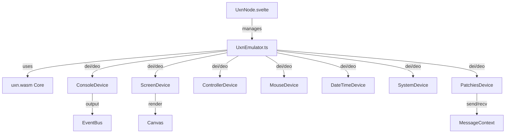

# Uxn/Uxntal Node Implementation (Priority 2)

## Overview

Implement a `uxn` node for running Uxntal programs using **uxn.wasm** (WebAssembly core) with a **custom port of uxn5's device layer**. This provides a general-purpose Uxn virtual machine integrated into Patchies, capable of running any Uxn ROM or Uxntal source code.

## Why Uxn Node (Separate from Orca)

Uxn is a minimal virtual machine with a rich ecosystem:

- Run general Uxntal programs
- Interactive visual programs
- Custom tools and games
- Low-level system programming
- Educational purposes

**Note**: This is separate from the Orca node (Priority 1), which uses JavaScript.

## Architecture




## Implementation Plan

### Phase 1: Setup

**1.1 Install uxn.wasm**

```bash
cd ui && bun add uxn.wasm
```

**1.2 Create directory structure**

```javascript
ui/src/lib/uxn/
├── UxnEmulator.ts
├── types.ts
├── constants.ts
├── LICENSE.uxn5
└── devices/
    ├── ConsoleDevice.ts
    ├── ScreenDevice.ts
    ├── ControllerDevice.ts
    ├── MouseDevice.ts
    ├── DateTimeDevice.ts
    ├── SystemDevice.ts
    └── PatchiesDevice.ts
```

**1.3 TypeScript interfaces** ([`ui/src/lib/uxn/types.ts`](ui/src/lib/uxn/types.ts))

```typescript
export interface UxnDevice {
  init?(): void;
  dei?(port: number): number;
  deo?(port: number, value: number): void;
  destroy?(): void;
}

export interface UxnEmulatorOptions {
  nodeId: string;
  canvasElement?: HTMLCanvasElement;
  messageContext?: MessageContext;
  onConsoleOutput?: (output: string, isError: boolean) => void;
}
```

**1.4 Attribution** ([`ui/src/lib/uxn/LICENSE.uxn5`](ui/src/lib/uxn/LICENSE.uxn5))

- uxn5 MIT license
- Credit Hundred Rabbits

### Phase 2: Port Devices

**2.1 DateTimeDevice** (Simplest - start here) [`ui/src/lib/uxn/devices/DateTimeDevice.ts`](ui/src/lib/uxn/devices/DateTimeDevice.ts)Ports 0xc0-0xcf: year, month, day, hours, minutes, seconds**2.2 ConsoleDevice** [`ui/src/lib/uxn/devices/ConsoleDevice.ts`](ui/src/lib/uxn/devices/ConsoleDevice.ts)Ports 0x10 - 0x1f: stdin, stdout, stderr**2.3 SystemDevice** [`ui/src/lib/uxn/devices/SystemDevice.ts`](ui/src/lib/uxn/devices/SystemDevice.ts)Ports 0x00 - 0x0f: palette, expansion, halt**2.4 ScreenDevice** [`ui/src/lib/uxn/devices/ScreenDevice.ts`](ui/src/lib/uxn/devices/ScreenDevice.ts)Ports 0x20 - 0x2f: pixels, sprites, palette**2.5 ControllerDevice** [`ui/src/lib/uxn/devices/ControllerDevice.ts`](ui/src/lib/uxn/devices/ControllerDevice.ts)Ports 0x80-0x8f: keyboard**2.6 MouseDevice** [`ui/src/lib/uxn/devices/MouseDevice.ts`](ui/src/lib/uxn/devices/MouseDevice.ts)Ports 0x90-0x9f: position, buttons, scroll**2.7 PatchiesDevice** (specific to patchies) [`ui/src/lib/uxn/devices/PatchiesDevice.ts`](ui/src/lib/uxn/devices/PatchiesDevice.ts)Ports 0xd0-0xdf: Message passing

### Phase 3: Emulator

**3.1 Create UxnEmulator** ([`ui/src/lib/uxn/UxnEmulator.ts`](ui/src/lib/uxn/UxnEmulator.ts))

```typescript
export class UxnEmulator {
  private uxn: Uxn;
  private devices: Map<number, UxnDevice>;
  
  async init(options: UxnEmulatorOptions): Promise<void>;
  async loadCode(code: string): Promise<void>;
  async loadROM(rom: Uint8Array): Promise<void>;
  start(): void;
  dei(port: number): number;
  deo(port: number, value: number): void;
  destroy(): void;
}
```


### Phase 4: Component

**4.1 Create UxnNode.svelte** ([`ui/src/lib/components/nodes/UxnNode.svelte`](ui/src/lib/components/nodes/UxnNode.svelte))Layout:

```javascript
┌─────────────────────────────┐
│ [uxn] [≡] [▶] [⚙]          │
│ ┌─────────────────────────┐ │
│ │                         │ │
│ │   Canvas                │ │
│ │                         │ │
│ └─────────────────────────┘ │
│ [Console output optional]   │
└─────────────────────────────┘
```


### Phase 5: Integration

**5.1 Register node**

- node-types.ts
- defaultNodeData.ts

**5.2 Create examples**

- Hello World
- Drawing program
- Interactive demo

### Phase 6: Documentation

**6.1 Update README**

```markdown
### `uxn`: Uxn Virtual Machine

Run Uxntal programs and ROMs.

- Full Varvara device support
- Screen, keyboard, mouse
- Console I/O
- Message passing
```

**6.2 Update spec**

- Mark as implemented
- Document devices
- Note future enhancements

## Device Port Map

```javascript
0x00-0x0f: System (palette, halt)
0x10-0x1f: Console (I/O)
0x20-0x2f: Screen (display)
0x80-0x8f: Controller (keyboard)
0x90-0x9f: Mouse (pointer)
0xc0-0xcf: DateTime (time)
0xd0-0xdf: Patchies (messages)
```


## Future Enhancements

1. **File device** (0xa0-0xaf)
2. **Audio device** (0x30-0x3f)