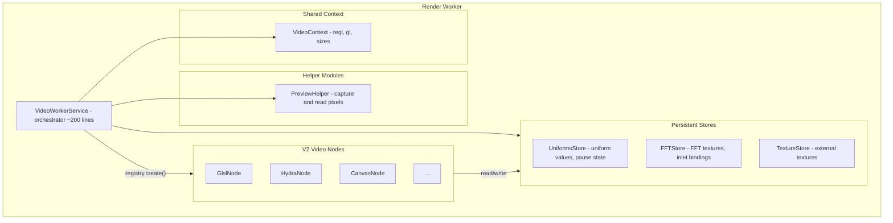
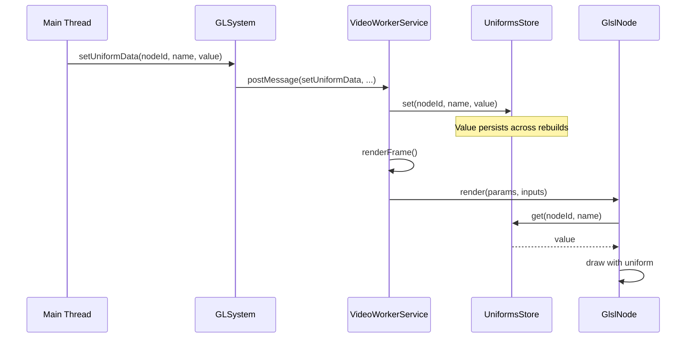

# Video Service V2 Migration Plan (Revised)

## Problem Analysis

The current `fboRenderer.ts` (918 lines) mixes several concerns:| Concern | Lines | Should Be ||---------|-------|-----------|| Node factories (create*Renderer) | ~200 | V2 Node classes || Uniform/FFT management | ~160 | V2 Node classes + StateStore || Message routing | ~30 | V2 Node classes || Preview system | ~100 | PreviewHelper module || Texture management | ~50 | TextureStore module || Render loop + frame | ~100 | VideoWorkerService (slim) || Graph/FBO management | ~80 | VideoWorkerService || WebGL context | ~30 | VideoContext |

## Proposed Architecture




## Module Responsibilities

### 1. VideoContext (tiny, ~30 lines)

Holds shared WebGL resources:

```typescript
// ui/src/workers/rendering/v2/VideoContext.ts
export interface VideoContext {
  readonly regl: regl.Regl;
  readonly gl: WebGL2RenderingContext;
  readonly offscreenCanvas: OffscreenCanvas;
  outputSize: [number, number];
  previewSize: [number, number];
  readonly fallbackTexture: regl.Texture2D;
}
```


### 2. UniformsStore (~40 lines)

Stores uniform values that persist across graph rebuilds:

```typescript
// ui/src/workers/rendering/v2/UniformsStore.ts
export class UniformsStore {
  // Uniform values per node: nodeId -> uniformName -> value
  private uniforms = new Map<string, Map<string, unknown>>();
  
  // Pause state per node
  private pausedNodes = new Set<string>();
  
  get(nodeId: string, name: string): unknown;
  set(nodeId: string, name: string, value: unknown): void;
  getAll(nodeId: string): Map<string, unknown> | undefined;
  clear(nodeId: string): void;
  
  isPaused(nodeId: string): boolean;
  setPaused(nodeId: string, paused: boolean): void;
}
```


### 3. FFTStore (~50 lines)

Manages FFT textures and inlet bindings for audio analysis:

```typescript
// ui/src/workers/rendering/v2/FFTStore.ts
export class FFTStore {
  // FFT textures: analyzerNodeId -> analysisType -> texture
  private textures = new Map<string, Map<AudioAnalysisType, regl.Texture2D>>();
  
  // FFT inlet bindings: nodeId -> inlet metadata
  private inlets = new Map<string, GlslFFTInletMeta>();
  
  getTexture(analyzerNodeId: string, type: AudioAnalysisType): regl.Texture2D | undefined;
  setTexture(analyzerNodeId: string, type: AudioAnalysisType, tex: regl.Texture2D): void;
  updateFromPayload(payload: AudioAnalysisPayloadWithType, regl: regl.Regl): void;
  
  getInlet(nodeId: string): GlslFFTInletMeta | undefined;
  setInlet(nodeId: string, inlet: GlslFFTInletMeta): void;
  clearNode(nodeId: string): void;
}
```

**Key insight**: Nodes read from these stores during render. GLSL nodes use `UniformsStore.get()` and `FFTStore.getTexture()` in their `render()` method.

### 5. TextureStore (~50 lines)

Manages external textures (images, video frames):

```typescript
// ui/src/workers/rendering/v2/TextureStore.ts
export class TextureStore {
  private textures = new Map<string, regl.Texture2D>();
  
  set(nodeId: string, bitmap: ImageBitmap, regl: regl.Regl): void;
  get(nodeId: string): regl.Texture2D | undefined;
  remove(nodeId: string): void;
  has(nodeId: string): boolean;
}
```


### 6. PreviewHelper (~100 lines)

Pure functions for preview operations:

```typescript
// ui/src/workers/rendering/v2/PreviewHelper.ts

export function capturePreview(
  ctx: VideoContext,
  framebuffer: regl.Framebuffer2D,
  customSize?: [number, number]
): Uint8Array;

export function captureTexturePreview(
  ctx: VideoContext,
  texture: regl.Texture2D,
  customSize?: [number, number]
): Uint8Array;

export function blitToOutput(
  ctx: VideoContext,
  source: regl.Framebuffer2D | regl.Texture2D
): void;
```


### 7. VideoWorkerService (~200 lines)

Slim orchestrator - NO node type checks:

```typescript
// ui/src/workers/rendering/v2/VideoWorkerService.ts
export class VideoWorkerService {
  readonly ctx: VideoContext;
  readonly uniformsStore: UniformsStore;
  readonly fftStore: FFTStore;
  readonly textureStore: TextureStore;
  readonly registry: VideoRegistry;
  
  private nodes = new Map<string, VideoNodeV2>();
  private renderGraph: RenderGraph | null = null;
  
  // Graph management
  async buildGraph(graph: RenderGraph): Promise<void>;
  
  // Render loop
  startLoop(onFrame: () => void): void;
  stopLoop(): void;
  renderFrame(): void;
  
  // Preview (delegates to PreviewHelper)
  setPreviewEnabled(nodeId: string, enabled: boolean): void;
  renderPreviews(): Map<string, Uint8Array>;
  
  // Message routing (no type checks - nodes handle themselves)
  sendMessage(nodeId: string, message: Message): void;
}
```


### 8. VideoNodeV2 Interface

```typescript
// ui/src/lib/video/v2/interfaces/video-nodes.ts
export interface VideoNodeV2 {
  readonly nodeId: string;
  readonly framebuffer: regl.Framebuffer2D;
  readonly texture: regl.Texture2D;
  
  // Lifecycle
  create?(data: unknown, stores: VideoStores): Promise<void> | void;
  render?(params: RenderParams, inputs: Map<number, regl.Texture2D>): void;
  destroy?(): void;
  
  // Message handling (node implements its own)
  onMessage?(data: unknown, message: Message): void;
  
  // FFT (for nodes that support it)
  setFFTData?(payload: AudioAnalysisPayloadWithType): void;
}

// Passed to nodes for accessing persistent state
export interface VideoStores {
  uniforms: UniformsStore;
  fft: FFTStore;
  textures: TextureStore;
}
```


### 9. Example V2 Node: GlslNode

```typescript
// ui/src/workers/rendering/v2/nodes/GlslNode.ts
export class GlslNode implements VideoNodeV2 {
  static type = 'glsl';
  static group: VideoNodeGroup = 'processors';
  
  readonly nodeId: string;
  readonly framebuffer: regl.Framebuffer2D;
  readonly texture: regl.Texture2D;
  
  private drawCommand: regl.DrawCommand;
  private uniformDefs: GLUniformDef[] = [];
  private stores: VideoStores;
  
  constructor(nodeId: string, ctx: VideoContext) {
    this.nodeId = nodeId;
    this.texture = ctx.regl.texture({ width, height });
    this.framebuffer = ctx.regl.framebuffer({ color: this.texture });
  }
  
  create(data: { code: string; glUniformDefs: GLUniformDef[] }, stores: VideoStores) {
    this.stores = stores;
    this.uniformDefs = data.glUniformDefs;
    
    // Initialize defaults in uniforms store if not present
    for (const def of this.uniformDefs) {
      if (!stores.uniforms.get(this.nodeId, def.name)) {
        stores.uniforms.set(this.nodeId, def.name, getDefaultValue(def.type));
      }
    }
    
    this.drawCommand = createShaderToyDrawCommand({...});
  }
  
  render(params: RenderParams, inputs: Map<number, regl.Texture2D>) {
    // Build uniforms from stores
    const uniforms = this.buildUniforms(inputs);
    this.framebuffer.use(() => this.drawCommand({ ...params, ...uniforms }));
  }
  
  private buildUniforms(inputs: Map<number, regl.Texture2D>) {
    // Reads from stores.uniforms for uniform values
    // Handles FFT textures via stores.fft.getTexture()
    // ...
  }
  
  // No onMessage needed - GLSystem routes uniform updates via stores.uniforms.set()
  
  destroy() {
    this.framebuffer.destroy();
    this.texture.destroy();
  }
}
```


## Data Flow for Uniform Updates




## File Structure

```javascript
ui/src/workers/rendering/
├── v2/
│   ├── VideoContext.ts          # ~30 lines - shared WebGL resources
│   ├── VideoWorkerService.ts    # ~200 lines - slim orchestrator
│   ├── stores/
│   │   ├── UniformsStore.ts     # ~40 lines - uniform values, pause state
│   │   ├── FFTStore.ts          # ~50 lines - FFT textures, inlet bindings
│   │   └── TextureStore.ts      # ~50 lines - external bitmap textures
│   ├── PreviewHelper.ts         # ~100 lines - preview capture functions
│   ├── VideoRegistry.ts         # ~50 lines - node class registry
│   └── nodes/
│       ├── index.ts             # registerVideoNodes()
│       ├── GlslNode.ts
│       ├── HydraNode.ts
│       ├── CanvasNode.ts
│       ├── SwglNode.ts
│       └── ImgNode.ts
└── renderWorker.ts              # Updated to use V2
```


## Migration Strategy

### Phase 1: Infrastructure

1. Create `VideoContext` interface
2. Create `UniformsStore` class
3. Create `FFTStore` class
4. Create `TextureStore` class
5. Create `PreviewHelper` module
6. Create `VideoRegistry`
7. Create `VideoWorkerService` skeleton (delegates to existing FBORenderer)

### Phase 2: First Node (GlslNode)

1. Migrate `createGlslRenderer` to `GlslNode` class
2. Move uniform handling into node (reads from StateStore)
3. Move FFT texture handling into node
4. Update VideoWorkerService to use GlslNode via registry

### Phase 3: Remaining Nodes

1. HydraNode (complex: Hydra lib, FFT, source textures)
2. CanvasNode (animation loop, JSRunner)
3. SwglNode (SwissGL context)
4. ImgNode (external texture, simple)

### Phase 4: Cleanup

1. Remove V1 code paths
2. Delete old FBORenderer
3. Update renderWorker.ts to only use V2