# Patchies.app: creative coding patcher in the browser


> The above image remixes the Hydra code "Filet Mignon" from [AFALFL](https://www.instagram.com/a_f_alfl) and GLSL shader ["Just another cube"](https://www.shadertoy.com/view/3XdXRr) from mrange. Licensed under CC BY-NC-SA 4.0 and CC0 respectively.

Patchies is a patcher for audio, visual and computational things that runs on the web. It's made for creative coding; patch objects and code snippets together to explore visualizations, soundscapes and computations 🎨

Try it out at [patchies.app](https://patchies.app) - it's open source and free to use 😎

## Use tools and libraries you love

Patchies lets you use the audio-visual tools and libraries that you know (and love!), together in one place. For example:

- Create interactive graphics with [P5.js](https://p5js.org), [Three.js](https://threejs.org), [HTML5 Canvas](https://developer.mozilla.org/en-US/docs/Web/API/Canvas_API) and [Textmode.js](https://code.textmode.art)
- Synthesize and process video with [Hydra](https://hydra.ojack.xyz) and [GLSL shaders](https://www.shadertoy.com)
- Live code music with [Strudel](https://strudel.cc), [ChucK](https://chuck.cs.princeton.edu/webchuck), [SuperSonic](https://sonic-pi.net/supersonic/demo.html) and [Orca](https://github.com/hundredrabbits/Orca)
- Synthesize and process audio with [Web Audio](https://developer.mozilla.org/en-US/docs/Web/API/Web_Audio_API) nodes, [Tone.js](https://tonejs.github.io) and [Elementary Audio](https://www.elementary.audio)
- Run programs and games on the [Uxn](https://wiki.xxiivv.com/site/uxn.html) virtual machine and write your own with [Uxntal](https://wiki.xxiivv.com/site/uxntal.html) assembly.
- Compute in a raw and fun way with [stack machine assembly](./modules/vasm/README.md)
- Run numerical computations with [Python 3](https://pyodide.org)
- Use any [third party JavaScript library](#importing-javascript-packages-from-npm) via [esm.run](https://esm.run).

## ...by patching them together ✨


> Try out [the above demo](https://patchies.app/?id=f4tvzfxk1qr4xr2) which uses P5.js with Hydra to create a random walk shader.

Patchies is designed to mix textual coding and visual patching, using the best of both worlds. Instead of writing long chunks of code or patching together a huge web of small objects, Patchies encourages you to write small and compact programs and patch 'em together.

If you haven't used a patching environment before, patching is a _visual_ way to program by connecting objects together. Each object does something e.g. generate sound, generate visual, compute some values. You connect the output of one object to the input of another object to create a flow of data.

This lets you visually see the program's core composition and its in-between results such as audio, video and message flows, while using tools you're already familiar with that lets you do a lot with a bit of code. This is done through [Message Passing](#message-passing), [Video Chaining](#video-chaining) and [Audio Chaining](#audio-chaining). They're heavily inspired by tools like Max, Pd, TouchDesigner and VVVV.

> "What I cannot create, I do not understand. Know how to solve every problem that has been solved." - Richard Feynman

## Getting Started


Playing around with demos first is a nice way to get inspirations and see what Patchies can do, first-hand.

- Go to [patchies.app](https://patchies.app)
- Click on the "demos" tab to view the list of demos you can play with
- Use the mouse to pan the canvas.
- Use the scroll wheel to zoom the canvas.
- You can always go back to this dialog by clicking on the "Help" button on the bottom right.

## Creating Objects


- Press `Enter` to create a new object.
- Type to search for object name. Try `hydra` or `glsl` or `p5`.
- `Arrow Up/Down` navigates the list.
- `Enter` inserts the object.
- `Esc` closes the menu.

### Browsing Objects


Use `Ctrl/Cmd + B` or the search icon button on the bottom right to open the **Object Browser** - a searchable, categorized view of all available objects in Patchies.

See all 100+ objects organized by category (_Video_, _Audio_, _Code_, _Control_, _UI_, etc.), with searchable names and brief description. Click to insert an object -- pick one at random and experiment with it!

### Modifying Objects

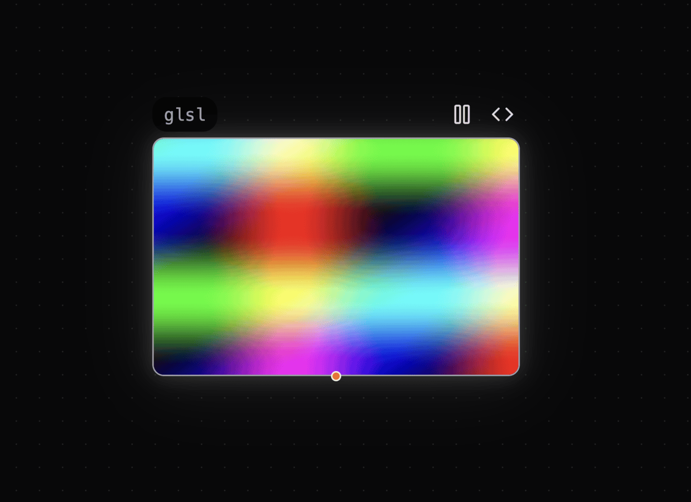

- Click on an object to select it. The outline color should change when an object is selected.
- Once selected, drag the object to move it around.
  - If you can't drag an object, click on the **title** on the top-left of an object and drag it instead.
  - `Delete` to delete an object.
  - `Ctrl + C/V` to copy and paste an object, or use the "copy/paste" button.
- When hovering the mouse over an object, you'll see floating icon buttons such as "edit code" and "play/stop" on the top right.

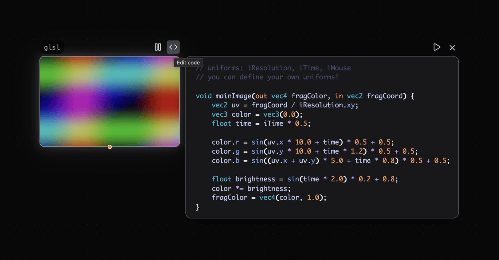

- Click on `Edit Code` button to open the code editor.
- `Shift + Enter` when in a code editor re-runs the code. This helps you to make changes to the code and see the results right away.

### Keyboard Shortcuts


Patchies is designed to be keyboard-first so you can get in the flow. Go to "Help > Shortcuts" to see the full list of keyboard shortcuts.

### Connecting Objects

[standard-connect.webm](https://github.com/user-attachments/assets/f44fb610-6030-4b4c-ad72-eb91481abd50)

- Click and drag on an object's handle all the way to the other object's handle to connect them together.
- A handle looks like circle grey, blue, orange or purple dots at the top or bottom of objects.
- Alternatively, click on two handles consecutively to connect them together.
- When connecting, the starting handle will highlight to show where you're connecting from.
- When connecting, all [invalid connection targets](#connection-rules) will be dimmed.

### Easy Connect

[easy-connect.webm](https://github.com/user-attachments/assets/00c8c9f5-e3c0-4ca0-9601-6e3b678886ba)

Use the _easy connect_ button to make the handles big and easy to touch, for these use cases:

1. You are using touch devices like a mobile phone or tablet.
2. You cannot locate the tiny object handles or drag across them.
3. You want to quickly connect many handles together by tap or click.

To use this feature:

1. Locate the cable button on your toolbar, that's _easy connect_.
2. Tap on a big handle to start the connection.
3. It highlights your starting handle and dim any invalid connection targets.
4. Tap on another big handle to connect the two handles together.
5. Repeat the connections as many time as you wish.
6. Click the _easy connect_ button again to stop connecting.

### Sharing Links

To create shareable links, click on the "Share Link" button on the bottom right. You can also use "Share Patch" from the command palette.

## Supporting Open Source

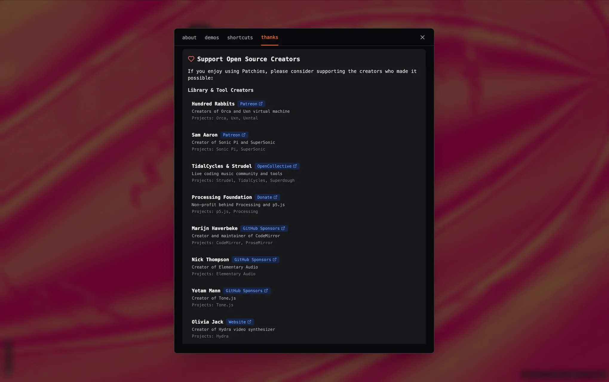

Patchies is licensed under [AGPL-3.0](LICENSE) and builds upon many amazing open source projects. See the [complete licenses and attributions](LICENSES.md) for detailed information about all third-party libraries used.

If you enjoy using Patchies, please consider [supporting the open source creators](SUPPORT.md) who made it possible. You can view the list of creators to sponsor in-app by going to the "thanks" tab in the help dialog.

Special thanks to [the amazing people](SUPPORT.md#special-thanks) who helped bring Patchies to life through their continuous support, feedback, and encouragement.

## Message Passing

Each object can send message to other objects, and receive messages from other objects.


In this example, two `slider` objects sends out their value to a `expr $1 + $2` object which adds the number together. The result is sent as a message to the `p5` object which displays it.

Here are some examples to get you started:


> ✨ Try this patch out [in the app](https://patchies.app/?id=9c5ytrchpoazlez)!

- Create two `button` objects, and connect the outlet of one to the inlet of another.
  - When you click on the first button, it will send a `bang` message to the second button, which will flash.
  - In JavaScript, you will receive this as an object: `{type: 'bang'}`
- Create a `msg` object with the message `'hello world'` (you can hit `Enter` and type `m 'hello world'`). Mind the quotes.
  - Then, hit `Enter` again and search for the `logger.js` preset. Connect them together.
  - When you click on the message object, it will send the string `'hello world'` to the console object, which will log it to the virtual console.

Most messages in Patchies are objects with a `type` field. For example, `bang` is `{type: 'bang'}`, and `start` is `{type: 'start'}`. If you need more properties, then you can add more fields to the object, e.g. `{type: 'loop', value: false}`.

Typing `bang` in the message box sends `{type: 'bang'}` for convenience. If you want to send a string "bang", type in `"bang"` with quotes. See the [message object](#msg-message-object)'s documentation for the message box syntax.

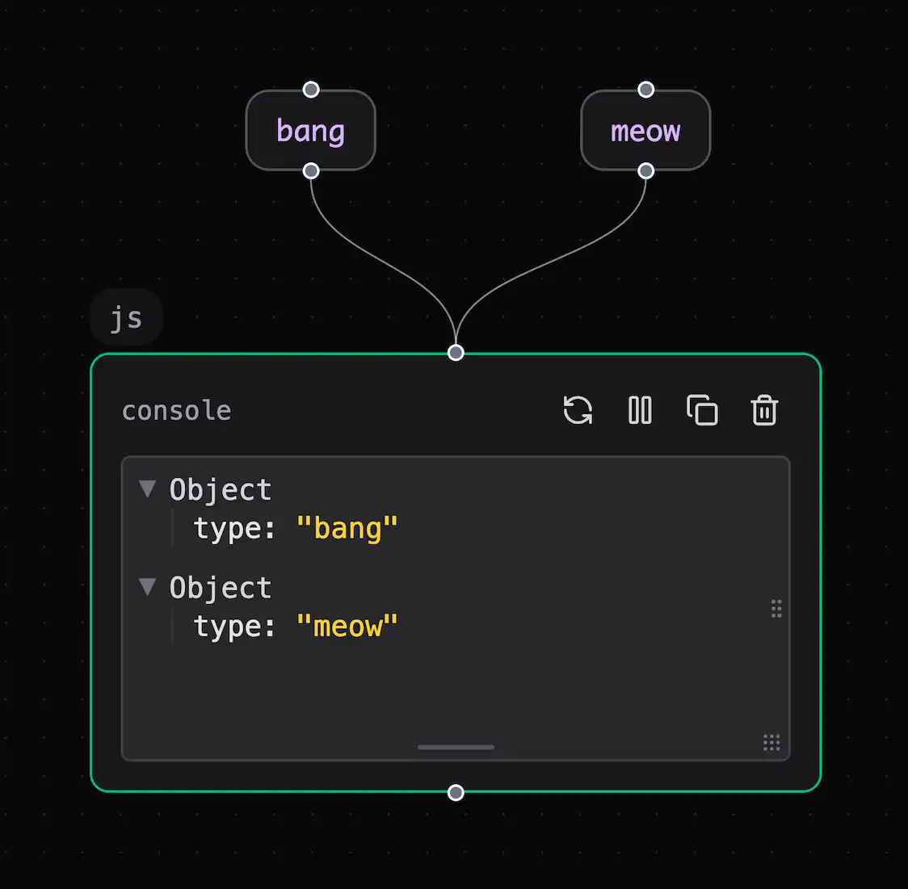

In every object that supports writing JavaScript code (e.g. `js` and `p5`), you can use the `send()` and `recv()` functions to send and receive messages between objects. For example:

```js
// In the source `js` object
send({ type: "bang" });
send("Hello from Object A");

// In the target `js` object
recv((data) => {
  // data 0 is { type: 'bang' }
  // data 1 is "Hello from Object A"
  console.log("Received message:", data);
});
```

This is similar to the second example above, but using JavaScript code.

> [!TIP]
> To see what kind of messages an object is sending out, use the `logger.js` preset. It is a `js` object that runs `recv(m => console.log(m))`, i.e. logs every incoming message to the console. You can add any preset by hitting `Enter` and searching for them.

The `recv` callback also accepts the `meta` argument in addition to the message data. It includes the `inlet` field which lets you know which inlet the message came from.

You can combine this with `send(data, {to: inletIndex})` to send data to only a particular inlet, for example:

```js
// If the message came from inlet #2, send it out to outlet #2
recv((data, meta) => {
  send(data, { to: meta.inlet });
});
```

In most JavaScript-based objects, you can also call `setPortCount(inletCount, outletCount)` to set the exact number of message inlets and outlets. Example: `setPortCount(2, 1)` ensures there is 2 message inlets and 1 message outlet.

See the [Message Passing with GLSL](#message-passing-with-glsl) section for how to use message passing with GLSL shaders to pass data to shaders dynamically.

## Video Chaining

You can chain visual objects together to create video effects and compositions, by using the output of a visual object as an input to another.


The above example creates a `hydra` object and a `glsl` object that produces a pattern, and connects them to a `hydra` object that subtracts the two visuals together using `src(s0).sub(s1).out(o0)`.

This is very similar to _shader graphs_ in programs like TouchDesigner, Unity, Blender, Godot and Substance Designer.

To use video chaining:

- Try out the presets to get started quickly.

  - Pipe presets (e.g. `pipe.hydra`, `pipe.gl`) simply passes the visual through without any changes. This is the best starting point for chaining.
  - Hydra has many presets that perform image operations (e.g. `diff.hydra`, `add.hydra`, `sub.hydra`) on two visual inputs, see [hydra section](#hydra-creates-a-hydra-video-synthesizer).
  - Check out the docs of [each visual objects](#list-of-objects) for more fun presets you can use.

- The visual object should have at least one visual inlets and/or outlets, i.e. orange circles on the top and bottom.

  - Inlets provides visual into the object, while outlets outputs visual from the object.
  - In `hydra`, you can call `setVideoCount(ins = 1, outs = 1)` to specify how many visual inlets and outlets you want. See [hydra section](#hydra-creates-a-hydra-video-synthesizer) for more details.
  - For chaining `glsl` objects, you can dynamically create sampler2D uniforms. See [glsl section](#glsl-creates-a-glsl-fragment-shader) for more details.

- The visual object should have code that takes in a visual source, does something, and outputs visual. See the above presets for examples.

- Connect the orange inlets of a source object to the orange outlets of a target object.

  - Try connecting the orange visual outlet of `p5` to an orange visual inlet of a `pipe.hydra` preset, and then connect the `hydra` object to a `pipe.gl` preset. You should see the output of the `p5` object being passed through `hydra` and `glsl` objects without modification.

- Getting lag and slow patches? See the [Rendering Pipeline](#rendering-pipeline) section on how to avoid lag.

## Audio Chaining

Similar to video chaining, you can chain many audio objects together to create audio effects and soundscapes.


> ✨ Try this patch out [in the app](https://patchies.app/?id=b17136cy9rxxebw)!

This is a FM synthesis demo that uses a combination of `osc~` (sine oscillator), `expr` (math expression), `gain~` (gain control), and `fft~` (frequency analysis) objects to create a simple synth with frequency modulation.

For a more fun example, here's [a little patch](https://patchies.app/?id=vdqg4fpgxeca8ot) by [@kijjaz](https://www.instagram.com/kijjaz) that uses mathematical expressions to make a beat in `expr~`:


If you don't have an idea where to start, why not build your own drum machine? [Try it out](https://patchies.app/?id=w46um7gafe7hgle)! Use the `W A S D` keys on your keyboard to play some drums 🥁.


If you have used an audio patcher before (e.g. Pd, Max, FL Studio Patcher, Bitwig Studio's Grid), the idea is similar.

- Use these objects as audio sources: `osc~`, `sig~`, `mic~`, `strudel`, `chuck~`, `ai.tts`, `ai.music`, `soundfile~`, `sampler~`, `video`, `dsp~`, `tone~`, `elem~`, `sonic~`

  - **VERY IMPORTANT!**: you must connect your audio sources to `dac~` to hear the audio output, otherwise you will hear nothing. Audio sources do not output audio unless connected to `dac~`. Use `gain~` to control the volume.
  - See the documentation on [audio objects](#audio--music-objects) for more details on how these work.

- Use these objects to process audio: `gain~`, `fft~`, `+~`, `lowpass~`, `highpass~`, `bandpass~`, `allpass~`, `notch~`, `lowshelf~`, `highshelf~`, `peaking~`, `compressor~`, `pan~`, `delay~`, `waveshaper~`, `convolver~`, `expr~`, `dsp~`, `tone~`, `elem~`, `sonic~`.

- Use `dac~` to output audio to your speakers.

- Use the `fft~` object to analyze the frequency spectrum of the audio signal. See the [Audio Analysis](#audio-analysis) section on how to use FFT with your visual objects.

## Connection Rules

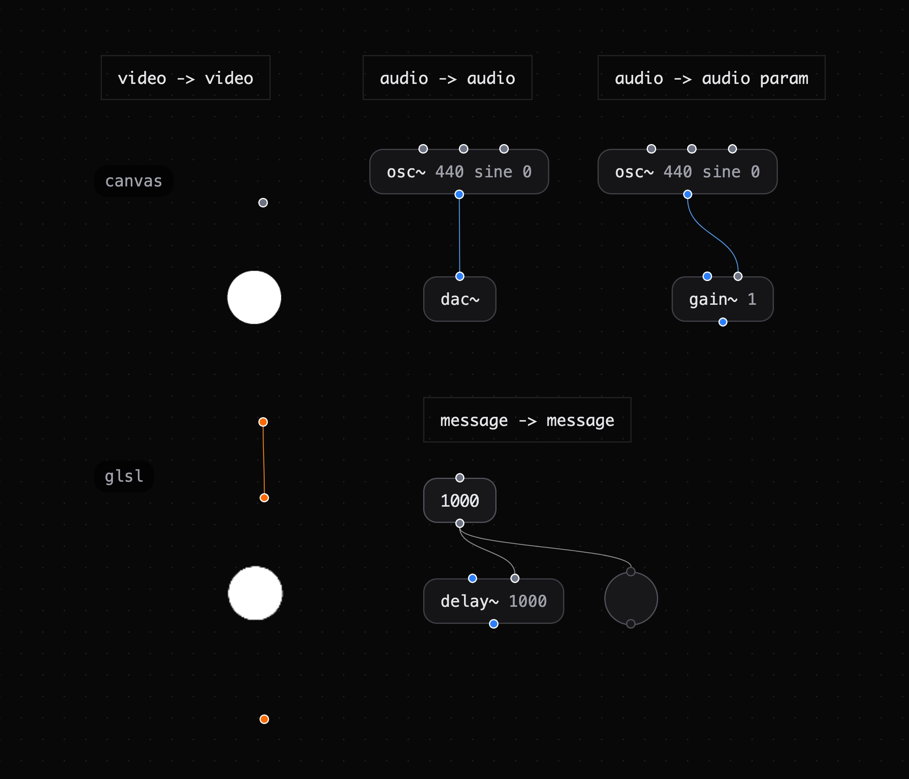

These rules define what handles can be connected together.

- You can connect multiple outlets to a single inlet and vice-versa.
- Video outlets (orange) can _only_ connect to video inlets.
- Message outlets (gray) can _only_ connect to message inlets.
- Audio outlets (blue) can connect to audio inlets.
- Analysis outlets (purple) from `fft~` output can connect to message and video inlets
- Audio outlets can connect to _audio parameter_ inlets for _parameter modulation_.
  - `osc~`'s `frequency` and `gain~`'s `gain` are both audio param inlets.
  - Message _and_ audio outlets (like `osc~` out and `gain~` out) can connect to audio param inlets
  - If you start dragging from an audio outlet (blue), the audio param inlets will _turn from grey to blue_ to indicate it's connectable to those outlets.

## Experimental features

> [!CAUTION]
> These features are experimental, and thus has a _very high_ chance of corrupting and destroying your code and patches without any way to restore it. Try it on an empty patch or backup your objects.

### Create and edit objects with AI

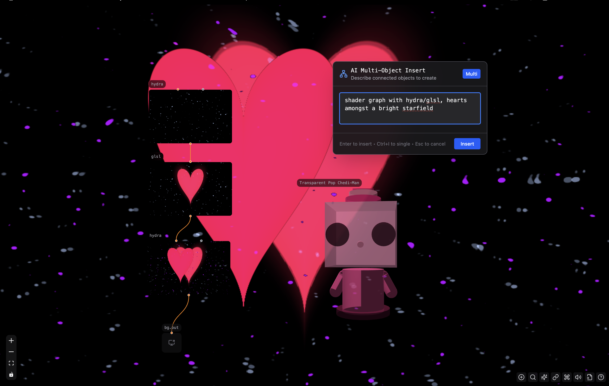

> Try out [the above patch](https://patchies.app/?id=rza2o6eoa7338rh) in which the AI generates a shader graph of starfield with hearts 💕

Press `Ctrl/Cmd + I` to open the object insert/edit prompt. Describe what you want to create in natural language, and the AI will generate or edit the appropriate objects with code for you.

When the AI object insert prompt is open, press `Ctrl/Cmd+I` again to switch between Single Insert and Multi Insert mode.

- **Single Insert Mode** (no object selected): create a single object at your cursor position
- **Multi Insert Mode** (no object selected): create multiple connected objects at your cursor position
- **Edit Mode** (object selected): modifies the selected object's code based on your description

> [!TIP]
> AI is 100% optional and _opt-in_ with Patchies. Dislike AI? Hit `Ctrl/Cmd + K` then `Toggle AI Features`. This _permanently_ turns all AI-based nodes and AI generation features off.

Here's how to set it up:

1. Create a separate API key that has strict budget limits.
2. Press `Cmd/Ctrl + I`.
3. Enter your API Key and hit `Save & Continue`.
4. Use `Ctrl/Cmd + I` or the _sparkles_ button on the bottom right to generate.

This feature uses the `gemini-3-flash-preview` model to understand your prompt and generate the object configuration. API keys are stored on localStorage as `gemini-api-key` and there is a risk of your API keys being _stolen_ by malicious patches you open.

## List of objects

Here are the non-exhaustive list of objects that we have in Patchies.

### Visual & Creative Coding Objects

These objects support video chaining and can be connected to create complex visual effects:

### `p5`: creates a P5.js sketch

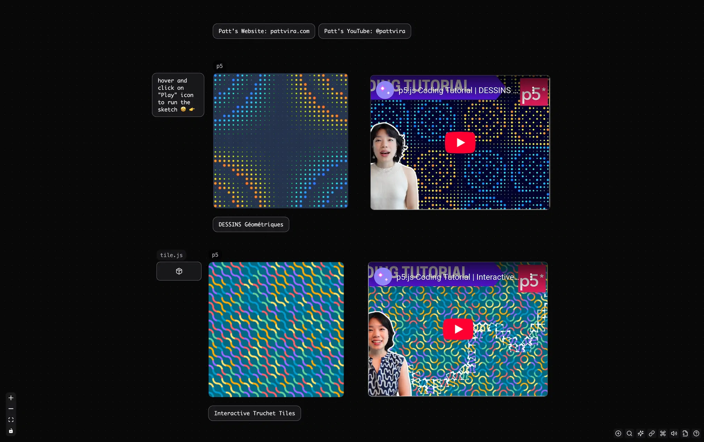

> ✨ Try this patch out [in the app](https://patchies.app/?id=9r2t5vizvv6xyou). The sketches are [Patt Vira](https://pattvira.com)'s [DESSINS Géométriques](https://www.pattvira.com/coding-tutorials/v/dessins-geometriques) and [Interactive Truchet Tiles](https://www.pattvira.com/coding-tutorials/v/interactive-truchet-tiles) tutorials. Her [YouTube tutorials](https://www.youtube.com/@pattvira) are helpful for getting familiar with P5 and for daily inspirations.

- P5.js is a JavaScript library for creative coding. It provides a simple way to create graphics and animations, but you can do very complex things with it.
- Read the [P5.js documentation](https://p5js.org/reference) to see how P5 works.
- See the [P5.js tutorials](https://p5js.org/tutorials) and [OpenProcessing](https://www.openprocessing.org) for more inspirations.
- **Note**: Patchies uses P5.js v2.x with backward compatibility libraries for v1 features. All existing P5.js v1 sketches should work without modification.

- You can call these special methods in your sketch:

  - `noDrag()` disables dragging the whole canvas. You **must** call this method if you want to add interactivity to your sketch, such as adding sliders or mousePressed events. You can call it in your `setup()` function.
    - When `noDrag()` is enabled, you can still drag the "p5" title to move the whole object around.
  - `noOutput()` hides the video output port (the orange outlet at the bottom). This is useful when creating interface widgets that don't need to be part of the video chain.
  - `setTitle(title)` sets the title of the node. Use this to create custom, reusable widgets with meaningful names. Example: `setTitle('Color Picker')`.
  - `send(message)` and `recv(callback)`, see [Message Passing](#message-passing).

- You can use any third-party packages you want in your sketch, see [importing JavaScript packages from NPM](#importing-javascript-packages-from-npm).

  - Try out [ML5.js](https://ml5js.org) for machine learning and [Matter.js](https://brm.io/matter-js) for physics simulation. They play well with P5.js.

  ```js
  import ml5 from "npm:ml5";

  function preload() {
    classifier = ml5.imageClassifier("MobileNet");
  }
  ```

- You can import shared JavaScript libraries across multiple `p5` objects, see [sharing JavaScript across multiple `js` blocks](#sharing-javascript-across-multiple-js-blocks).
  - Try out this [Matter.js example](https://patchies.app/?id=08wca4jzuz5wpng) from Daniel Shiffman's [The Nature of Code](https://natureofcode.com) that creates a simple physics simulation. In this example, the code for the Boundary and Box class is separated into shared library objects. You can [purchase the book](https://natureofcode.com/) to support Daniel's amazing educational work!
- Please consider supporting the [Processing Foundation](https://processingfoundation.org/donate) who maintains p5.js!

### `hydra`: creates a Hydra video synthesizer

- [Hydra](https://hydra.ojack.xyz) is a live coding video synthesizer created by [Olivia Jack](https://ojack.xyz). You can use it to create all kinds of video effects.
- See the [Hydra documentation](https://hydra.ojack.xyz/docs) to learn how to use hydra.
- Try out the standalone editor at [Hydra](https://hydra.ojack.xyz) to see how Hydra works.
  - Use the "shuffle" button on the editor to get code samples you can use. You can copy it into Patchies. Check the license terms first.
- You can call these special methods in your Hydra code:
  - `setVideoCount(ins = 1, outs = 1)` creates the specified number of Hydra source ports.
  - `setVideoCount(2)` initializes `s0` and `s1` sources with the first two visual inlets.
  - `setMouseScope('global' | 'local')` sets mouse tracking scope. `'local'` (default) tracks mouse within the canvas preview, `'global'` tracks mouse across the entire screen using screen coordinates.
  - full hydra synth is available as `h`
  - outputs are available as `o0`, `o1`, `o2`, and `o3`.
  - `mouse.x` and `mouse.y` provide real-time mouse coordinates (scope depends on `setMouseScope`)
  - `send(message)` and `recv(callback)` works here, see [Message Passing](#message-passing).
  - `setTitle(title)` sets the hydra object title
- Try out these presets to get you started:
  - `pipe.hydra`: passes the image through without any changes
  - `diff.hydra`, `add.hydra`, `sub.hydra`, `blend.hydra`, `mask.hydra`: perform image operations (difference, addition, subtraction, blending, masking) on two video inputs
  - `filet-mignon.hydra`: example Hydra code "Filet Mignon" from [AFALFL](https://www.instagram.com/a_f_alfl). Licensed under CC BY-NC-SA 4.0.
- Try out [this demo](https://patchies.app/?id=qbnonbgwyvzov2c) which uses P5.js with Hydra to create a random walk shader
- Check out [Olivia Jack's website](https://ojack.xyz/) to learn more about her work!

### `glsl`: creates a GLSL fragment shader

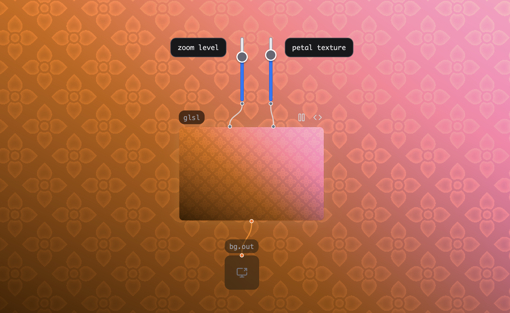

> ✨ Try this patch out [in the app](https://patchies.app/?id=3k3qnwk022tfj7e). Shader is from @dtinth's talk, [the power of signed distance functions](https://dt.in.th/SDFTalk)!

- GLSL is a shading language used in OpenGL. You can use it to create complex visual effects and animations.
- You can use video chaining by connecting any visual objects (e.g. `p5`, `hydra`, `glsl`, `swgl`, `bchrn`, `ai.img` or `canvas`) to the GLSL object via `sampler2D` video inlets.
- You can create any number of GLSL uniform inlets by defining them in your GLSL code.
  - For example, if you define `uniform float iMix;`, it will create a float inlet for you to send values to.
  - If you define the uniform as `sampler2D` such as `uniform sampler2D iChannel0;`, it will create an orange video inlet for you to connect video sources to.
- See [Shadertoy](https://www.shadertoy.com) for examples of GLSL shaders.
- All shaders on the Shadertoy website are automatically compatible with `glsl`, as they accept the same uniforms.
- **Mouse Interaction**: If your shader uses the `iMouse` uniform (vec4), mouse interaction is automatically enabled:
  - `iMouse.xy`: current mouse position or last click position
  - `iMouse.zw`: drag start position (positive when mouse down, negative when mouse up)
    - When dragging (mouse down): `iMouse.zw > 0` contains ongoing drag start position
    - When released (mouse up): `iMouse.zw < 0` (use `abs()` to get last drag start position)
  - When `iMouse` is detected in your code, the node becomes interactive (drag is disabled to allow mouse input)
- I recommend playing with [The Book of Shaders](https://thebookofshaders.com) to learn the GLSL basics!
- Try these presets for GLSL to get you started:
  - `red.gl`: solid red color
  - `pipe.gl`: passes the image through without any changes
  - `mix.gl`: mixes two video inputs
  - `overlay.gl`: put the second video input on top of the first one
  - `fft-freq.gl`: visualizes the frequency spectrum from audio input
  - `fft-waveform.gl`: visualizes the audio waveform from audio input
  - `switcher.gl`: switches between six video inputs by sending an int message of 0 - 5.

#### Message Passing with GLSL

You can send messages into the GLSL uniforms to set the uniform values in real-time. First, create a GLSL uniform using the standard GLSL syntax, which adds two dynamic inlets to the GLSL object.

```glsl
uniform float iMix;
uniform vec2 iFoo;
```

You can now send a message of value `0.5` to `iMix`, and send `[0.0, 0.0]` to `iFoo`. When you send messages to these inlets, it will set the internal GLSL uniform values for the object. The type of the message must match the type of the uniform, otherwise the message will not be sent.

If you want to set a default uniform value for when the patch gets loaded, use the `loadbang` object connected to a `msg` object or a slider. `loadbang` sends a `bang` message when the patch is loaded, which you can use to trigger a `msg` object or a `slider` to send the default value to the GLSL uniform inlet.

Supported uniform types are `bool` (boolean), `int` (number), `float` (floating point number), `vec2`, `vec3`, and `vec4` (arrays of 2, 3, or 4 numbers).

### `swgl`: creates a SwissGL shader

- [SwissGL](https://github.com/google/swissgl) is a wrapper for WebGL2 to create shaders in very few lines of code. Here is how to make a simple animated mesh:

  ```js
  function render({ t }) {
    glsl({
      t,
      Mesh: [10, 10],
      VP: `XY*0.8+sin(t+XY.yx*2.0)*0.2,0,1`,
      FP: `UV,0.5,1`,
    });
  }
  ```

- See the [SwissGL examples](https://google.github.io/swissgl) for some inspirations on how to use SwissGL.
  - Right now, we haven't hooked the mouse and camera to SwissGL yet, so a lot of what you see in the SwissGL demo won't work in Patchies yet. PRs are welcome!

### `canvas`: creates a JavaScript canvas (offscreen)

- You can use [HTML5 Canvas](https://developer.mozilla.org/en-US/docs/Web/API/Canvas_API) to create custom graphics and animations. The rendering context is exposed as `ctx` in the JavaScript code, so you can use methods like `ctx.fill()` to draw on the canvas.

- You can call these special methods in your canvas code:

  - `noDrag()` disables dragging the node. This allows you to add mouse or touch interactivity to your canvas without accidentally moving the node.
  - `noOutput()` hides the video output port. Useful when creating interface widgets or tools that don't need to be part of the video processing chain.
  - `setTitle(title)` sets the title of the node. Create custom, reusable widgets with meaningful names like `setTitle('Spectogram')`.
  - `send(message)` and `recv(callback)`, see [Message Passing](#message-passing).
  - `fft()` for audio analysis, see [Audio Analysis](#audio-analysis)

- This runs on the [rendering pipeline](#rendering-pipeline) using [OffscreenCanvas](https://developer.mozilla.org/en-US/docs/Web/API/OffscreenCanvas) on web workers. This means:

  - Pro: It can chain with other visual objects (`glsl`, `hydra`, etc.) without lag. You can draw animations using the canvas API and output it at 60fps.
  - Pro: It's fast as it doesn't block the main thread. You can do complex animations and computations there.
  - Con: You cannot use DOM APIs like `document` or `window`
  - Con: `fft~` inputs has very high delay due to worker message passing

### `canvas.dom`: creates a JavaScript canvas (main thread)

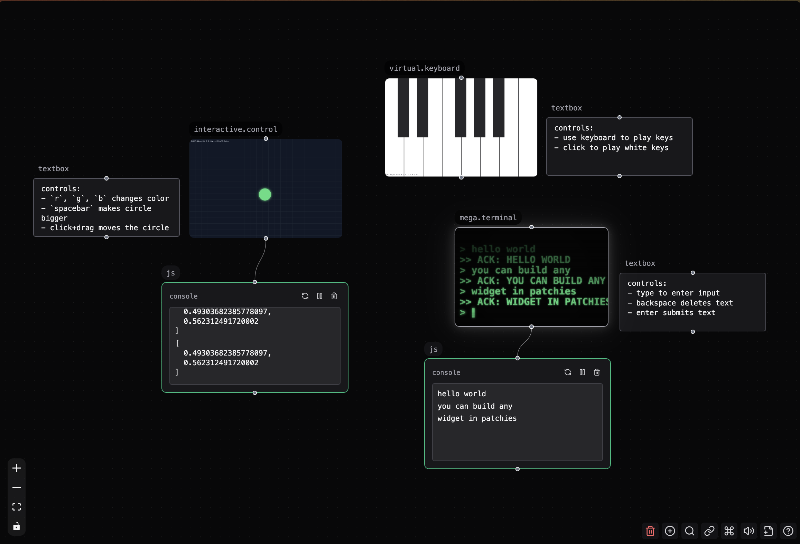

> ✨ Try this patch out [in the app](https://patchies.app/?id=izs6hjxchit2zad)!

- Same as `canvas` but runs directly on the main thread instead of on the [rendering pipeline thread](#rendering-pipeline), and comes with some additional features:

  - Use `mouse` object with properties: `x`, `y`, `down`, `buttons` to get current mouse position and state.
  - Use `onKeyDown(callback)` and `onKeyUp(callback)` to register keyboard event handlers. Events are trapped and won't leak to xyflow (e.g., pressing Delete won't delete the node).
  - Full DOM and browser API access (e.g. `document` and `window`)
  - Use `setCanvasSize(width, height)` to dynamically resize the canvas resolution (e.g., `setCanvasSize(500, 500)`).
  - Otherwise, the API remains the same as `canvas`: `noDrag()`, `noOutput()`, `setTitle(title)`, `send(message)`, `recv(callback)`, `fft()` can all be used in `canvas.dom`.

- When to use `canvas.dom` instead of `canvas`:

  - Instant FFT reactivity: no worker message passing delay, perfect for tight audio-reactive visual.
  - Mouse interactivity: use `mouse.x`, `mouse.y`, `mouse.down` for interactive sketches.
  - Keyboard interactivity: use `onKeyDown()` and `onKeyUp()` for keyboard-controlled widgets.
  - DOM access: use `document`, `window` and other browser APIs when needed.

- Try out these fun and useful presets for inspirations on widgets and interactive controls:

  - `particle.canvas` adds a particle canvas that reacts to your mouse inputs.
  - `xy-pad.canvas` adds an X-Y pad that you can send `[x, y]` coordinates into to set the position of the crosshair. It also sends `[x, y]` coordinates to the message outlet when you drag on it.
  - `rgba.picker` and `hsla.picker` lets you pick colors and sends them as outputs: `[r, g, b, a]` and `[h, s, l, a]` respectively.
  - `keyboard.example` demonstrates keyboard event handling with `onKeyDown()` and `onKeyUp()` callbacks.
  - `fft.canvas` preset takes in analysis output from `fft~` object and does a FFT plot, similar to `fft.p5` but even faster.

- Performance trade-offs:

  - When using [video chaining](#video-chaining), to output the canvas content to the video outlet, it drastically slow down the browser by a huge margin as it needs to copy each frame to the [rendering pipeline](#rendering-pipeline).
  - It runs on main thread, so heavy computation can affect UI responsiveness.

### `textmode` and `textmode.dom`: creates ASCII/text-mode graphics

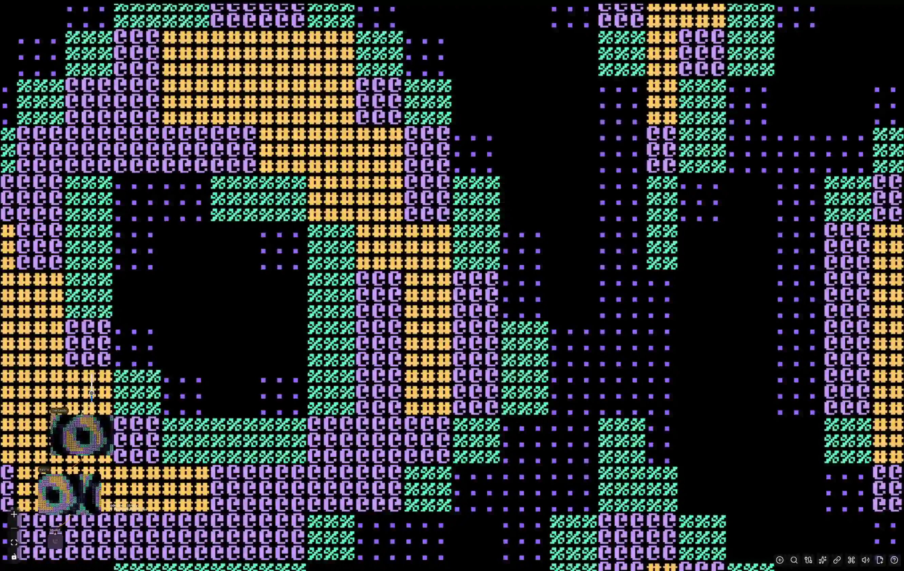

> ✨ Try this patch out [in the app](https://patchies.app/?id=3hd88qv62h4zltq)! Code sample and library by [@humanbydefinition](https://github.com/humanbydefinition)

[Textmode.js](https://code.textmode.art) is a library for creating ASCII art and text-mode graphics in the browser using WebGL2. Perfect for creating retro-style visuals, text animations, and creative coding with characters.

- There are two flavors of textmode objects with a few differences:

  - `textmode`: Runs on the [rendering pipeline](#rendering-pipeline) and is performant when chaining to other video nodes. Features such as mouse interactivity, images/videos and fonts are NOT supported.
  - `textmode.dom`: Runs on the main thread. Supports [mouse](https://code.textmode.art/docs/events.html#mouse-events), [touch](https://code.textmode.art/docs/events.html#touch-events) and [keyboard](https://code.textmode.art/docs/events.html#keyboard-events) interactivity. Supports [video and images](https://code.textmode.art/docs/loadables.html). Slower when chaining to other video nodes as it requires CPU-to-GPU pixel copy.

- You can call these special methods in your textmode code:

  - `send(message)` and `recv(callback)`, see [Message Passing](#message-passing).
  - `fft()` for audio analysis, see [Audio Analysis](#audio-analysis)
  - `noDrag()` disables dragging the node.
  - `noOutput()` hides the video output port.
  - `setTitle(title)` sets the title of the node.
  - `setHidePorts(true | false)` sets whether to hide inlets and outlets

- The textmode instance is exposed as `tm` in your code:

  ```ts
  tm.setup(() => {
    tm.fontSize(16);
    tm.frameRate(60);
  });

  tm.draw(() => {
    tm.background(0, 0, 0, 0);

    const halfCols = tm.grid.cols / 2;
    const halfRows = tm.grid.rows / 2;

    for (let y = -halfRows; y < halfRows; y++) {
      for (let x = -halfCols; x < halfCols; x++) {
        const dist = Math.sqrt(x * x + y * y);
        const wave = Math.sin(dist * 0.2 - tm.frameCount * 0.1);

        tm.push();
        tm.translate(x, y, 0);
        tm.char(wave > 0.5 ? "▓" : wave > 0 ? "▒" : "░");
        tm.charColor(0, 150 + wave * 100, 255);
        tm.point();
        tm.pop();
      }
    }
  });
  ```

> [!CAUTION]
> If you create too many `textmode` or `textmode.dom` objects, your browser will crash with `Too many active WebGL contexts. Oldest context will be lost`. It seems like textmode might not be sharing the WebGL contexts across `TextModifier` instances.

- You can use the [textmode.filters.js](https://github.com/humanbydefinition/textmode.filters.js) plugin to apply image filters, e.g. `tm.layers.base.filter('brightness', 1.3)`

- Try these presets for more quick examples: `digital-rain.tm`, `animated-wave.tm`, `plasma-field.tm`, `rain.tm`, `torus.tm` and `fire.tm`

- See the [Textmode.js documentation](https://code.textmode.art/docs/introduction.html) to learn how to use the library.
- Please consider supporting [@humanbydefinition](https://code.textmode.art/docs/support.html) who maintains textmode.js!

### `three` and `three.dom`: creates Three.js 3D graphics

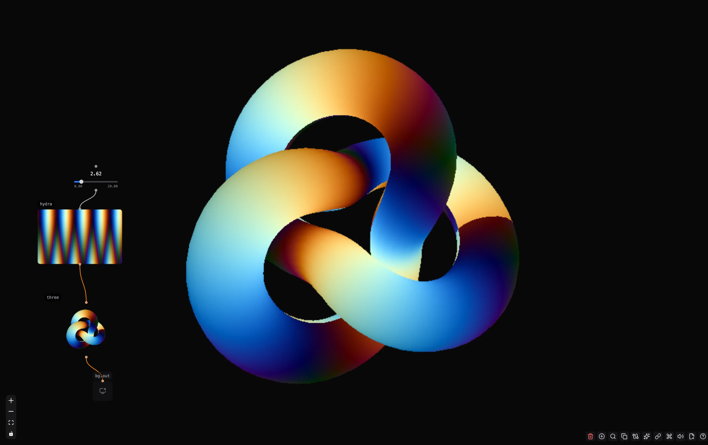

> ✨ Try this patch out [in the app](https://patchies.app/?id=1c484xkin7p7p2r)! It shows how you can use 2D textures from other objects in Three.js.

- [Three.js](https://threejs.org) is a powerful 3D graphics library for WebGL. Create 3D scenes, animations, and interactive visualizations in the browser.

- There are two flavors of three objects with a few differences:

  - `three`: Runs on the [rendering pipeline](#rendering-pipeline) and is performant when chaining to other video nodes. Can take
  - `three.dom`: Runs on the main thread. Supports interactivity via OrbitControls or custom handlers. Slower when chaining to other video nodes as it requires CPU-to-GPU pixel copy.

- The `draw()` function should be defined to draw every frame:

  ```js
  const { Scene, PerspectiveCamera, BoxGeometry, Mesh, MeshNormalMaterial } =
    THREE;

  const scene = new Scene();
  const camera = new PerspectiveCamera(75, width / height, 0.1, 1000);
  camera.position.z = 2;

  const geometry = new BoxGeometry(1, 1, 1);
  const material = new MeshNormalMaterial();
  const cube = new Mesh(geometry, material);
  scene.add(cube);

  function draw() {
    cube.rotation.x += 0.01;
    cube.rotation.y += 0.01;
    renderer.render(scene, camera);
  }
  ```

- You can call these special methods in the `three` object only:

  - `getTexture(inlet): THREE.Texture` gets the video input as Three.js texture. Only works with
  - `setVideoCount(ins, outs)` sets the number of video inlets and outlets (for video chaining).

- You can call these special methods in the `three.dom` object only:

  - `setCanvasSize(width, height)` resizes the output canvas size
  - `onKeyDown(callback)` receives keydown events
  - `onKeyUp(callback)` receives keyup events

- You can call these special methods in both `three` and `three.dom`:

  - `send(message)` and `recv(callback)`, see [Message Passing](#message-passing).
  - `fft()` for audio analysis, see [Audio Analysis](#audio-analysis)
  - `noDrag()` disables dragging the node.
  - `noOutput()` hides the video output port.
  - `setTitle(title)` sets the title of the node.
  - `setPortCount(ins, outs)` sets the number of message inlets and outlets
  - `setHidePorts(true | false)` sets whether to hide inlets and outlets

- As well as these variables:

  - `mouse.x` and `mouse.y` provides mouse position
  - `width` and `height` provides output size

- The Three.js context provides these variables:

  - `THREE`: the Three.js library
  - `renderer: WebGLRenderer`: the WebGL renderer from Three.js

- See the [Three.js documentation](https://threejs.org/docs) and [examples](https://threejs.org/examples) for more inspiration.
- Please consider supporting [mrdoob on GitHub Sponsors](https://github.com/sponsors/mrdoob)!

### `bchrn`: render the Winamp Milkdrop visualizer (Butterchurn)

- [Butterchurn](https://github.com/jberg/butterchurn) is a JavaScript port of the Winamp Milkdrop visualizer.
- You can use it as video source and connect it to other visual objects (e.g. `hydra` and `glsl`) to derive more visual effects.
- It can be very compute intensive. Use it sparingly otherwise your patch will lag. It also runs on the main thread, see [rendering pipeline](#rendering-pipeline) for more details.

### `img`: display images

- Load and display images from URLs or local files.
- Supports video chaining - can be used as texture sources for other visual objects.
- Messages
  - `string`: load the image from the given url.

### `video`: display videos

- Load and display images from URLs or local files.
- Supports audio and video chaining - can be used as texture and audio sources for other objects.
- Messages
  - `bang`: restart the video
  - `string`: load the video from the given url.
  - `play`: play the video
  - `pause`: pause the video
  - `{type: 'loop', value: false}`: do not loop the video

### `iframe`: embed web content

- Embed external web pages and interactive web content in your patches.
- Resizable iframe with customizable URL.
- Messages
  - `string` or `{type: 'load', url: 'https://...'}`: loads the webpage from the given URL.
- Double-click to enter a URL when no content is loaded.
- The iframe is sandboxed for security.

### `bg.out`: background output

- Set the final output that appears as the background.
- The endpoint for video chaining pipelines.
- Determines what the audience sees as the main visual.

### Programming & Control Objects

### `js`: A JavaScript code block

- Use `console.log()` to log messages to the virtual console.
- Use `setInterval(callback, ms)` to run a callback every `ms` milliseconds.
  - The code block has a special version of `setInterval` that automatically cleans up the interval on unmount. Do not use `window.setInterval` from the window scope as that will not clean up.
- Use `requestAnimationFrame(callback)` to run a callback on the next animation frame.
  - The code block has a special version of `requestAnimationFrame` that automatically cleans up on unmount. Do not use `window.requestAnimationFrame` from the window scope as that will not clean up.
- Use `send()` and `recv()` to send and receive messages between objects. This also works in other JS-based objects. See the [Message Passing](#message-passing) section above.
- Use `setRunOnMount(true)` to run the code automatically when the object is created. By default, the code only runs when you hit the "Play" button.
- Use `setPortCount(inletCount, outletCount)` to set the number of message inlets and outlets you want. By default, there is 1 inlet and 1 outlet.
  - Use `meta.inlet` in the `recv` callback to distinguish which inlet the message came from.
  - Use `send(data, { to: inletIndex })` to send data to a specific inlet of another object.
- Top-level awaits are supported.
  - Use `await delay(ms)` to pause the code for `ms` milliseconds. For example, `await delay(1000)` pauses the code for 1 second.

#### Importing JavaScript packages from NPM

> This feature is only available in `js`, `p5`, `canvas`, `textmode`, `three`, `three.dom`, `sonic~` and `elem~` objects, for now.

- You can import any JavaScript package by using the `npm:` prefix in the import statement.

  - This uses [esm.run](https://esm.run) under the hood to load the package from NPM.
  - This gets translated into top-level dynamic imports behind the scenes.
  - `import * as X` is not yet supported.

  ```js
  import Matter from "npm:matter-js";
  import { uniq } from "npm:lodash-es";

  console.log(Matter); // Matter.js library
  console.log(uniq([1, 1, 2, 2, 3, 3])); // [1, 2, 3]
  ```

- Alternatively, write the dynamic import yourself:

  ```js
  const { uniq } = await import("https://esm.run/lodash-es");
  console.log(uniq([1, 1, 2, 2, 3, 3])); // [1, 2, 3]

  // or use a shorthand `await esm()` function that does the same thing
  const { uniq } = await esm("lodash-es");
  console.log(uniq([1, 1, 2, 2, 3, 3])); // [1, 2, 3]
  ```

#### Sharing JavaScript across multiple `js` blocks

> This feature is only available in `js`, `p5`, `canvas`, `textmode`, `three`, `three.dom`, `sonic~` and `elem~` objects, for now.

You can share JavaScript code across multiple `js` blocks by using the `// @lib <module-name>` comment at the top of your code, and exporting at least one constant, function, class, or module.

- For example, adding `// @lib foobar` on top of the code snippet with an exported constant, function, class, or module will register the module as `foobar`.
  - This will turn the object into a library object, as shown by the package icon.
- You must use the ES modules `export` syntax in your library `js` object, e.g. `export const rand = () => Math.random()`. This works for everything: classes, functions, modules.
  - Note that the constants are NOT shared across objects. Each object has their own isolated execution context. You cannot create shared singletons. Use [message passing](#message-passing) to communicate between objects.
- You can then use ES modules syntax like `import { rand } from 'foobar'` from other objects that supports this feature.

See the following example:


### `expr`: expression evaluator

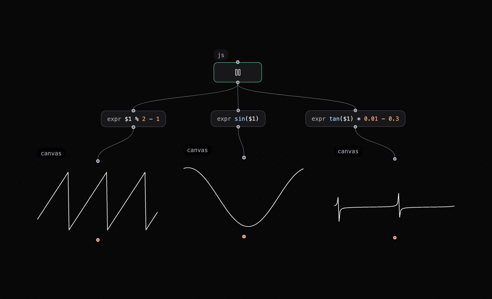

> ✨ Try this patch out [in the app](https://patchies.app/?id=c6adsknw8iix3m2)!

- Evaluate expressions and formulas.
- Use the `$1` to `$9` variables to create inlets dynamically. For example, `$1 + $2` creates two inlets for addition.
- This uses the [expr-eval](https://github.com/silentmatt/expr-eval) library from silentmatt under the hood for evaluating expressions.
- There are so many functions and operators you can use here! See the [expression syntax](https://github.com/silentmatt/expr-eval?tab=readme-ov-file#expression-syntax) section.
- Very helpful for control signals and parameter mapping.
- This works with non-numbers too! You can use it to access object fields and work with arrays.
- You can also create variables and they are multi-line. Make sure to use `;` to separate statements. For example:

  ```js
  a = $1 * 2;
  b = $2 + 3;
  a + b;
  ```

- You can also [define functions](https://github.com/silentmatt/expr-eval?tab=readme-ov-file#function-definitions) to make the code easier to read, e.g. `add(a, b) = a + b`.

#### Hot and cold inlets

The `expr` object follows the Max and Pd convention of **hot** and **cold** inlets:

- **Inlet 0 (hot)**: When a message arrives at the first inlet (`$1`), the expression is evaluated and the result is sent to the outlet.
- **Inlets 1+ (cold)**: When a message arrives at other inlets (`$2`, `$3`, etc.), the value is stored but no output is triggered. The stored values are used the next time inlet 0 receives a message.

This allows you to set up multiple values before triggering a computation. Use [the trigger object](#the-trigger-object) to control the order of execution when you need to update multiple inlets and then trigger the output.

### `uxn`: Uxn virtual machine


- [Uxn](https://100r.co/site/uxn.html) is a virtual machine for running small programs written in [Uxntal](https://wiki.xxiivv.com/site/uxntal.html), an assembly language for the Uxn stack machine. Conforms with the [Varvara](https://wiki.xxiivv.com/site/varvara.html) device specifications.
- Run classic Uxn programs like [Orca](https://100r.co/site/orca.html) and [Left](https://100r.co/site/left.html). Run games like [Oquonie](https://hundredrabbits.itch.io/oquonie) and [Donsol](https://hundredrabbits.itch.io/donsol).
- Supports video chaining - connect the video outlet to other visual objects (e.g. `hydra` and `glsl`) to process the Uxn screen output.
- Console output is automatically sent as messages through the message outlet, allowing you to process program output with other objects.
- Load ROM files by dropping a `.rom` file, or use the Load ROM button (folder icon)
- "Console" button (terminal icon) shows program output
  - Console output is automatically sent as string messages through the message outlet.
- "Pause" button pauses and resumes program execution.
- The canvas captures keyboard and mouse input for Uxn programs. Click on the canvas to focus it.

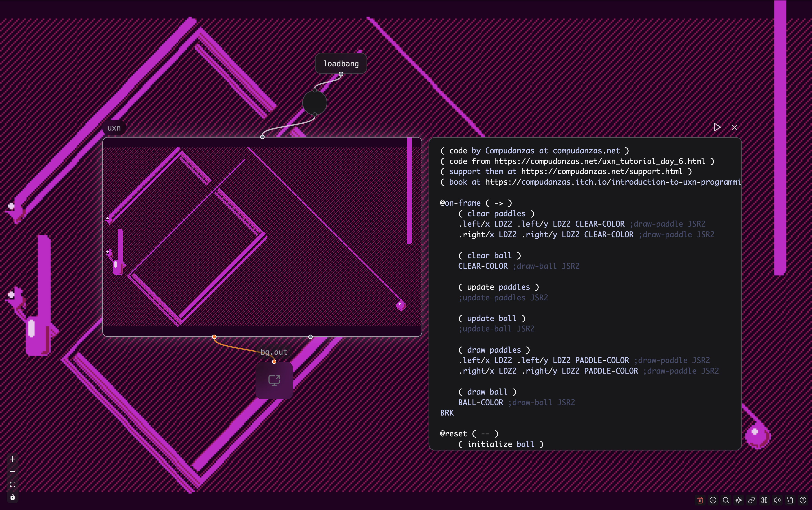

> ✨ Try this patch out [in the app](https://patchies.app/?id=z7rtmujmtvbv0e0)! Code is by [Compudanzas' Uxn tutorial](https://compudanzas.net/uxn_tutorial_day_6.html). If you like their tutorial, please go [support](https://compudanzas.net/support.html) them!

- Write and assemble your own Uxntal programs directly in the editor!

  - "Edit Code" button opens the Uxntal assembly code editor.
  - Press `Shift + Enter` or click "Assemble & Load" to compile and run your code.
  - Assembler errors are displayed below the node.

- Messages

  - `string`
    - If starts with `http://` or `https://`, loads ROM from URL.
    - Otherwise, it treats the string as Uxntal code to assemble and load.
  - `bang`: Re-assembles and loads code if available, or reloads ROM from URL if available.
  - `Uint8Array`: Load ROM from raw binary data
  - `File`: Load ROM from file object
  - `{type: 'load', url: string}`: Load ROM from URL
  - Outputs string messages from console device

- Auto-loading behavior:

  - On object mount, if code is provided (and no URL/ROM), the code is assembled and loaded automatically.
  - On object mount, if URL is provided (and no code/ROM), the ROM is loaded from the URL automatically.

- See the [Uxn documentation](https://wiki.xxiivv.com/site/uxn.html) and [Uxntal reference](https://wiki.xxiivv.com/site/uxntal_reference.html) to learn how to write Uxn programs.
- Check out [100r.co](https://100r.co) for Uxn design principles.
- See [Awesome Uxn](https://github.com/hundredrabbits/awesome-uxn) for cool resources and projects from the Uxn community.
- Please consider supporting [Hundred Rabbits on Patreon](https://www.patreon.com/hundredrabbits) for their amazing work on Uxn and Orca!

### `asm`: virtual stack machine assembly interpreter

`asm` lets you write a simple flavor of stack machine assembly to construct concise programs. This was heavily inspired by Zachtronic games like [TIS-100](https://en.wikipedia.org/wiki/TIS-100) and [Shenzhen I/O](https://en.wikipedia.org/wiki/Shenzhen_I/O), where you write small assembly programs to interact with the world and solve problems:


The stack machine module is quite extensive, with over 50 assembly instructions and a rich set of features. There are lots of quality-of-life tools unique to Patchies like color-coded memory region visualizer, line-by-line instruction highlighting, and external memory cells (`asm.mem`).

See the [documentation for assembly module](./modules/vasm/README.md) to see the full instruction sets and syntax, what the `asm` object and its friends can do, and how to use it.

Try out my [example assembly patch](https://patchies.app/?id=6pyirxuw3cqvwhg) to get a feel of how it works.

### `python`: creates a Python code environment

- Run Python code directly in the browser using [Pyodide](https://pyodide.org/en/stable/).
- Great for data processing, scientific computing, and algorithmic composition.
- Full Python standard library available.

### Interface & Control Objects

### `button`: a simple button

- Sends the `bang` message when clicked.
- Messages:
  - `any`: flashes the button when it receives any message, and outputs the `bang` message out.

### `msg`: message object

- Store and send predefined messages.
- Click to send the stored message to connected objects.
- Good for triggering sequences or sending configuration data.
- You can hit `Enter` and type `m <message>` to create a `msg` object with the given message.
  - Example: `m start` creates a `msg` object that sends `start` when clicked.
- Message format:
  - Bare strings (e.g. `hello` or `start`) are sent as **objects with type field**: i.e. `{type: 'hello'}` or `{type: 'start'}`
  - Quoted strings (e.g. `"hello"`) are sent as **JS strings**: `"hello"`
  - Numbers (e.g. `100`) are sent as **numbers**: `100`
  - JSON objects (e.g. `{foo: 'bar'}`) are sent **as-is**: `{foo: 'bar'}`
  - You can use the [JSON5 syntax](https://json5.org) to create the JSON objects.
- Examples
  - `bang` sends `{type: 'bang'}` object - this is what `button` does when you click it
  - `start` sends `{type: 'start'}` object
  - `'hello world'` or `"hello world"` sends the string `'hello world'`
  - `100` sends the number `100`
  - `{x: 1, y: 2}` sends the object `{x: 1, y: 2}`
- Messages:
  - `bang`: outputs the message

#### Placeholders and hot/cold inlets

You can use placeholders from `$1` - `$9` to send messages with stored variables. This is very helpful if you have a message like `{type: 'noteOn', note: $1, velocity: 100}` and you need the note to be dynamic.

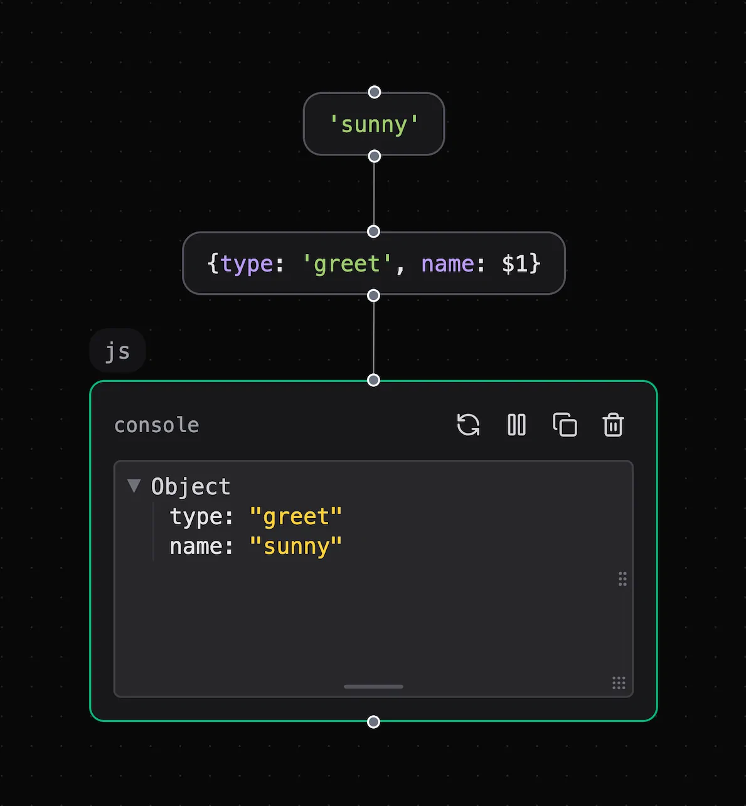

The `msg` object follows the Max and Pd convention of **hot** and **cold** inlets:

- **No placeholders**: A single inlet that triggers output on any message (bang or value).
- **1 placeholder (`$1`)**: A single hot inlet. Sending a value stores it as `$1` and triggers output. Sending a bang triggers output with the current stored value.
- **2+ placeholders (`$1`, `$2`, etc.)**: First inlet is hot (`$1`), rest are cold (`$2`, `$3`, etc.). Cold inlets store values without triggering. Send values to cold inlets first, then trigger via the hot inlet. Use [the trigger object](#the-trigger-object) to do this.

### `slider`: numerical value slider

- Continuous value control with customizable range.
- Perfect for real-time parameter adjustment.
- Outputs numeric values that can control other objects.
- Hit `Enter` and type in these short commands to create sliders with specific ranges:
  - `slider <min> <max>`: integer slider control. example: `slider 0 100`
  - `fslider <min> <max>`: floating-point slider control. example: `fslider 0.0 1.0`. `fslider` defaults to `-1.0` to `1.0` range if no arguments are given.
  - `vslider <min> <max>`: vertical integer slider control. example: `vslider -50 50`
  - `vfslider <min> <max>`: vertical floating-point slider control. example: `vfslider -1.0 1.0`. `vfslider` defaults to `-1.0` to `1.0` range if no arguments are given.
- Messages:
  - `bang`: outputs the current slider value
  - `number`: sets the slider to the given number within the range and outputs the value
- When a patch is loaded, the slider will output its current value automatically 100ms after the patch loads.

### `textbox`: multi-line text input

- Create a multi-line textbox for user input.
- Messages:
  - `bang`: outputs the current text
  - `string`: sets the text to the given string

### Audio & Music Objects

### `orca`: Orca livecoding sequencer


- [Orca](https://github.com/hundredrabbits/Orca) is an esoteric programming language where every character is an operation that runs sequentially every frame.
- Create procedural sequences with 26 letter operators (A-Z) and special symbols for MIDI control.
- Try out [this demo](https://patchies.app/?id=ks1srq082zkp4qb) for a silly little procedurally-generated lullaby. Don't fall asleep!
- See [the Orca docs](https://github.com/hundredrabbits/Orca/blob/main/README.md) for how to use it.
- **Output-agnostic**: Orca emits standard Patchies MIDI messages (`noteOn, noteOff, controlChange`)
  - Connect the outlet to `midi.out` for MIDI output to hardware.
  - Try the `poly-synth-midi.tone` preset, which uses the `tone~` node to playback MIDI messages with a polyphonic synth.
- **Controls**:
  - Click on the canvas and type characters to edit the grid
  - Space to play/pause
  - `Enter` or `ctrl+f` advances one frame
  - `ctrl+shift+r` resets frame
  - Settings button lets you update BPM, font size and grid size
  - `>` increases tempo and `<` decreases tempo
- **Attribution**: Based on the original Orca by Hundred Rabbits, licensed under [MIT License](https://github.com/hundredrabbits/Orca/blob/main/LICENSE.md).
- Please consider supporting [Hundred Rabbits on Patreon](https://www.patreon.com/hundredrabbits) for their amazing work on Orca and Uxn!

### `strudel`: Strudel music environment

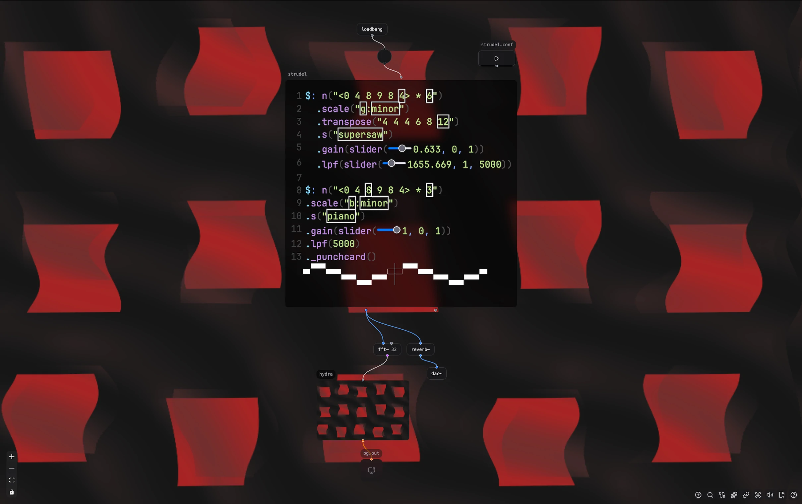

> ✨ Try this patch out [in the app](https://patchies.app/?id=rtjfuwsnvame8bb)!

- [Strudel](https://strudel.cc) is a live coding environment based on TidalCycles. You can use it to expressively write dynamic music pieces, as well as create complex audio patterns and effects.
- See the [Strudel workshop](https://strudel.cc/workshop/getting-started) to learn how to use Strudel.
- Check out the [Strudel showcase](https://strudel.cc/intro/showcase) to get inspirations with how people use Strudel.
- Use `Ctrl/Cmd + Enter` to re-evaluate the code.
- Don't forget to connect the `dac~` object to hear the audio output.
- Messages
  - `bang` or `run`: evaluates the code and starts playback
  - string or `{type: 'set', code: '...'}`: sets the code in the editor
  - `{type: 'setFontSize', value: 18}`: sets the font size of the editor.
  - `{type: 'setFontFamily', value: 'JetBrains Mono, monospace'}`: sets the font family of the editor. fallback is allowed.
  - `{type: 'setStyles', value: {container: 'background: transparent'}}`: sets custom styles for editor container.
    - you can apply blur and padding with CSS here.
- Try out the [funk42 preset by froos](https://patchies.app/?id=zntnikb36c47eaw) for a more complex use of Strudel.
- Limitations
  - `recv` only works with a few functions, e.g. `setcpm` right now. Try `recv(setcpm)` to automate the cpm value.
- You can create multiple instances of `strudel` object, but only **one** will be playing at a time.
  - You can use the `bang` or `run` messages to switch playback between multiple Strudel objects to orchestrate them.
- Please consider supporting the development of TidalCycles and Strudel at [OpenCollective](https://opencollective.com/tidalcycles)!

### `chuck~`: creates a ChucK audio programming environment

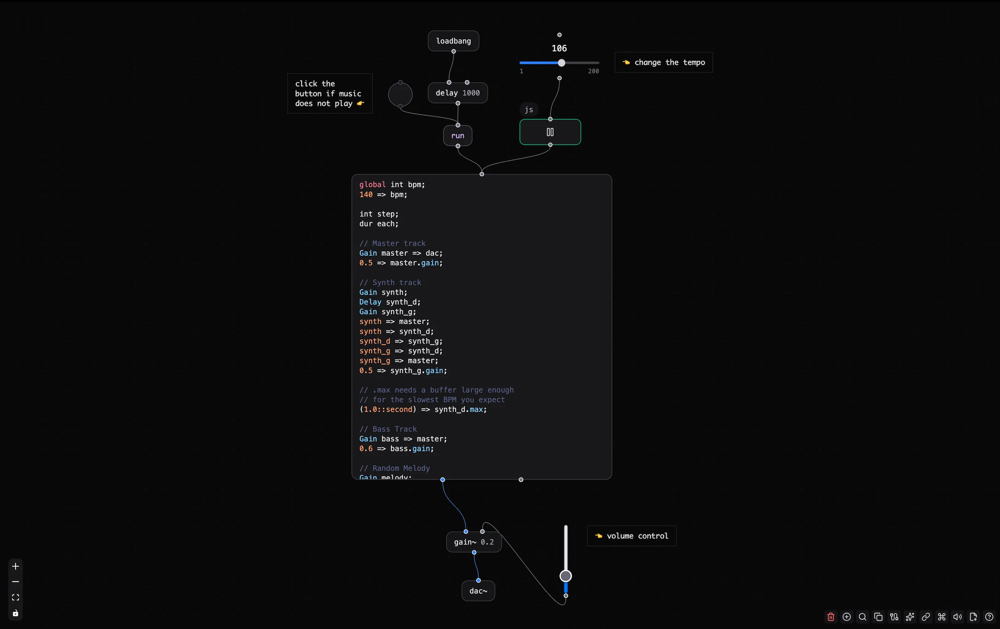

> ✨ Try this patch out [in the app](https://patchies.app/?id=2nyuznzjgbp2j0a)! This is from @dtinth's [ChucK experiments](https://dt.in.th/ChucKSong4).

- [ChucK](https://chuck.cs.princeton.edu) is a programming language for real-time sound synthesis and music creation.
- Great for algorithmic composition and sound design.
- Runs in the browser via [WebChucK](https://chuck.cs.princeton.edu/webchuck/).
- Actions
  - Replace Shred `Ctrl/Cmd + Enter`: replaces the most recent shred.
    - If there is no previous shred, it creates a new shred.
  - Add Shred `Ctrl/Cmd + \`: adds a new shred to the shreds list.
  - Remove Shred `Ctrl/Cmd + Backspace`: removes the most recent shred.
  - Click on the gear button to see list of running shreds. Remove any shred by clicking on the "x" button.
- Messages: playback and shred control
  - string: adds the string expression as a new shred
  - `bang`, `replace` or `run`: replaces the most recent shred with the current expression
  - `add`: adds the current expression as a new shred
  - `remove`: removes the last shred
  - `stop`: stops all shreds
  - `clearAll`: clears all shreds
  - `{type: 'replace', code: string}`: replaces the most recent shred with the given code
- Messages: global variables and events
  - The [above demo patch](https://patchies.app/?id=2nyuznzjgbp2j0a) shows how global variables lets you control ChucK programs with Patchies messages.
  - To use global variables, declare your variable with `global` (e.g. `global int bpm`) and make sure all dependent variables are re-computed in a loop.
  - `{type: 'set', key: string, value: any}`: sets a chuck global value / array (can be string, int or float)
    - Make sure your variable types match! If you try to pass an int (e.g. 140) to a `global bpm float` of `140.0` it would not work. Try `setInt` or `setFloat` if there is an issue.
  - `{type: 'setInt', key: string, value: any}`: sets a chuck global integer value / array
  - `{type: 'setFloat', key: string, value: any}`: sets a chuck global float value / array
  - `{type: 'signal', event: string}`: signal an event by name
  - `{type: 'broadcast', event: string}`: broadcast an event by name

### `object`: textual object system

- Supports a wide range of audio processing, control, and utility objects.
- Create a textual object by pressing `Enter`, and type in the name of the object you want to create.
- Hover over the inlet name to see a tooltip with description of what the inlet's type are, and what values it does accept.
  - Try to hover over a `gain~` object's gain value (e.g. `1.0`) to see the tooltip.

#### Control objects

These objects run on _control rate_, which means they process messages (control signals), but not audio signals.

- `mtof`: Convert MIDI note numbers to frequencies
- `loadbang`: Send bang on patch load
- `metro`: Metronome for regular timing
- `delay`: Message delay (not audio)
- `adsr`: ADSR envelope generator
- `trigger` (alias `t`): Send messages through multiple outlets in right-to-left order
- `spigot`: Message gate that allows or blocks data based on a condition

Most of these objects are easy to re-implement yourself with the `js` object as they simply emit messages, but they are provided for your convenience!

#### The `trigger` object

The `trigger` object (shorthand: `t`) is essential for controlling message order and working with hot/cold inlets. It sends messages through multiple outlets in **right-to-left order**.

**Usage:** `trigger <type1> <type2> ...` or `t <type1> <type2> ...`

**Type specifiers:**

- `b` or `bang`: Always sends `{type: 'bang'}`
- `a` or `any`: Passes the input unchanged
- `n/f` or `number/float`: Passes only if input is a number (JS `Number` object)
- `l` or `list`: Passes only if input is an array
- `o` or `object`: Passes only if input is a plain object (not array)
- `s` or `symbol`: Passes only if input is an object with a `type` key or a `Symbol`

**Example:** `t b n` creates two outlets. When it receives the number `42`:

1. First, outlet 1 (right) sends `42`
2. Then, outlet 0 (left) sends `{type: 'bang'}`

This right-to-left order is crucial for setting up cold inlets before triggering hot inlets. For example, to properly update an `expr $1 + $2` object:

```text
[slider] ──┬──► [t b a] ──► outlet 0 (bang) ──► expr inlet 0 (hot, triggers output)
           │           └──► outlet 1 (value) ──► expr inlet 1 (cold, stores value)
```

The trigger ensures the value reaches the cold inlet (`$2`) before the bang triggers the hot inlet (`$1`).

#### Audio objects

These objects run on _audio rate_, which means they process audio signals in real-time. They are represented with a `~` suffix in their names.

**Audio Processing:**

- `gain~`: Amplifies audio signals with gain control
- `osc~`: Oscillator for generating audio waveforms (sine, square, sawtooth, triangle)
- `lowpass~`, `highpass~`, `bandpass~`, `allpass~`, `notch~`: Various audio filters
- `lowshelf~`, `highshelf~`, `peaking~`: EQ filters for frequency shaping
- `compressor~`: Dynamic range compression for audio
- `pan~`: Stereo positioning control
- `delay~`: Audio delay line with configurable delay time
- `+~`: Audio signal addition
- `sig~`: Generate constant audio signals
- `waveshaper~`: Distortion and waveshaping effects
- `convolver~`: Convolution reverb using impulse responses
  - To input the impulse response, connect a `soundfile~` object to the `convolver~` object's `message` inlet. Then, upload a sound file or send a url as an input message.
  - Then, send a `read` message to the `soundfile~` object to read the impulse response into the `convolver~` object.
  - The sound file must be a valid [impulse response](https://en.wikipedia.org/wiki/Impulse_response) file. It is a usually a short audio file with a single impulse followed by reverb tail. You can clap your hands in a room and record the sound to create your own impulse response.
- `split~`: Split multi-channel audio into separate mono channels.
  - Use the settings button to set the number of output channels.
- `merge~`: Merge multiple mono channels into a single multi-channel audio.
  - Use the settings button to set the number of input channels.
- `fft~`: FFT analysis for frequency domain processing. See the [audio analysis](#audio-analysis) section for how to read the FFT data.
- `meter~`: Visual audio level meter that shows the loudness of the audio source.

**Sound Input and Output:**


> Try out the [drum sequencer](https://patchies.app/?id=b2vsbbe4jt87qyz): use `P` to play and `K` to stop!

- `soundfile~`: Load and play audio files with transport controls
- `sampler~`: Sample playback with triggering capabilities, see [sampler~](#sampler-audio-sampler-with-recording-and-playback)
- `mic~`: Capture audio from microphone input
- `dac~`: Send audio to speakers

#### Using periodic waves in `osc~` oscillator

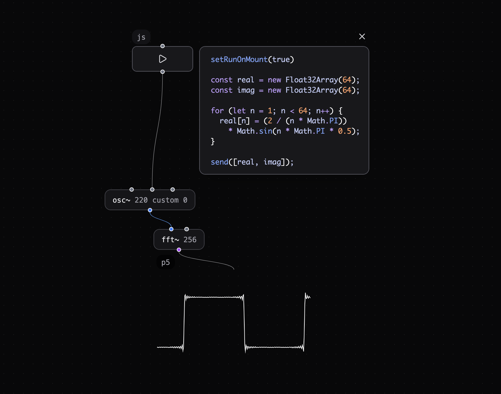

> ✨ Try this patch out [in the app](https://patchies.app/?id=ocj3v2xp790gq8u)!

The `osc~` oscillator object supports custom waveforms using [PeriodicWave](https://developer.mozilla.org/en-US/docs/Web/API/PeriodicWave) by sending `[real: Float32Array, imaginary: Float32Array]` to the type inlet. Both arrays must be Float32Array or TypedArray of the same length (minimum 2).

1. Create a `js` object
2. Connect it to `osc~`'s `type` inlet (second message inlet from the left)'
3. Paste the below code snippet in.
4. Hit `Run` on the `js` object to send the arrays to the `osc~` object.
5. The `type` property on the object should say "custom" now.

```js
setRunOnMount(true);

const real = new Float32Array(64);
const imag = new Float32Array(64);

for (let n = 1; n < 64; n++) {
  real[n] = (2 / (n * Math.PI)) * Math.sin(n * Math.PI * 0.5);
}

send([real, imag]);
```

#### Using custom distortion curves in the `waveshaper~`

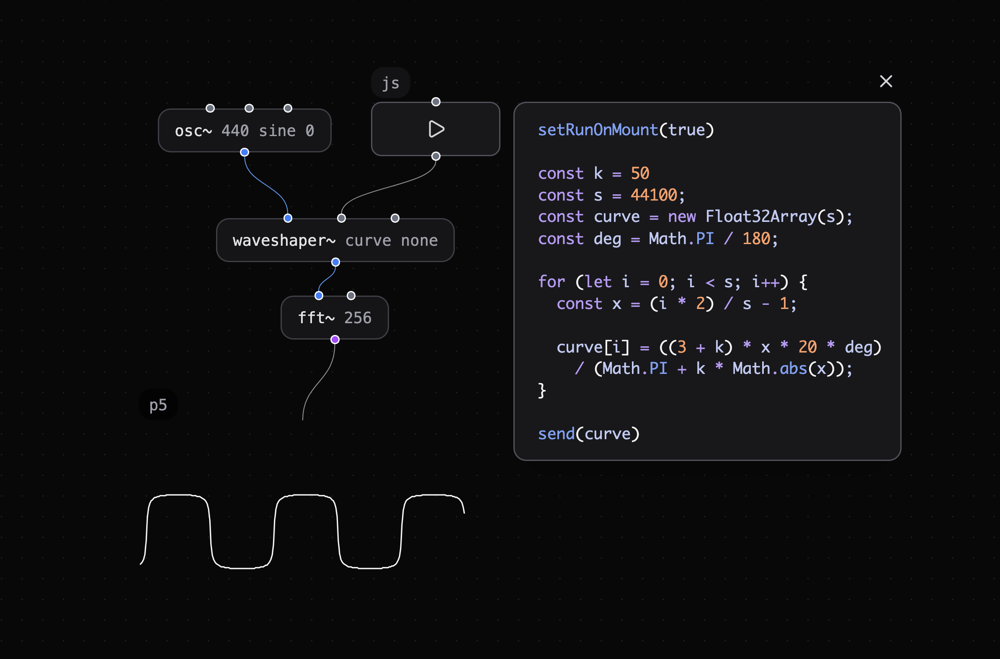

> ✨ Try this patch out [in the app](https://patchies.app/?id=55oju82ir1ujko1)!

Similar to the periodic wave example above, you can also send a [wave shaping distortion curve](https://developer.mozilla.org/en-US/docs/Web/API/WaveShaperNode) to the `curve` inlet of the `waveshaper~`. It expects a single `Float32Array` describing the distortion curve.

1. Create a `js` object
2. Connect it to `waveshaper~`'s `curve` inlet (second message inlet from the left)'
3. Paste the below code snippet in.
4. Hit `Run` on the `js` object to send the array to the `waveshaper~` object.
5. The `curve` property on the object should say "curve" now.

Here's an example distortion curve:

```js
setRunOnMount(true);

const k = 50;
const s = 44100;
const curve = new Float32Array(s);
const deg = Math.PI / 180;

for (let i = 0; i < s; i++) {
  const x = (i * 2) / s - 1;
  curve[i] = ((3 + k) * x * 20 * deg) / (Math.PI + k * Math.abs(x));
}

send(curve);
```

#### Notes on audio objects

- Most of the audio objects correspond to Web Audio API nodes. See the [Web Audio API](https://developer.mozilla.org/en-US/docs/Web/API/Web_Audio_API) documentation on how they work under the hood.
- You can re-implement most of these audio objects yourself using the `dsp~`, `expr~`, `tone~`, `elem~` or `sonic~` objects. In fact, the default `dsp~`, `tone~` and `elem~` objects are simple sine wave oscillators that work similar to `osc~`.

### `sampler~`: audio sampler with recording and playback

The `sampler~` object records audio from connected sources into a buffer and plays it back with loop points, playback rate, and detune control. It's useful for sampling audio from other nodes, creating loops, and building sample-based instruments.

- Buttons: record (circle), play sample, open settings
- Settings: playback start/end, loop on/off, playback rate, detune in cents

**Messages**

- `play` / `bang`: play the recorded sample
- `record`: start recording audio from connected sources
- `end`: stop recording
- `stop`: stop playback
- `loop`: toggle loop and start loop playback
- `{type: 'loop', start: 0.5, end: 2.0}`: set loop points (in seconds) and play
- `loopOn`: enable loop mode
- `{type: 'loopOn', start: 0.5, end: 2.0}`: enable loop with specific points
- `loopOff`: Disable loop mode
- `{type: 'setStart', value: 0.5}` - start playback at 0.5 seconds
- `{type: 'setEnd', value: 2.0}` - end playback at 2.0 seconds
- `{type: 'setPlaybackRate', value: 2.0}` - play at double speed
- `{type: 'setPlaybackRate', value: 0.5}` - play at half speed
- `{type: 'setDetune', value: 1200}` - pitch up one octave
- `{type: 'setDetune', value: -1200}` - pitch down one octave

### `expr~`: audio-rate mathematical expression evaluator

- Similar to `expr` but runs at audio rate for audio signal processing.
- Double click to edit the expression.
- Use `shift+enter` to re-run the expression.
  - Exiting the editing mode by clicking outside of the `expr~` object will also re-run the expression.
- This uses the same [expr-eval](https://github.com/silentmatt/expr-eval) library as `expr`, so the same mathematical expression will work in both `expr` and `expr~`.
- This is useful for creating DSPs (digital signal processors) to generate audio effects.
- It requires an audio source to work. You can use `sig~` if you just need a constant signal.
- It accepts many DSP variables:
  - `s`: current sample value, a float between -1 and 1
  - `i`: current sample index in buffer, an integer starting from 0
  - `t`: current time in seconds, a float starting from 0
  - `channel`: current channel index, usually 0 or 1 for stereo
  - `bufferSize`: the size of the audio buffer, usually 128
  - `samples`: an array of samples from the current channel
  - `input`: first input audio signal (for all connected channels), a float between -1 and 1
  - `inputs`: every connected input audio signal
  - `$1` to `$9`: dynamic control inlets
- Example:
  - `sin(t * 440 * PI * 2)` creates a sine wave oscillator at 440Hz
  - `random()` creates white noise
  - `s` outputs the input audio signal as-is
  - `s * $1` applies gain control to the input audio signal
  - `s ^ 2` squares the input audio signal for distortion effect
- You can create variables from `$1` to `$9` to create dynamic control inlets.
  - For example, `$1 * 440` creates one message inlet that controls the frequency of a sine wave oscillator.
  - You can then attach a `slider 1 880` object to control the frequency.
- **WARNING**: Please use the `compressor~` object with appropriate limiter-esque setting after `expr~` to avoid loud audio spikes that can and will damage your hearing and speakers. You have been warned!
- Here are some patches you can play with!
  - [scales](https://patchies.app/?id=tfjdf019hjyxmeu) by [@kijjazz](https://www.instagram.com/kijjaz/)
    - alt ver: [sleep](https://patchies.app/?id=xhdtrqenaf6ur81)
  - [kicks](https://patchies.app/?id=jf7n1ku67auc5xg) by [@dtinth](https://dt.in.th)

### `dsp~`: dynamic JavaScript DSP processor

This is similar to `expr~`, but it takes in a single `process` JavaScript function that processes the audio. It essentially wraps an `AudioWorkletProcessor`. The worklet is always kept alive until the node is deleted.

Try out some patches that uses `dsp~` to get an idea of its power:

- [INFINITELY DESCENDING CHORD PROGRESSION (v1.2)](https://patchies.app/?id=ip0chhw6jzuyo6x) by [@dtinth](https://dt.in.th). [code explanation](https://notes.dt.in.th/InfinitelyDescendingChord).

Some presets are also built on top of `dsp~`:

- `snapshot~`: takes a snapshot of the incoming audio's first sample and outputs it.

Here's how to make white noise:

```ts
function process(inputs, outputs) {
  outputs[0].forEach((channel) => {
    for (let i = 0; i < channel.length; i++) {
      channel[i] = Math.random() * 1 - 1;
    }
  });
}
```

Here's how to make a sine wave oscillator at 440Hz:

```ts
function process(inputs, outputs) {
  outputs[0].forEach((channel) => {
    for (let i = 0; i < channel.length; i++) {
      let t = (currentFrame + i) / sampleRate;
      channel[i] = Math.sin(t * 440 * Math.PI * 2);
    }
  });
}
```

You can use the `counter` variable that increments every time `process` is called. There are also a couple more variables from the worklet global that you can use.

```ts
const process = (inputs, outputs) => {
  counter; // increments every time process is called
  sampleRate; // sample rate (e.g. 48000)
  currentFrame; // current frame number (e.g. 7179264)
  currentTime; // current time in seconds (e.g. 149.584)
};
```

You can use `$1`, `$2`, ... `$9` to dynamically create value inlets. Message sent to the value inlets will be set within the DSP. The number of inlets and the size of the `dsp~` object will adjust automatically.

```ts
const process = (inputs, outputs) => {
  outputs[0].forEach((channel) => {
    for (let i = 0; i < channel.length; i++) {
      channel[i] = Math.random() * $1 - $2;
    }
  });
};
```

In addition to the value inlets, we also have messaging capabilities:

- Use `setPortCount(inletCount, outletCount)` to set the number of message inlets.
  - By default, there is no message inlet and outlet.
- Use `setAudioPortCount(inletCount, outletCount)` to set the number of audio inlets and outlets.
  - By default, there is 1 audio inlet and 1 audio outlet.
- Use `setTitle(title)` to set the title of the object.
  - By default, the title is `dsp~`.
  - This lets you create custom objects with meaningful names.
- Use `setKeepAlive(enabled)` to control whether the worklet stays active when not connected.
  - `setKeepAlive(true)` keeps the worklet processing even when no audio is flowing through it.
  - (default) `setKeepAlive(false)` lets the worklet to stop processing when it's not connected to other audio nodes, which can improve performance.
  - see `snapshot~` and `bang~` presets for examples on when to use `setKeepAlive`
- Use `send` and `recv` to communicate with the outside world. See [Message Passing](#message-passing).

```ts
setPortCount(2);

recv((msg, meta) => {
  if (meta.inlet === 0) {
    // do something
  }
});
```

You can even use both value inlets and message inlets together in the DSP.

```ts
let k = 0;

recv((m) => {
  // you can use value inlets `$1` ... `$9` anywhere in the JavaScript DSP code.
  k = m + $1 + $2;
});

const process = (inputs, outputs) => {
  outputs[0].forEach((channel) => {
    for (let i = 0; i < channel.length; i++) {
      channel[i] = Math.random() * k;
    }
  });
};
```

### `tone~`: Tone.js synthesis and processing

The `tone~` object allows you to use [Tone.js](https://tonejs.github.io/) to create interactive music. Tone.js is a powerful Web Audio framework that provides high-level abstractions for creating synthesizers, effects, and complex audio routing.

By default, `tone~` adds a sample code for sine oscillator.

The Tone.js context gives you these variables:

- `Tone`: the Tone.js library
- `inputNode`: GainNode from Web Audio API for receiving audio input from other nodes
- `outputNode`: GainNode from Web Audio API for sending audio output to connected nodes

In addition to the audio processing capabilities, `tone~` also supports messaging:

- Use `setPortCount(inletCount, outletCount)` to set the number of message inlets and outlets.
  - By default, there are no message inlets or outlets.
- Use `setTitle(title)` to set the title of the object.
  - By default, the title is `tone~`.
  - This lets you create custom objects with meaningful names.
- Use `send` and `recv` to communicate with the outside world. See [Message Passing](#message-passing).

Try out these presets:

- `poly-synth.tone`: Polyphonic synthesizer that plays chord sequences
- `lowpass.tone` - low pass filters
- `pipe.tone` - directly pipe input to output

Code example:

```js
// Process incoming audio through a filter
const filter = new Tone.Filter(1000, "lowpass");
inputNode.connect(filter.input.input);
filter.connect(outputNode);

// Handle incoming messages to change frequency
recv((m) => {
  filter.frequency.value = m;
});

// Return cleanup function to properly dispose Tone.js objects
return {
  cleanup: () => filter.dispose(),
};
```

- Please consider supporting [Yotam Mann on GitHub Sponsors](https://github.com/sponsors/tambien), the creator of Tone.js!

### `sonic~`: SuperCollider synthesis engine

The `sonic~` object integrates [SuperSonic](https://sonic-pi.net/supersonic/demo.html), which brings SuperCollider's powerful `scsynth` audio engine to the browser via AudioWorklet.

By default, `sonic~` loads and triggers the Prophet synth on message.

The `sonic~` context provides:

- `sonic`: SuperSonic instance for synthesis control
- `SuperSonic`: Class for static methods (e.g., `SuperSonic.osc.encode()`)
- `sonicNode`: Audio node wrapper (`sonic.node`) for Web Audio connections
- `on(event, callback)`: Subscribe to SuperSonic events
- `inputNode`: Audio input GainNode
- `outputNode`: Audio output GainNode

Available events: `'ready'`, `'loading:start'`, `'loading:complete'`, `'error'`, `'message'`

In addition to the synthesis capabilities, `sonic~` also supports messaging:

- Use `setPortCount(inletCount, outletCount)` to set the number of message inlets and outlets.
  - By default, there are no message inlets or outlets.
- Use `setTitle(title)` to set the title of the object.
  - By default, the title is `sonic~`.
  - This lets you create custom objects with meaningful names.
- Use `send` and `recv` to communicate with the outside world. See [Message Passing](#message-passing).

Load and play a synth:

```js
setPortCount(1);

await sonic.loadSynthDef("sonic-pi-prophet");

recv((note) => {
  sonic.send(
    "/s_new",
    "sonic-pi-prophet",
    -1,
    0,
    0,
    "note",
    note,
    "release",
    2
  );
});
```

Load and play samples:

```js
await sonic.loadSynthDef("sonic-pi-basic_stereo_player");
await sonic.loadSample(0, "loop_amen.flac");
await sonic.sync();

sonic.send(
  "/s_new",
  "sonic-pi-basic_stereo_player",
  -1,
  0,
  0,
  "buf",
  0,
  "rate",
  1
);
```

See the [SuperSonic documentation](https://github.com/samaaron/supersonic) and [scsynth OSC reference](http://doc.sccode.org/Reference/Server-Command-Reference.html) for more details.

Please consider supporting [Sam Aaron on Patreon](https://www.patreon.com/samaaron), the creator of Sonic Pi and SuperSonic!

### `elem~`: Elementary Audio synthesis and processing

The `elem~` object lets you use the [Elementary Audio](https://www.elementary.audio) library, a declarative digital audio signal processing.

By default, `elem~` adds a sample code for a simple sine wave oscillator.

The `elem~` context gives you these variables:

- `el`: the Elementary Audio core library
- `core`: the WebRenderer instance for rendering audio graphs
- `node`: the AudioWorkletNode for connecting to the Web Audio graph
- `inputNode`: GainNode from Web Audio API for receiving audio input from other nodes
- `outputNode`: GainNode from Web Audio API for sending audio output to connected nodes

In addition to the audio processing capabilities, `elem~` also supports messaging:

- Use `setPortCount(inletCount, outletCount)` to set the number of message inlets and outlets.
  - By default, there are no message inlets or outlets.
- Use `setTitle(title)` to set the title of the object.
  - By default, the title is `elem~`.
  - This lets you create custom objects with meaningful names.
- Use `send` and `recv` to communicate with the outside world. See [Message Passing](#message-passing).

Here's how to create a simple phasor:

```js
setPortCount(1);

let [rate, setRate] = core.createRef(
  "const",
  {
    value: 440,
  },
  []
);

recv((freq) => setRate({ value: freq }));

// also try el.train and el.cycle in place of el.phasor
// first arg is left channel, second arg is right channel
core.render(el.phasor(rate), el.phasor(rate));
```

- Please consider supporting [Nick Thompson on GitHub Sponsors](https://github.com/sponsors/nick-thompson), the creator of Elementary Audio!

### `csound~`: Sound and music computing

> [!CAUTION]
> You must only create one `csound~` object per patch, for now. Creating multiple `csound~` object will break the patch's audio playback. Deleting the object also stops other object's audio. These are known bugs.

The `csound~` object allows you to use [Csound](https://csound.com) for audio synthesis and processing. Csound is a powerful, domain-specific language for audio programming with decades of development.

You can send messages to control Csound instruments:

- `bang`: Resume or re-eval Csound code
- `play`: Resume playback
- `pause`: Pause playback
- `stop`: Stop playback
- `reset`: Reset the Csound instance
- `{type: 'setChannel', channel: 'name', value: number}`: Set a control channel value
- `{type: 'setChannel', channel: 'name', value: 'string'}`: Set a string channel value
- `{type: 'setOptions', value: '-flagname'}`: Set Csound options and reset
- `{type: 'noteOn', note: 60, velocity: 127}`: Send MIDI note on
- `{type: 'noteOff', note: 60, velocity: 0}`: Send MIDI note off
- `{type: 'readScore', value: 'i1 0 1'}`: Send score statements to Csound
- `{type: 'eval', code: 'instr 1 ... endin'}`: Evaluate Csound code
- `number`: Set control channel for the inlet index
- `string`: Send input messages (or set option if starts with `-`)
- If you'd like to support Csound's development, check out their [contribution page](https://csound.com/contribute.html)!

### MIDI & Network Objects

### `midi.in`: MIDI input

- Receive MIDI messages from connected devices.
- Outputs note, velocity, and control change data.
- Perfect for musical controllers and hardware integration.

### `midi.out`: MIDI output

- Send MIDI messages to external devices or software.
- Control external synthesizers and DAWs.
- Supports note, CC, and system messages.

### `netsend`: network message sender

- Sends message across patches over WebRTC.
- When creating objects, type in `netsend <channelname>` to create a `netsend` object that sends messages to the specified channel name. Example: `netsend drywet`

### `netrecv`: network message receiver

- Receives message across patches over WebRTC.
- When creating objects, type in `netrecv <channelname>` to create a `netrecv` object that receives messages from the specified channel name. Example: `netrecv drywet`

### AI & Generation Objects

> [!CAUTION]
> API keys are stored on localStorage as `gemini-api-key` for Gemini (for `ai.txt`, `ai.img` and `ai.music`), and `celestiai-api-key` for `ai.tts`. This is super insecure.

Be very cautious that Patchies allows any arbitrary code execution right now with no sandboxing whatsoever, and if you load anyone's patch with malicious code, they can **steal your API keys**. I recommend removing API keys after use before loading other people's patch.

Please, do not use your main API keys here! Create separate API keys with limited quota for use in Patchies. I plan to ork on a backend-based way to store API keys in the future.

In addition, these objects can be hidden from insert object and the object list via "CMD + K > Toggle AI Features" if you prefer not to use AI objects in your patches.

With that in mind, use "CMD + K > Set Gemini API Key" to set your Gemini API key for `ai.txt`, `ai.img` and `ai.music`. You can get the API key from [Google Cloud Console](https://console.cloud.google.com/apis/credentials).

### `ai.txt`: AI text generation

- Generate text using AI language models.
- Create dynamic content, lyrics, or procedural text.
- Integrates with message system for interactive generation.

### `ai.img`: AI image generation

- Generate images from text prompts using AI.
- Create visual content programmatically.
- Supports video chaining as texture source.

### `ai.music`: AI music generation

- Generate musical compositions using AI.
- Create backing tracks, melodies, or soundscapes.
- Outputs audio that can be processed by other objects.

### `ai.tts`: AI text-to-speech

- Convert text to speech using AI voices.
- Create dynamic narration or vocal elements.
- Outputs audio for further processing.

### Documentation & Content

### `markdown`: Markdown renderer

- Render Markdown text as formatted content.
- Perfect for documentation, instructions, or dynamic text display.
- Supports full Markdown syntax including links and formatting.

## Audio Analysis

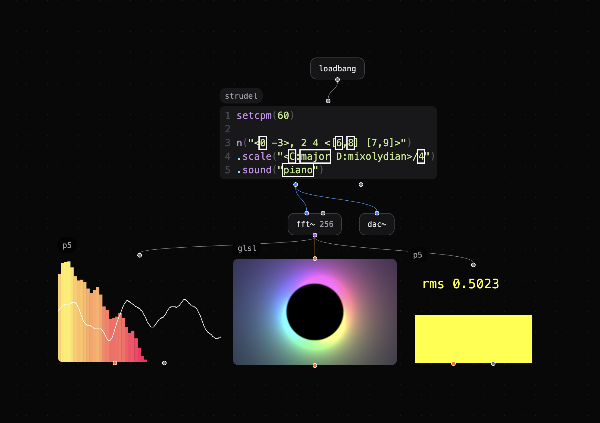

> ✨ Try this patch out [in the app](https://patchies.app/?id=sgov4pl7f9ku4h7)!

The `fft~` audio object gives you an array of frequency bins that you can use to create visualizations in your patch.

First, create a `fft~` object. Set the bin size (e.g. `fft~ 1024`). Then, connect the purple "analyzer" outlet to the visual object's inlet.

Supported objects are `glsl`, `hydra`, `p5`, `canvas`, `canvas.dom`, `textmode`, `textmode.dom`, `three`, `three.dom` and `js`.

### Usage with GLSL

- Create a `sampler2D` GLSL uniform inlet and connect the purple "analyzer" outlet of `fft~` to it.
- Hit `Enter` to insert object, and try out the `fft-freq.gl` and `fft-waveform.gl` presets for working code samples.
- To get the waveform (time-domain analysis) instead of the frequency analysis, you must name the uniform as exactly `uniform sampler2D waveTexture;`. Using other uniform names will give you frequency analysis.

### Usage with JavaScript-based objects

You can call the `fft()` function to get the audio analysis data in the supported JavaScript-based objects: `hydra`, `p5`, `canvas`, `canvas.dom` and `js`.

- **IMPORTANT**: Patchies does NOT use standard audio reactivity APIs in Hydra and P5.js. Instead, you must use the `fft()` function to get the audio analysis data.

  - See the below section on [Converting existing P5 and Hydra audio code](#convert-existing-p5-and-hydra-fft-code) for why this is needed and how to convert existing code.

- `fft()` defaults to waveform (time-domain analysis). You can also call `fft({type: 'wave'})` to be explicit.
- `fft({type: 'freq'})` gives you frequency spectrum analysis.
- Try out the `fft.hydra` preset for Hydra.
- Try out the `fft.p5`, `fft-sm.p5` and `rms.p5` presets for P5.js.
- Try out the `fft.canvas` preset for HTML5 canvas with **instant audio reactivity**.

  - The `fft.canvas` preset uses `canvas.dom` (main thread), giving you the same tight audio reactivity as `p5`.
  - For audio-reactive visuals, use `canvas.dom` or `p5` for best results.
  - The worker-based `canvas` node has slight FFT delay but won't slow down your patch when chained with other visual objects.

- The `fft()` function returns the `FFTAnalysis` class instance which contains helpful properties and methods:

  - raw frequency bins: `fft().a`
  - bass energy as float (between 0 - 1): `fft().getEnergy('bass') / 255`. You can use these frequency ranges: `bass`, `lowMid`, `mid`, `highMid`, `treble`.
  - energy between any frequency range as float (between 0 - 1): `fft().getEnergy(40, 200) / 255`
  - rms as float: `fft().rms`
  - average as float: `fft().avg`
  - spectral centroid as float: `fft().centroid`

- Where to call `fft()`:

  - `p5`: call in your `draw` function.
  - `canvas` and `canvas.dom`: call in your `draw` function that are gated by `requestAnimationFrame`
  - `js`: call in your `setInterval` or `requestAnimationFrame` callback

    ```js
    setInterval(() => {
      let a = fft().a;
    }, 1000);
    ```

  - `hydra`: call inside arrow functions for dynamic parameters

    ```js
    let a = () => fft().getEnergy("bass") / 255;
    src(s0).repeat(5, 3, a, () => a() * 2);
    ```

### Convert existing P5 and Hydra FFT code

- Q: Why not just use standard Hydra and P5.js audio reactivity APIs like `a.fft[0]` and `p5.FFT()`?

  - A: The reason is that the `p5-sound` and `a.fft` APIs only lets you access microphones and audio files. In contrast, Patchies lets you FFT any dynamic audio sources 😊
  - You can FFT analyze your own audio pipelines like your web audio graph, and other live audio coding environment like Strudel and ChucK.
  - It makes the API exactly the same between Hydra and P5.js. No need to juggle two.

- Converting Hydra's [Audio Reactivity](https://hydra.ojack.xyz/hydra-docs-v2/docs/learning/sequencing-and-interactivity/audio/#audio-reactivity) API into Patchies:

  - Replace `a.fft[0]` with `fft().a[0]` (un-normalized int8 values from 0 - 255)
  - Replace `a.fft[0]` with `fft().f[0]` (normalized float values from 0 - 1)
  - Instead of `a.setBins(32)`, change the fft bins in the `fft~` object instead e.g. `fft~ 32`
  - Instead of `a.show()`, use the below presets to visualize fft bins.
  - Using the value to control a variable:

    ```diff

      - osc(10, 0, () => a.fft[0]*4)
      + osc(10, 0, () => fft().f[0]*4)
        .out()
    ```

- Converting P5's [p5.sound](https://p5js.org/reference/p5.sound/) API into Patchies:

  - Replace `p5.Amplitude` with `fft().rms` (rms as float between 0-1)
  - Replace `p5.FFT` with `fft()`
  - Replace `fft.analyze()` with nothing - `fft()` is always up to date.
  - Replace `fft.waveform()` with `fft({ format: 'float' }).a`, as P5's waveform returns a value between -1 and 1. Using `format: 'float'` gives you Float32Array.
  - Replace `fft.getEnergy('bass')` with `fft().getEnergy('bass') / 255` (normalize to 0-1)
  - Replace `fft.getCentroid()` with `fft().centroid`

## Disabling AI features

AI is 100% optional and _opt-in_ with Patchies.

Don't want AI? Hit `Ctrl/Cmd + K` then `Toggle AI Features`. This _permanently_ turns all AI-based nodes and AI generation features off.

In particular, this will hide all AI-related objects and features, such as `ai.txt`, `ai.img`, `ai.tts` and `ai.music`. It also disables the experimental `Cmd/Ctrl + I` AI object insertion shortcut.

## Rendering Pipeline

> [!TIP]
> Use objects that run on the rendering pipeline e.g. `hydra`, `glsl`, `swgl`, `canvas`, `textmode`, `three` and `img` to reduce lag.

Behind the scenes, the [video chaining](#video-chaining) feature constructs a _rendering pipeline_ based on the use of [framebuffer objects](https://www.khronos.org/opengl/wiki/Framebuffer_Object) (FBOs), which lets visual objects copy data to one another on a framebuffer level, with no back-and-forth CPU-GPU transfers needed. The pipeline makes use of Web Workers, WebGL2, [Regl](https://github.com/regl-project/regl) and OffscreenCanvas (for `canvas`).

It creates a shader graph that streams the low-resolution preview onto the preview panel, while the full-resolution rendering happens in the frame buffer objects. This is much more efficient than rendering everything on the main thread or using HTML5 canvases.

**Objects on the rendering pipeline (web worker thread):**

- `hydra`, `glsl`, `swgl`, `canvas`, `textmode`, `three` and `img` run entirely on the web worker thread and are very performant when using [chaining multiple video objects together](#video-chaining), as it does not require CPU-to-GPU pixel copy.

**Objects on the main thread:**

- `p5`, `canvas.dom`, `textmode.dom`, `three.dom` and `bchrn` runs on the main thread.
- If these objects are connected to video outlets, at each frame we create an image bitmap on the main thread, then transfer it to the web worker thread for rendering.
  - Try connecting `canvas.dom` to `bg.out`, your FPS will drop around 10FPS - 20FPS. Use "CMD+K > Toggle FPS Monitor" to verify.
  - Try connecting `canvas` to `bg.out`, your FPS will not drop at all.
  - The copying of the pixels from CPU to GPU is way slower than using FBOs and can cause lag if you have many main-thread visual objects in your patch.
  - If you don't connect its video outlet to another video object, we don't perform the bitmap copy so the performance overhead is minimal.
- Use these only when you need instant FFT reactivity, mouse interactivity, or DOM access.
