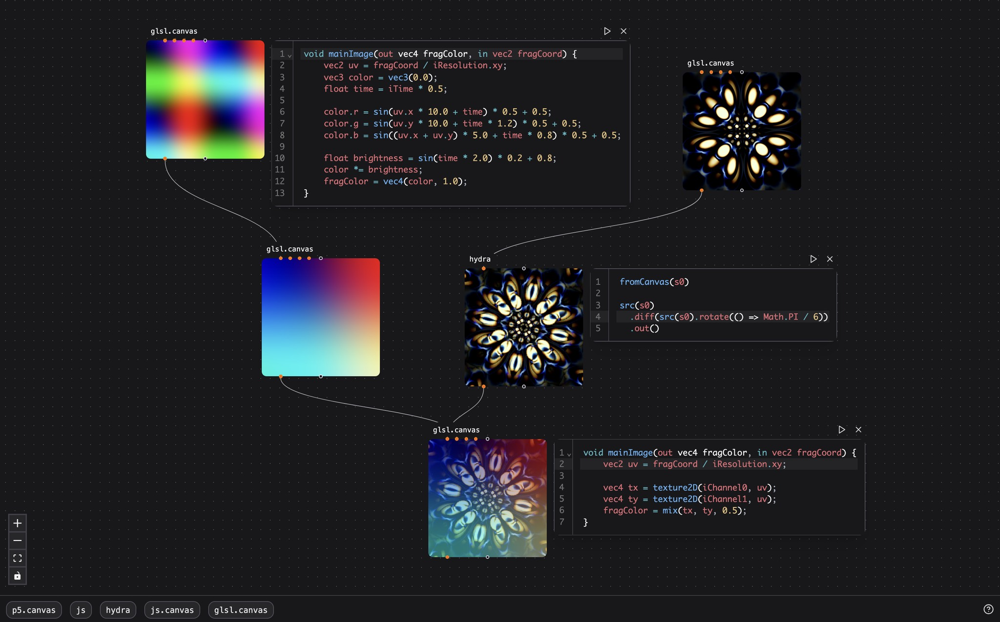

# Patchies.app



> The above uses the shader ["Tunnel of Lights"](https://www.shadertoy.com/view/w3KGRK) from nocrex. Hydra sample by [Olivia Jack](https://hydra.ojack.xyz).

Patchies is a tool to build audio-visual patches on the web. Try it out at [patchies.app](https://patchies.app).

You can use audio-visual tools that you know and love: [P5.js](https://p5js.org) (Processing in JavaScript), [Hydra](https://hydra.ojack.xyz) (Video Synth), [Strudel](https://strudel.cc) (TidalCycles in JavaScript), as well as write JavaScript and GLSL fragment shaders directly.

It has support for [Message Passing](#message-passing) and [Video Chaining](#video-chaining), which allows you to create complex audio-visual patches that are more powerful than what you can do with a single object.

> "What I cannot create, I do not understand. Know how to solve every problem that has been solved." - Richard Feynman

## How to use

- Go to [patchies.app](https://patchies.app).
- Press `n` to create a new object.
- Click and drag the title of the object on the top left to move.
- When hovering over an object, you'll see icon buttons such as "edit code" and "play/stop" on the top right.
- Press `shift+enter` while in a code editor to re-run the code.
- Click on the title and press `delete` to delete an object.

## Keyboard Shortcuts

You can use the Shortcuts button on the bottom right to see a list of shortcuts. Here are some of the most useful ones:

- `cmd + k`: open the command palette to search for commands.
- `n`: create a new object at cursor position.
- `shift + enter`: run the code in the code editor within the selected object.
- `delete`: delete the selected object.
- `cmd + z`: undo the last action.

## Message Passing

You can use `send()` and `onMessage()` functions to send and receive messages between objects. This allows you to create complex interactions between different parts of your patch. This is very similar to messages in Max/MSP.

Here is how to use `send` and `onMessage` in JavaScript objects:

```js
// Object A
send('Hello from Object A')

// Object B
onMessage((data, meta) => {
  // data = "Hello from Object A"
  console.log('Received message:', data)
})
```

You can use the `send` and `onMessage` function in all JavaScript-based objects, such as `js`, `p5`, `hydra`, `strudel` and `canvas`.

You can also `send` messages into GLSL uniforms. If you define a uniform in your GLSL code like so:

```glsl
uniform float iMix;
uniform vec2 iFoo;
```

This will create two inlets in the GLSL object: the first one allows `send(0.5)` for `iMix`, and the other allows `send([0.0, 0.0])` for `iFoo`. When you `send` messages to these inlets, it will set the internal GLSL uniform values for the node.

## Video Chaining

You can chain video objects together to create complex video effects, by using the output of a video object as an input to another. For example: P5 -> Hydra -> GLSL. This is similar to shader graphs in TouchDesigner.

To leverage video chaining, use the leftmost orange inlets and outlets on the patch. You can connect the orange video outlet of a `p5` to an orange video inlet of a `hydra` object, and then connect the `hydra` object to a `glsl`.

This allows you to create video patches that are more powerful than what you can do with a single object. Have fun!

## List of objects

Here are the list of objects that we have in Patchies. You can also hit `n` on your keyboard to see list of objects to create, as well as drag in the objects from the bottom bar.

### `js`: A JavaScript code block

- Use `console.log()` to log messages to the virtual console.
- Use `setInterval(callback, ms)` to run a callback every `ms` milliseconds.
  - The code block has a special version of `setInterval` that automatically cleans up the interval on unmount. Do not use `window.setInterval` from the window scope as that will not clean up.
- Use `send()` and `onMessage()` to send and receive messages between objects. This also works in other JS-based objects. See the [Message Passing](#message-passing) section below.

### `strudel`: creates a Strudel music environment

- Strudel is a live coding environment based on TidalCycles. You can use it to expressively write dynamic music pieces, as well as create complex audio patterns and effects.
- See the [Strudel workshop](https://strudel.cc/workshop/getting-started) to learn how to use Strudel.
- Check out the [Strudel showcase](https://strudel.cc/intro/showcase) to get inspirations with how people use Strudel.

### `p5`: creates a P5.js sketch

- P5.js is a JavaScript library for creative coding. It provides a simple way to create graphics and animations, but you can do very complex things with it.
- If you are new to P5.js, I recommend watching [Patt Vira](https://www.youtube.com/@pattvira)'s YouTube tutorials on YouTube, or on her [website](https://www.pattvira.com). They're fantastic for both beginners and experienced developers.
- Read the [P5.js documentation](https://p5js.org/reference) to see how P5 works.
- See the [P5.js tutorials](https://p5js.org/tutorials) and [OpenProcessing](https://www.openprocessing.org) for more inspirations.
- You can call these special methods in your P5 sketch:

  - `noDrag()` to disable dragging the whole canvas. this is needed if you want to add interactivity to your P5 sketch, such as adding sliders. You can call it in your `setup()` function.
  - `send(message)` and `onMessage(callback)`, see [Message Passing](#message-passing).

### `hydra`: creates a Hydra video synthesizer

- Hydra is a live coding video synthesizer. You can use it to create complex video effects and animations.
- See the [interactive Hydra documentation](https://hydra.ojack.xyz/docs) to learn how to use hydra.
- Try out the standalone editor at [Hydra](https://hydra.ojack.xyz) to see how Hydra works.
- The output method `.out(o0)` must always have an explicit output, otherwise it will error.
  - Example: `src(s0).out(o0)` will output the video from the source `s0` to the output `o0`.
  - If you copy examples from the Hydra documentation, you must add `.out(o0)` to the end of the code to make it work in Patchies.
  - This is a limitation of `hydra-ts`, the library that powers Hydra in Patchies.
- You can call these special methods in your Hydra code:
  - `setVideoCount(ins = 1, outs = 1)` creates the specified number of Hydra source ports.
    - For example, `setVideoCount(2)` will initialize `s0` and `s1` with the first two video inlets.
  - full hydra synth is available as `h`
  - outputs are available as `o0`, `o1`, `o2`, and `o3`.
  - `send(message)` and `onMessage(callback)`

### `glsl`: creates a GLSL fragment shader

- GLSL is a shading language used in OpenGL. You can use it to create complex visual effects and animations.
- You can use video chaining by connecting any video objects (e.g. `p5`, `hydra`, `glsl`, `butterchurn`, `ai.img` or `canvas`) to the GLSL object via the four video inlets.
  - These inlets are exposed as `iChannel0`, `iChannel1`, `iChannel2`, and `iChannel3` in your GLSL uniform.
- See [ShaderToy](https://www.shadertoy.com) for examples of GLSL shaders. All shaders on ShaderToy are automatically compatible with `glsl`, as they accept the same uniforms.
- I recommend playing with [The Book of Shaders](https://thebookofshaders.com) to learn the GLSL basics!

### `canvas`: creates a JavaScript canvas

- You can use [HTML5 Canvas](https://developer.mozilla.org/en-US/docs/Web/API/Canvas_API) to create custom graphics and animations. The rendering context is exposed as `canvas` in the JavaScript code, so you can use methods like `canvas.fill()` to draw on the canvas.
- You can call these special methods in your P5 sketch:

  - `noDrag()` to disable dragging the whole canvas. this is needed if you want to add interactivity to your P5 sketch, such as adding sliders. You can call it in your `setup()` function.
  - `getSource()` to get the video source from the previous video object using [Video Chaining](#video-chaining). This returns the HTML5 canvas element which you can use for e.g. copying pixels. You can call this in your `setup()` function.
  - `send(message)` and `onMessage(callback)`, see [Message Passing](#message-passing).

### `butterchurn`: render the Winamp Milkdrop visualizer

- [Butterchurn](https://github.com/jberg/butterchurn) is a JavaScript port of the Winamp Milkdrop visualizer.
- You can use it as video source and connect it to other video objects (e.g. `hydra` and `glsl`) to derive more visual effects.

## Hiding AI features

If you dislike AI features (e.g. text generation, image generation, speech synthesis and music generation), you can hide them by activating the command palette with `CMD + K`, then search for "Toggle AI Features". This will hide all AI-related objects and features, such as `ai.txt`, `ai.img`, `ai.tts` and `ai.music`.
