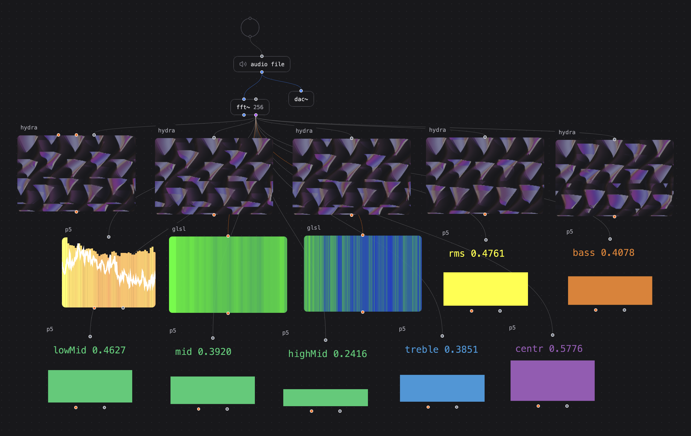

# Patchies.app: creative coding patcher in the browser


> The above image remixes the Hydra code "Filet Mignon" from [AFALFL](https://www.instagram.com/a_f_alfl) and GLSL shader ["Just another cube"](https://www.shadertoy.com/view/3XdXRr) from mrange. Licensed under CC BY-NC-SA 4.0 and CC0 respectively.

Patchies is a tool for building interactive audio-visual patches in the browser with JavaScript and GLSL. It's made for live creative coding -- for building visualizations, soundscapes and simulations of all kinds.

Try it out at [patchies.app](https://patchies.app) - it's open source 😎

Patchies lets you use the audio-visual tools that you know and love, together in one place. For example:

- [P5.js](https://p5js.org), a JavaScript library for creative coding.
- [Hydra](https://hydra.ojack.xyz), a live-coding video synthesizer.
- [Strudel](https://strudel.cc), a TidalCycles-like music environment
- [ChucK](https://chuck.cs.princeton.edu/webchuck), a programming language for real-time sound synthesis.
- [ML5.js](https://ml5js.org), friendly machine learning library for the web.
- [Web Audio API](https://developer.mozilla.org/en-US/docs/Web/API/Web_Audio_API), a powerful audio synthesis and processing API.
- [GLSL fragment shaders](https://www.shadertoy.com), for complex visual effects.
- ...as well as write JavaScript code directly.

Patchies lets you "patch" multiple objects together using [Message Passing](#message-passing), [Video Chaining](#video-chaining) and [Audio Chaining](#audio-chaining). It is very heavily inspired by tools such as Max/MSP, Pure Data, TouchDesigner, VVVV, and many others.

> "What I cannot create, I do not understand. Know how to solve every problem that has been solved." - Richard Feynman

## Wait, what is patching? What's a patcher?

If you haven't used a patching environment before, patching is a visual way to program by connecting objects together. Each object does something e.g. generate sound, generate visual, compute some values. You can connect the output of one object to the input of another object to create a flow of data. We call the whole visual program a "patch" or "patcher".

Here's a visual example:



This patch takes in audio from an audio file, analyzes the frequency spectrum using the `fft~` object, and sends the frequency data to various visual objects to create audio-reactive visuals and meters. You can create your own patches by combining different objects in different ways 😝

## Getting Started

- Go to [patchies.app](https://patchies.app).
- Use your mouse to pan and zoom the canvas.
  - Scroll up: zoom in. Scroll down: zoom out.
  - Drag on empty space to pan the canvas.

### Creating Objects

- Press `Enter` to create a new object.
  - Type to search for object name. Try `hydra` or `glsl` or `p5`.
  - `Arrow Up` and `Arrow Down` to navigate the list.
  - `Enter` creates the selected object.
  - `Esc` closes the object menu.
- Click on the "+ Nodes" button on the bottom left to see a list of objects you can create.
  - Drag the object name from the bottom bar onto the canvas to create it.
  - This is slower than using `Enter`, but it lets you see all visual nodes at a glance 👀

### Modifying Objects

- Click on an object to select it. The outline color should change when an object is selected.
  - If you can't drag an object, click on the title of the object and drag it.
- Once selected, drag the object to move it around.
  - `Delete` to delete an object.
- When _hovering_ the mouse over an object, you'll see floating icon buttons such as "edit code" and "play/stop" on the top right.
  - Use "Edit Code" to open the code editor.
- `Shift + Enter` while in a code editor to run the code again. This helps you to make changes to the code and see the results immediately.

### Command Palette

- `Ctrl/Cmd + K` brings up the command palette.
  - You can do many actions here, such as toggling fullscreen, import/export patch files, save/load patches in your browser, setting API keys, opening secondary output screen, toggling FPS monitors, toggling bottom bars and more.

### Connecting Objects

- Click on the handle on the top and bottom of an object, and drag to connect to another object.
  - Top handle are inputs. Bottom handle are outputs.
  - You can connect multiple outlets to a single inlet.

### Sharing Links

To create shareable links, click on the "Share Link" button on the bottom right. You can also use "Share Patch" from the command palette.

## Mouse and Keyboard Shortcuts

You can use the Shortcuts button on the bottom right to see a list of shortcuts. Here are some of the most useful ones:

- `Click on object / title`: focus on the object.
- `Drag on object / title`: move the object around.
- `Scroll up`: zoom in.
- `Scroll down`: zoom out.
- `Drag on empty space`: pan the canvas.
- `Enter`: create a new object at cursor position.
- `Ctrl/Cmd + K`: open the command palette to search for commands.
- `Shift + Enter`: run the code in the code editor within the selected object.
- `Delete`: delete the selected object.
- `Ctrl + C`: copy the selected object.
- `Ctrl + V`: paste the copied object.

## Message Passing

Each object can send message to other objects, and receive messages from other objects. Here are some examples to get you started:

- Create two `button` objects, and connect the outlet of one to the inlet of another.
  - When you click on the first button, it will send a `{type: 'bang'}` message to the second button, which will flash.
- Create a `msg` object with the message `hello world` (you can hit `Enter` and type `m hello world`). Then, hit `Enter` again and search for the `message-console.js` preset. Connect them together.
  - When you click on the message object, it will send the string `hello world` to the console object, which will log it to the virtual console.

In JavaScript-based objects such as `js`, `p5`, `hydra`, `strudel` and `canvas`, you can use the `send()` and `recv()` functions to send and receive messages between objects. For example:

```js
// In the source `js` object
send('Hello from Object A')

// In the target `js` object
recv((data) => {
  // data is "Hello from Object A"
  console.log('Received message:', data)
})
```

This is similar to the second example above, but using JavaScript code.

The `recv` callback also accepts the `meta` argument in addition to the message data. It includes the `inlet` field which lets you know which inlet the message came from.

You can combine this with `send(data, {to: inletIndex})` to send data to only a particular inlet, for example:

```js
recv((data, meta) => {
  send(data, {to: meta.inlet})
})
```

In the above example, if the message came from inlet 2, it will be sent to outlet 2.

In `js`, `p5` and `hydra` objects, you can call `setPortCount(inletCount, outletCount)` to set the exact number of message inlets and outlets. Example: `setPortCount(2, 1)` ensures there is 2 message inlets and 1 message outlet.

See the [Message Passing with GLSL](#message-passing-with-glsl) section for how to use message passing with GLSL shaders to pass data to shaders dynamically.

## Video Chaining

You can chain video objects together to create complex video effects, by using the output of a video object as an input to another. For example: `P5 -> Hydra -> GLSL -> output`. This is similar to shader graphs in programs like TouchDesigner.


To use video chaining, connect the orange inlets and outlets on the patch. For example, connect the orange video outlet of a `p5` to an orange video inlet of a `hydra` object, and then connect the `hydra` object to a `glsl`.

See the `glsl` object section for how to create uniforms to accept video inputs.

## Audio Chaining

Similar to video chaining, you can chain many audio objects together to create complex audio effects.

- You can use these objects as audio sources: `strudel`, `chuck`, `ai.tts`, `ai.music`, `soundfile~`, `sampler~`, `video` as well as the web audio objects (e.g. `osc~`, `sig~`, `mic~`)

  - **VERY IMPORTANT!**: you must connect your audio sources to `dac~` to hear the audio output, otherwise you will hear nothing. Audio sources do not output audio unless connected to `dac~`. Use `gain~` to control the volume.

- You can use these objects to process audio: `gain~`, `fft~`, `+~`, `lowpass~`, `highpass~`, `bandpass~`, `allpass~`, `notch~`, `lowshelf~`, `highshelf~`, `peaking~`, `compressor~`, `pan~`, `delay~`, `waveshaper~`, `convolver~`.

  - These objects correspond to Web Audio API nodes. See the [Web Audio API documentation](https://developer.mozilla.org/en-US/docs/Web/API/Web_Audio_API) for more details.

- Use the `fft~` object to analyze the frequency spectrum of the audio signal. See the [Audio Analysis](#audio-analysis) section on how to use FFT with your visual objects.

- You can use `dac~` to output audio to your speakers.

## List of objects

Here are the non-exhaustive list of objects that we have in Patchies.

### Visual & Creative Coding Objects

These objects support video chaining and can be connected to create complex visual effects:

### `p5`: creates a P5.js sketch

- P5.js is a JavaScript library for creative coding. It provides a simple way to create graphics and animations, but you can do very complex things with it.
- If you are new to P5.js, I recommend watching [Patt Vira](https://www.youtube.com/@pattvira)'s YouTube tutorials on YouTube, or on her [website](https://www.pattvira.com). They're fantastic for both beginners and experienced developers.
- Read the [P5.js documentation](https://p5js.org/reference) to see how P5 works.
- See the [P5.js tutorials](https://p5js.org/tutorials) and [OpenProcessing](https://www.openprocessing.org) for more inspirations.
- You can also use [ML5.js](https://ml5js.org) in your P5 sketch to add machine learning capabilities. Call `loadML5()` at the top of your sketch to load the ML5 library.
- You can call these special methods in your sketch:

  - `noDrag()` disables dragging the whole canvas. You **must** call this method if you want to add interactivity to your sketch, such as adding sliders or mousePressed events. You can call it in your `setup()` function.
    - When `noDrag()` is enabled, you can still drag the "p5" title to move the whole object around.
  - `send(message)` and `recv(callback)`, see [Message Passing](#message-passing).

### `hydra`: creates a Hydra video synthesizer

- [Hydra](https://hydra.ojack.xyz) is a live coding video synthesizer created by [Olivia Jack](https://ojack.xyz). You can use it to create all kinds of video effects.
- See the [Hydra documentation](https://hydra.ojack.xyz/docs) to learn how to use hydra.
- Try out the standalone editor at [Hydra](https://hydra.ojack.xyz) to see how Hydra works.
  - Use the "shuffle" button on the editor to get code samples you can use. You can copy it into Patchies. Check the license terms first.
- You can call these special methods in your Hydra code:
  - `setVideoCount(ins = 1, outs = 1)` creates the specified number of Hydra source ports.
  - `setVideoCount(2)` initializes `s0` and `s1` sources with the first two video inlets.
  - full hydra synth is available as `h`
  - outputs are available as `o0`, `o1`, `o2`, and `o3`.
  - `send(message)` and `recv(callback)` works here, see [Message Passing](#message-passing).
- Try out these presets to get you started:
  - `pipe.hydra`: passes the image through without any changes
  - `diff.hydra`, `add.hydra`, `sub.hydra`, `blend.hydra`, `mask.hydra`: perform image operations (difference, addition, subtraction, blending, masking) on two video inputs
  - `filet-mignon.hydra`: example Hydra code "Filet Mignon" from [AFALFL](https://www.instagram.com/a_f_alfl). Licensed under CC BY-NC-SA 4.0.

### `glsl`: creates a GLSL fragment shader

- GLSL is a shading language used in OpenGL. You can use it to create complex visual effects and animations.
- You can use video chaining by connecting any video objects (e.g. `p5`, `hydra`, `glsl`, `swgl`, `bchrn`, `ai.img` or `canvas`) to the GLSL object via the four video inlets.
- You can create any number of GLSL uniform inlets by defining them in your GLSL code.
  - For example, if you define `uniform float iMix;`, it will create a float inlet for you to send values to.
  - If you define the uniform as `sampler2D` such as `uniform sampler2D iChannel0;`, it will create a video inlet for you to connect video sources to.
- See [Shadertoy](https://www.shadertoy.com) for examples of GLSL shaders.
- All shaders on the Shadertoy website are automatically compatible with `glsl`, as they accept the same uniforms.
- I recommend playing with [The Book of Shaders](https://thebookofshaders.com) to learn the GLSL basics!
- Try these presets for GLSL to get you started:
  - `red.gl`: solid red color
  - `pipe.gl`: passes the image through without any changes
  - `mix.gl`: mixes two video inputs
  - `overlay.gl`: put the second video input on top of the first one
  - `fft-freq.gl`: visualizes the frequency spectrum from audio input
  - `fft-waveform.gl`: visualizes the audio waveform from audio input
  - `switcher.gl`: switches between six video inputs by sending an int message of 0 - 5.

#### Message Passing with GLSL

You can send messages into the GLSL uniforms to set the uniform values in real-time. First, create a GLSL uniform using the standard GLSL syntax, which adds two dynamic inlets to the GLSL object.

```glsl
uniform float iMix;
uniform vec2 iFoo;
```

You can now send a message of value `0.5` to `iMix`, and send `[0.0, 0.0]` to `iFoo`. When you send messages to these inlets, it will set the internal GLSL uniform values for the object. The type of the message must match the type of the uniform, otherwise the message will not be sent.

If you want to set a default uniform value for when the patch gets loaded, use the `loadbang` object connected to a `msg` object or a slider. `loadbang` sends a `{type: 'bang'}` message when the patch is loaded, which you can use to trigger a `msg` object or a `slider` to send the default value to the GLSL uniform inlet.

Supported uniform types are `bool` (boolean), `int` (number), `float` (floating point number), `vec2`, `vec3`, and `vec4` (arrays of 2, 3, or 4 numbers).

### `swgl`: creates a SwissGL shader

- [SwissGL](https://github.com/google/swissgl) is a wrapper for WebGL2 to create shaders in very few lines of code.

### `canvas`: creates a JavaScript canvas

- You can use [HTML5 Canvas](https://developer.mozilla.org/en-US/docs/Web/API/Canvas_API) to create custom graphics and animations. The rendering context is exposed as `canvas` in the JavaScript code, so you can use methods like `canvas.fill()` to draw on the canvas.

- You can call these special methods in your canvas code:

  - `noDrag()` to disable dragging the whole canvas. this is needed if you want to add interactivity to your canvas, such as adding sliders. You can call it in your `setup()` function.
  - `send(message)` and `recv(callback)`, see [Message Passing](#message-passing).

### `bchrn`: render the Winamp Milkdrop visualizer (Butterchurn)

- [Butterchurn](https://github.com/jberg/butterchurn) is a JavaScript port of the Winamp Milkdrop visualizer.
- You can use it as video source and connect it to other video objects (e.g. `hydra` and `glsl`) to derive more visual effects.

### `img`: display images

- Load and display images from URLs or local files.
- Supports video chaining - can be used as texture sources for other visual objects.
- Messages
  - `string`: load the image from the given url.

### `video`: display videos

- Load and display images from URLs or local files.
- Supports audio and video chaining - can be used as texture and audio sources for other objects.
- Messages
  - `bang`: restart the video
  - `string`: load the video from the given url.
  - `{type: 'play'}`: play the video
  - `{type: 'pause'}`: pause the video
  - `{type: 'loop', value: false}`: do not loop the video

### `bg.out`: background output

- Set the final output that appears as the background.
- The endpoint for video chaining pipelines.
- Determines what the audience sees as the main visual.

### Programming & Control Objects

### `js`: A JavaScript code block

- Use `console.log()` to log messages to the virtual console.
- Use `setInterval(callback, ms)` to run a callback every `ms` milliseconds.
  - The code block has a special version of `setInterval` that automatically cleans up the interval on unmount. Do not use `window.setInterval` from the window scope as that will not clean up.
- Use `requestAnimationFrame(callback)` to run a callback on the next animation frame.
  - The code block has a special version of `requestAnimationFrame` that automatically cleans up on unmount. Do not use `window.requestAnimationFrame` from the window scope as that will not clean up.
- Use `send()` and `recv()` to send and receive messages between objects. This also works in other JS-based objects. See the [Message Passing](#message-passing) section above.
- Use `setRunOnMount(true)` to run the code automatically when the object is created. By default, the code only runs when you hit the "Play" button.
- Use `setPortCount(inletCount, outletCount)` to set the number of message inlets and outlets you want. By default, there is 1 inlet and 1 outlet.
  - Use `meta.inlet` in the `recv` callback to distinguish which inlet the message came from.
  - Use `send(data, { to: inletIndex })` to send data to a specific inlet of another object.

### `expr`: mathematical expression evaluator

- Evaluate mathematical expressions and formulas.
- Use the `$1` to `$9` variables to create inlets dynamically. For example, `$1 + $2` creates two inlets for addition, and sends a message with the result each time inlet one or two is updated.
- This uses the [expr-eval](https://github.com/silentmatt/expr-eval) library from silentmatt under the hood for evaluating mathematical expressions.
- There are so many mathematical functions and operators you can use here! See the [expression syntax](https://github.com/silentmatt/expr-eval?tab=readme-ov-file#expression-syntax) section.
- Very helpful for control signals and parameter mapping.
- You can also create variables and they are multi-line. Make sure to use `;` to separate statements. For example:

  ```js
  a = $1 * 2
  b = $2 + 3
  a + b
  ```

  This creates two inlets, and sends the result of `(inlet1 * 2) + (inlet2 + 3)` each time inlet one or two is updated.

- You can also [define functions](https://github.com/silentmatt/expr-eval?tab=readme-ov-file#function-definitions) to make the code easier to read, e.g. `add(a, b) = a + b`.

### `python`: creates a Python code environment

- Run Python code directly in the browser using Pyodide.
- Great for data processing, scientific computing, and algorithmic composition.
- Full Python standard library available.

### `expr~`: audio-rate mathematical expression evaluator

- Similar to `expr` but runs at audio rate for audio signal processing.
- This uses the same [expr-eval](https://github.com/silentmatt/expr-eval) library as `expr`, so the same mathematical expression will work in both `expr` and `expr~`.
- This is useful for creating DSPs (digital signal processors) to generate audio effects.
- It requires an audio source to work. You can use `sig~` if you just need a constant signal.
- It accepts many DSP variables:
  - `$1` to `$9`: control inlets
  - `s`: current sample value, a float between -1 and 1
  - `i`: current sample index in buffer, an integer starting from 0
  - `channel`: current channel index, usually 0 or 1 for stereo
  - `bufferSize`: the size of the audio buffer, usually 128
  - `samples`: an array of samples from the current channel
  - `input`: first input audio signal (for all connected channels), a float between -1 and 1
  - `inputs`: every connected input audio signal
- Example:
  - `random()` creates white noise
  - `s` outputs the input audio signal as-is
  - `s * $1` applies gain control to the input audio signal
  - `s ^ 2` squares the input audio signal for distortion effect
- **WARNING**: Please use the `compressor~` object with appropriate limiter-esque setting after `expr~` to avoid loud audio spikes that can and will damage your hearing and speakers. You have been warned!

### Interface & Control Objects

### `button`: a simple button

- Sends the `{type: 'bang'}` message when clicked.
- Messages:
  - `any`: flashes the button when it receives any message, and outputs the `{type: 'bang'}` message out.

### `msg`: message object

- Store and send predefined messages.
- Click to send the stored message to connected objects.
- Good for triggering sequences or sending configuration data.
- You can hit `Enter` and type `m <message>` to create a `msg` object with the given message.
  - Example: `m {type: 'start'}` creates a `msg` object that sends `{type: 'start'}` when clicked.
- Examples
  - `100` sends the number 100
  - `hello` or `"hello"` sends the string "hello"
  - `{type: 'bang'}` sends the object `{type: 'bang'}`. this is what `button` does.
- Messages:
  - `{type: 'bang'}`: outputs the message

### `slider`: numerical value slider

- Continuous value control with customizable range.
- Perfect for real-time parameter adjustment.
- Outputs numeric values that can control other objects.
- Hit `Enter` and type in these short commands to create sliders with specific ranges:
  - `slider <min> <max>`: integer slider control. example: `slider 0 100`
  - `fslider <min> <max>`: floating-point slider control. example: `fslider 0.0 1.0`
- Messages:
  - `{type: 'bang'}`: outputs the current slider value
  - `number`: sets the slider to the given number within the range and outputs the value

### `textbox`: multi-line text input

- Create a multi-line textbox for user input.
- Messages:
  - `{type: 'bang'}`: outputs the current text
  - `string`: sets the text to the given string

### Audio & Music Objects

### `strudel`: Strudel music environment

- [Strudel](https://strudel.cc) is a live coding environment based on TidalCycles. You can use it to expressively write dynamic music pieces, as well as create complex audio patterns and effects.
- See the [Strudel workshop](https://strudel.cc/workshop/getting-started) to learn how to use Strudel.
- Check out the [Strudel showcase](https://strudel.cc/intro/showcase) to get inspirations with how people use Strudel.
- Use `Ctrl/Cmd + Enter` to re-evaluate the code.
- Don't forget to connect the `dac~` object to hear the audio output.
- Limitations
  - `recv` only works with a few functions, e.g. `setcpm` right now. Try `recv(setCpm)` to automate the cpm value.
- Please consider supporting the development of TidalCycles and Strudel at [OpenCollective](https://opencollective.com/tidalcycles)!

### `chuck`: creates a ChucK audio programming environment

- [ChucK](https://chuck.cs.princeton.edu) is a programming language for real-time sound synthesis and music creation.
- Great for algorithmic composition and sound design.
- Runs in the browser via [WebChucK](https://chuck.cs.princeton.edu/webchuck/).
- Actions
  - Replace Shred `Ctrl/Cmd + \`: replaces the most recent shred
  - Add Shred `Ctrl/Cmd + Enter`: adds a new shred
  - Remove Shred `Ctrl/Cmd + Backspace`: removes the most recent shred
  - Click on the gear button to see list of running shreds. Remove any shred by clicking on the "x" button.

### `object`: textual object system

- Supports a wide range of audio processing, control, and utility objects.
- Create a textual object by pressing `Enter`, and type in the name of the object you want to create.
- Hover over the inlet name to see a tooltip with description of what the inlet's type are, and what values it does accept.
  - Try to hover over a `gain~` object's gain value (e.g. `1.0`) to see the tooltip.

#### Available textual objects

**Audio Processing:**

- `gain~`: Amplifies audio signals with gain control
- `osc~`: Oscillator for generating audio waveforms (sine, square, sawtooth, triangle)
- `lowpass~`, `highpass~`, `bandpass~`, `allpass~`, `notch~`: Various audio filters
- `lowshelf~`, `highshelf~`, `peaking~`: EQ filters for frequency shaping
- `compressor~`: Dynamic range compression for audio
- `pan~`: Stereo positioning control
- `delay~`: Audio delay line with configurable delay time
- `+~`: Audio signal addition
- `sig~`: Generate constant audio signals
- `waveshaper~`: Distortion and waveshaping effects
- `convolver~`: Convolution reverb using impulse responses
- `fft~`: FFT analysis for frequency domain processing

**Sound Sources:**

- `soundfile~`: Load and play audio files with transport controls
  - use `soundurl~ <url>` to load audio files and streams from URLs directly.
  - try `soundurl~ http://stream.antenne.de:80/antenne` to stream Antenne Bayern live radio.
- `sampler~`: Sample playback with triggering capabilities
- `mic~`: Capture audio from microphone input
- `dac~`: Send audio to speakers

**Control & Utility:**

- `mtof`: Convert MIDI note numbers to frequencies
- `loadbang`: Send bang on patch load
- `metro`: Metronome for regular timing
- `delay`: Message delay (not audio)
- `adsr`: ADSR envelope generator

### MIDI & Network Objects

### `midi.in`: MIDI input

- Receive MIDI messages from connected devices.
- Outputs note, velocity, and control change data.
- Perfect for musical controllers and hardware integration.

### `midi.out`: MIDI output

- Send MIDI messages to external devices or software.
- Control external synthesizers and DAWs.
- Supports note, CC, and system messages.

### `netsend`: network message sender

- Sends message across patches over WebRTC.
- When creating objects, type in `netsend <channelname>` to create a `netsend` object that sends messages to the specified channel name. Example: `netsend drywet`

### `netrecv`: network message receiver

- Receives message across patches over WebRTC.
- When creating objects, type in `netrecv <channelname>` to create a `netrecv` object that receives messages from the specified channel name. Example: `netrecv drywet`

### AI & Generation Objects

These objects can be hidden via the "Toggle AI Features" command if you prefer not to use AI:

### `ai.txt`: AI text generation

- Generate text using AI language models.
- Create dynamic content, lyrics, or procedural text.
- Integrates with message system for interactive generation.

### `ai.img`: AI image generation

- Generate images from text prompts using AI.
- Create visual content programmatically.
- Supports video chaining as texture source.

### `ai.music`: AI music generation

- Generate musical compositions using AI.
- Create backing tracks, melodies, or soundscapes.
- Outputs audio that can be processed by other objects.

### `ai.tts`: AI text-to-speech

- Convert text to speech using AI voices.
- Create dynamic narration or vocal elements.
- Outputs audio for further processing.

### Documentation & Content

### `markdown`: Markdown renderer

- Render Markdown text as formatted content.
- Perfect for documentation, instructions, or dynamic text display.
- Supports full Markdown syntax including links and formatting.

## Audio Analysis

The `fft~` audio object gives you an array of frequency bins that you can use to create visualizations in your patch.

First, create a `fft~` object. Set the bin size (e.g. `fft~ 1024`). Then, connect the purple "analyzer" outlet to the visual object's inlet.

### Usage with GLSL

- Create a `sampler2D` GLSL uniform inlet and connect the purple "analyzer" outlet of `fft~` to it.
- Hit `Enter` to insert object, and try out the `fft-freq.gl` and `fft-waveform.gl` presets for working code samples.
- To get the waveform (time-domain analysis) instead of the frequency analysis, you must name the uniform as exactly `uniform sampler2D waveTexture;`. Using other uniform names will give you frequency analysis.

### Usage with Hydra and P5.js

- **IMPORTANT**: Patchies does NOT use standard audio reactivity APIs in Hydra and P5.js. Instead, you must use the `fft()` function to get the audio analysis data.

  - See the below section on [Converting existing P5 and Hydra audio code](#convert-existing-p5-and-hydra-fft-code) for why this is needed and how to convert existing code.

- `fft()` defaults to waveform (time-domain analysis). You can also call `fft({type: 'wave'})` to be explicit.
- `fft({type: 'freq'})` gives you frequency spectrum analysis.
- Try out the `fft.hydra` preset for Hydra examples.
- Try out the `fft-capped.p5`, `fft-full.p5` and `rms.p5` presets for P5.js examples.

- The `fft()` function returns the `FFTAnalysis` class instance which contains helpful properties and methods:
  - raw frequency bins: `fft().a`
  - bass energy as float (between 0 - 1): `fft().getEnergy('bass') / 255`. You can use these frequency ranges: `bass`, `lowMid`, `mid`, `highMid`, `treble`.
  - energy between any frequency range as float (between 0 - 1): `fft().getEnergy(40, 200) / 255`
  - rms as float: `fft().rms`
  - average as float: `fft().avg`
  - spectral centroid as float: `fft().centroid`

### Convert existing P5 and Hydra FFT code

- Q: Why not just use standard Hydra and P5.js audio reactivity APIs like `a.fft[0]` and `p5.FFT()`?

  - A: The reason is that the `p5-sound` and `a.fft` APIs only lets you access microphones and audio files. In contrast, Patchies lets you FFT any dynamic audio sources 😊
  - You can FFT analyze your own audio pipelines like your web audio graph, and other live audio coding environment like Strudel and ChucK.
  - It makes the API exactly the same between Hydra and P5.js. No need to juggle two.

- Converting Hydra's [Audio Reactivity](https://hydra.ojack.xyz/hydra-docs-v2/docs/learning/sequencing-and-interactivity/audio/#audio-reactivity) API into Patchies:

  - Replace `a.fft[0]` with `fft().a[0]` (un-normalized int8 values from 0 - 255)
  - Replace `a.fft[0]` with `fft().f[0]` (normalized float values from 0 - 1)
  - Instead of `a.setBins(32)`, change the fft bins in the `fft~` object instead e.g. `fft~ 32`
  - Instead of `a.show()`, use the below presets to visualize fft bins.
  - Using the value to control a variable:

    ```diff

      - osc(10, 0, () => a.fft[0]*4)
      + osc(10, 0, () => fft().f[0]*4)
        .out()
    ```

- Converting P5's [p5.sound](https://p5js.org/reference/p5.sound/) API into Patchies:

  - Replace `p5.Amplitude` with `fft().rms` (rms as float between 0-1)
  - Replace `p5.FFT` with `fft()`
  - Replace `fft.analyze()` with nothing - `fft()` is always up to date.
  - Replace `fft.waveform()` with `fft({ format: 'float' }).a`, as P5's waveform returns a value between -1 and 1. Using `format: 'float'` gives you Float32Array.
  - Replace `fft.getEnergy('bass')` with `fft().getEnergy('bass') / 255` (normalize to 0-1)
  - Replace `fft.getCentroid()` with `fft().centroid`

## Hiding AI features

If you dislike AI features (e.g. text generation, image generation, speech synthesis and music generation), you can hide them by activating the command palette with `CMD + K`, then search for "Toggle AI Features". This will hide all AI-related objects and features, such as `ai.txt`, `ai.img`, `ai.tts` and `ai.music`.
