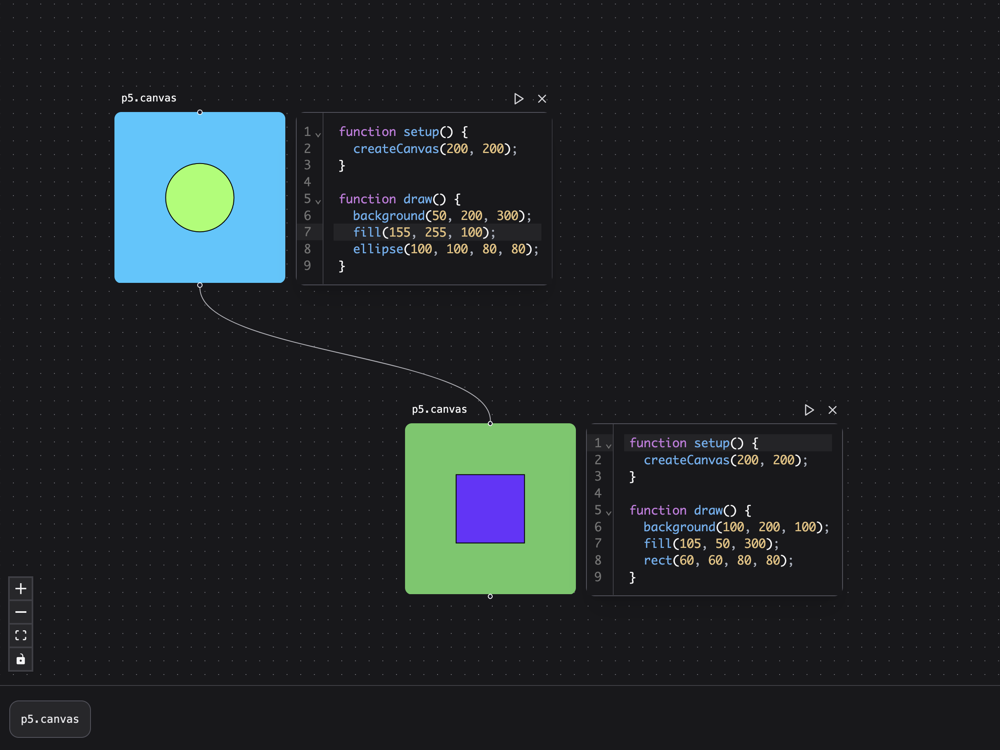

# Patchies.app

> "What I cannot create, I do not understand. Know how to solve every problem that has been solved." - Richard Feynman

Patchies is a tool for creating and playing with simulations.

Creating patches helps you to explore concepts and algorithms through play, while expressing yourself and sharing their ideas through art and creation in the process. Whether visually, auditory or thru other mediums.

It helps you to learn in public, by creating **sandboxes** where other people can use the tools you've created to build their own simulations. You can embed patches and sandboxes in your own website to share it with the world.

This is a spiritual successor to [Visual Assembly Canvas](https://github.com/heypoom/visual-assembly-canvas), which will be integrated into Patchies soon.
