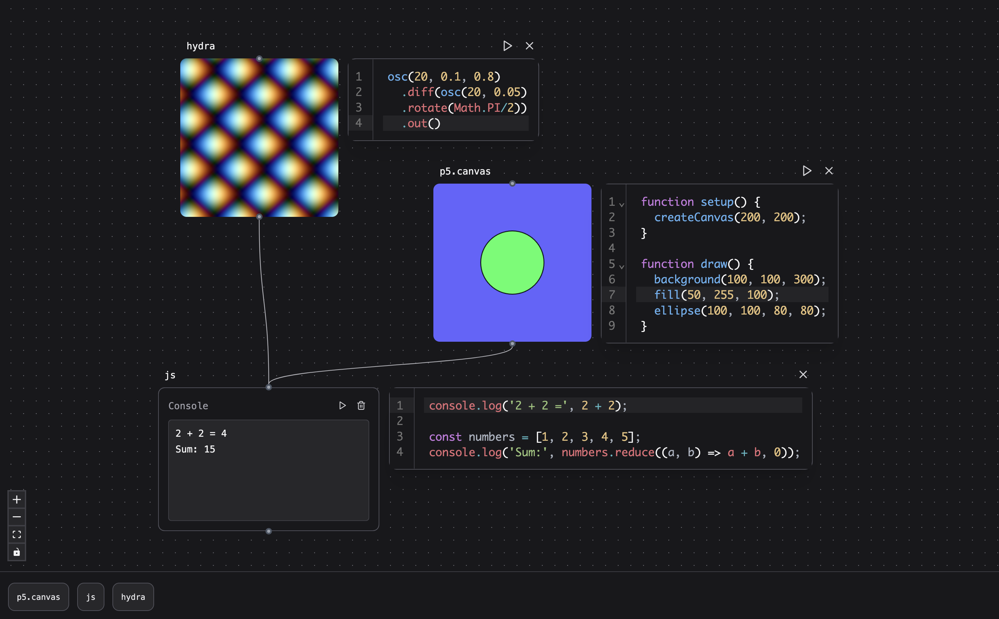

# Patchies.app

> "What I cannot create, I do not understand. Know how to solve every problem that has been solved." - Richard Feynman

Patchies is an audio-visual for building patches on the web. Try it out at [patchies.app](https://patchies.app).

You can use audio-visual tools that you know and love: [P5.js](https://p5js.org) (Processing in JavaScript), [Hydra](https://hydra.ojack.xyz) (Video Synth), [Strudel](https://strudel.cc) (TidalCycles in JavaScript), as well as write JavaScript and GLSL fragment shaders directly.

## Features

- **Message Passing**: You can use `send()` and `onMessage()` functions to send and receive messages between objects. This allows you to create complex interactions between different parts of your patch. This is similar to messages in Max/MSP.

- **Video Chaining**: You can chain video objects together to create complex video effects. For example: P5 -> Hydra -> GLSL. This allows you to create video patches that are more powerful than what you can do with a single object. This is similar to shader graphs in TouchDesigner.

## How to use

- Go to [patchies.app](https://patchies.app).
- Press `n` to create a new object.
- Click and drag the title of the object on the top left to move.
- When hovering over an object, you'll see icon buttons such as "edit code" and "play/stop" on the top right.
- Press `shift+enter` while in a code editor to re-run the code.
- Click on the title and press `delete` to delete an object.
