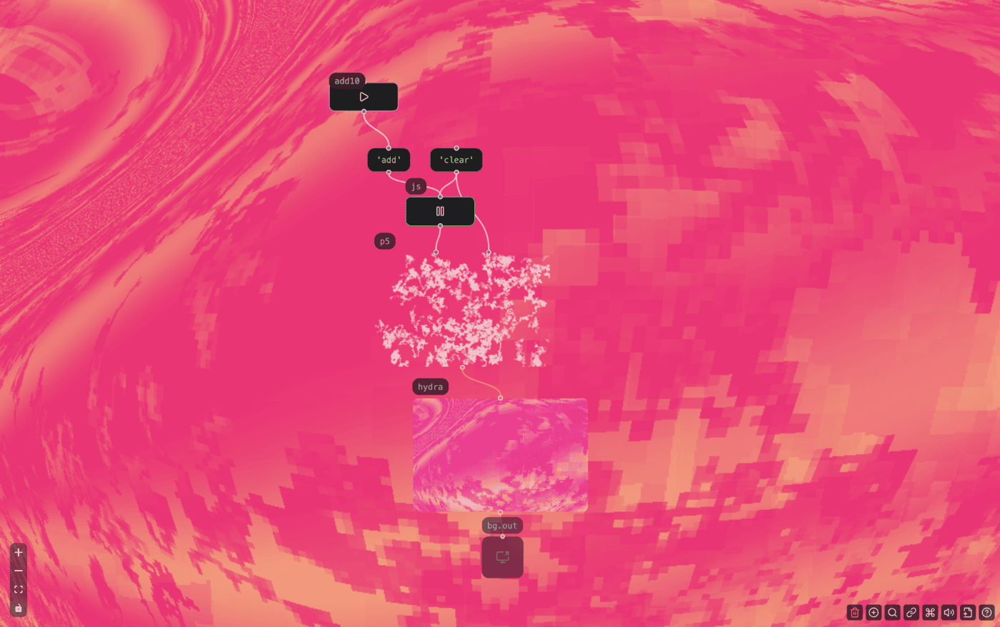
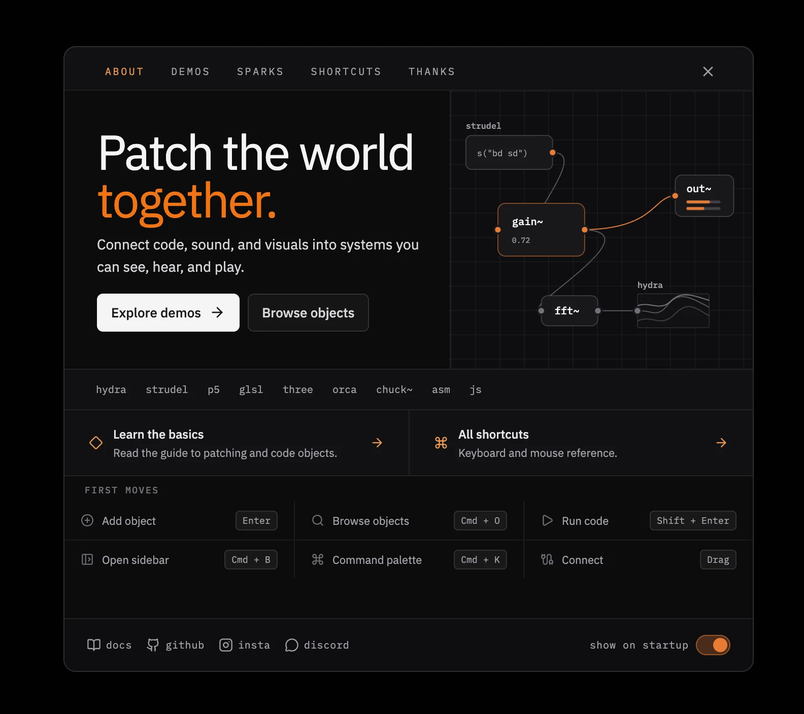

# Patchies: Write Small Programs & Patch Them All

<a href="https://patchies.app/?demo=random-walk-world"></a>

> Try out [the above demo](https://patchies.app/?demo=random-walk-world) which uses P5.js with Hydra to create a random walk shader.

Patchies is a _creative coding patcher_ where you write small programs using the tools and libraries that you already know, and patch them together to make something interesting.

It's a playground where you can make interactive widgets, craft synthesizers, simulate biology and physics, design audio-reactive visuals, compose shader graphs, and connect all of them together.

It's all running on the web, no installation needed. Want to try out Patchies? [Let's get started.](#get-started)

## What can I make?

> Prefer to watch a video? [Check out this walkthrough on YouTube](https://www.youtube.com/watch?v=jxFXNnmcOAs)

Patchies lets you use audio, visual and computational tools and libraries that you know and love, together in one place. For example:

- Make interactive graphics and widgets with [P5.js](https://patchies.app/docs/objects/p5), [HTML5 Canvas](https://patchies.app/docs/objects/canvas.dom), [Three.js](https://patchies.app/docs/objects/three) and [Textmode.js](https://patchies.app/docs/objects/textmode)
- Synthesize videos with [Hydra](https://patchies.app/docs/objects/hydra), [GLSL shaders](https://patchies.app/docs/objects/glsl), and [Shader Park](https://patchies.app/docs/objects/shaderpark)
- Make music from code with [Strudel](https://patchies.app/docs/objects/strudel), [Orca](https://patchies.app/docs/objects/orca), [Bytebeat](https://patchies.app/docs/objects/bytebeat~), [ChucK](https://patchies.app/docs/objects/chuck~), [SuperSonic](https://patchies.app/docs/objects/sonic~) and [Csound](https://patchies.app/docs/objects/csound~)
- Design sounds with [Pure Data-style](https://patchies.app/docs/audio-chaining) objects, [Tone.js](https://patchies.app/docs/objects/tone~) and [Elementary Audio](https://patchies.app/docs/objects/elem~)
- Build and run tiny programs & games on the [Uxn](https://patchies.app/docs/objects/uxn) virtual machine.
- Compute like an ancient witch with [Stack Assembly](https://patchies.app/docs/objects/asm) and [Uiua](https://patchies.app/docs/objects/uiua), or like a wizard with [Ruby](https://patchies.app/docs/objects/ruby) and [Python](https://patchies.app/docs/objects/python)
- Reach out to outside world with [MIDI](https://patchies.app/docs/objects/midi.in), [MQTT](https://patchies.app/docs/objects/mqtt), [SSE](https://patchies.app/docs/objects/sse), [WebRTC](https://patchies.app/docs/objects/netsend), [Iframe](https://patchies.app/docs/objects/iframe) and [VDO.Ninja](https://patchies.app/docs/objects/vdo.ninja.push).
- Manage [data and control flow](https://patchies.app/docs/message-passing) with [js](https://patchies.app/docs/objects/js), [expr](https://patchies.app/docs/objects/expr), [filter](https://patchies.app/docs/objects/filter), [map](https://patchies.app/docs/objects/map), [iframe](https://patchies.app/docs/objects/iframe), [spigot](https://patchies.app/docs/objects/spigot), [trigger](https://patchies.app/docs/objects/trigger) and more.
- Craft widgets with [Vue.js](https://patchies.app/docs/objects/vue), [DOM API](https://patchies.app/docs/objects/dom), [Tailwind](https://tailwindcss.com) or any library you like.
- Use any [third party JavaScript library](https://patchies.app/docs/javascript-runner) via [esm.sh](https://esm.sh).

## What is patching?

Patchies lets you write small blocks of code and patch them together.

Patching is a _visual_ way to program by connecting objects together. Each object does something e.g. generate sound, generate visual, compute some values. You then chain their [messages](https://patchies.app/docs/message-passing), [audio output](https://patchies.app/docs/audio-chaining) or [video output](https://patchies.app/docs/video-chaining) together to build up a larger program.

This is heavily inspired by the [actor model](https://en.wikipedia.org/wiki/Actor_model), as well as software like TouchDesigner, Pure Data and Max/MSP.

> "What I cannot create, I do not understand. Know how to solve every problem that has been solved." - Richard Feynman

## Get started

<a href="https://patchies.app"></a>

Choose the option that works for you:

1. **Use the hosted app:** Open [patchies.app](https://patchies.app) and get patching.
2. **Host Patchies with Docker.** Run the [published Docker image](https://hub.docker.com/r/phoomparin/patchies), or build the included Dockerfile yourself:

   ```bash
   docker run --rm -p 8090:8090 -v patchies-data:/app/pb_data phoomparin/patchies:latest

   # Or build locally first
   just docker-build
   docker run --rm -p 8090:8090 -v patchies-data:/app/pb_data patchies
   ```

   Then open [http://localhost:8090](http://localhost:8090). The `patchies-data` volume keeps your PocketBase data between container runs.

3. **Build and run a single binary.** With Bun, Go, and [just](https://github.com/casey/just) installed, build the bundled frontend and server into one executable:

   ```bash
   just build

   # Store data and SQLite database in this directory
   PATCHIES_DATA_DIR=./patchies-data

   ./patchies-server serve --http=0.0.0.0:8090
   ```

   Then open [http://localhost:8090](http://localhost:8090). Patchies is built with Pocketbase and writes to a single SQLite database file.

Before exposing a self-hosted instance, follow the [production guide](./docs/PRODUCTION.md) for persistent data, settings encryption, backups, and health checks.

### Helpful Links

- Play with the [demos](https://patchies.app/?startup=demos) to see what you can make with Patchies.
- Skim the [docs](https://patchies.app/docs/manage-collections) for tutorials and object references.
- No idea what to make? Open [sparks](https://patchies.app/?startup=sparks) to generate patch ideas.
- Follow the [Instagram](https://www.instagram.com/patchiesapp) for demos, inspirations and tutorials.
- Join the [Discord](https://discord.gg/PpccRb2XjE) to share your creations, ask for help and chat with other patchers.

## Development

See [DEVELOPMENT.md in docs](./docs/DEVELOPMENT.md) for how to develop Patchies locally.

## Thanks

Patchies is open source, [AGPL-licensed](https://github.com/heypoom/patchies/blob/main/LICENSE). You're more than welcome to use it in your AGPL-licensed projects, or fork it and make it your own.

Patchies is only possible because of the generosity of open source library developers who made it possible! If you enjoyed using Patchies, it would make my day if you can go and support them 🧡

Please check out the [thanks tab](https://patchies.app/?startup=thanks) which contains the direct links to support all the amazing people who helped play a part in bringing Patchies to life through their code and support.
