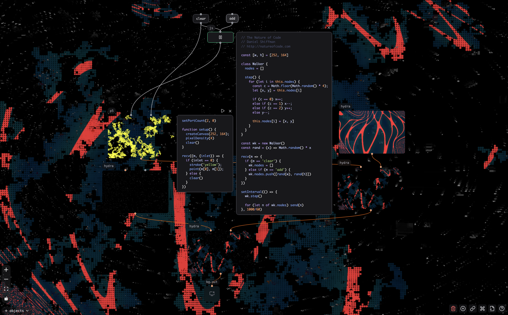
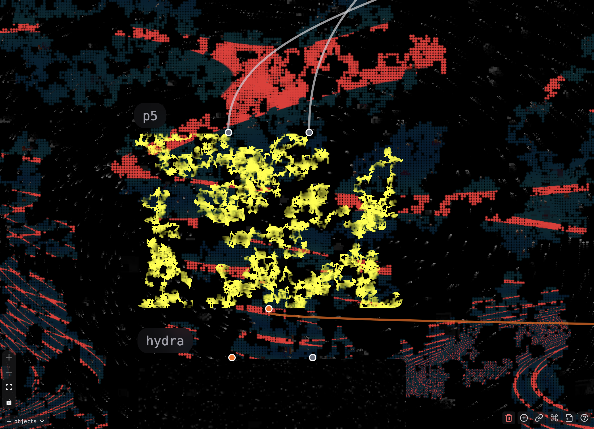

# Patchies.app: creative coding patcher in the browser


> The above image remixes the Hydra code "Filet Mignon" from [AFALFL](https://www.instagram.com/a_f_alfl) and GLSL shader ["Just another cube"](https://www.shadertoy.com/view/3XdXRr) from mrange. Licensed under CC BY-NC-SA 4.0 and CC0 respectively.

Patchies is a tool for building interactive audio-visual patches in the browser with JavaScript and GLSL. It's made for creative coding; patch objects and code snippets together to make visualizations, simulations, soundscapes and artistic explorations 🎨

Try it out at [patchies.app](https://patchies.app) - it's open source and free to use 😎

## Use tools and libraries you love

Patchies lets you use the audio-visual tools and libraries that you know (and love!), together in one place. For example:

- [P5.js](https://p5js.org), library for creative coding and making art.
- [Hydra](https://hydra.ojack.xyz), live-coding video synthesizer.
- [Strudel](https://strudel.cc), TidalCycles-like music environment
- [ChucK](https://chuck.cs.princeton.edu/webchuck), programming language for real-time sound synthesis.
- [SwissGL](https://github.com/google/swissgl), minimal WebGL2 wrapper for shaders.
- [GLSL fragment shaders](https://www.shadertoy.com), for complex 3D visual effects.
- [Tone.js](https://tonejs.github.io), framework for creating interactive music in the browser.
- [Web Audio](https://developer.mozilla.org/en-US/docs/Web/API/Web_Audio_API), powerful audio synthesis and processing.
- [HTML5 Canvas](https://developer.mozilla.org/en-US/docs/Web/API/Canvas_API), for custom 2D graphics.
- [Assembly](./modules/vasm/README.md), for fun stack machine computational puzzles.
- [Python 3](https://pyodide.org), runs on the browser via Pyodide.
- Use any [third party JavaScript library](#importing-javascript-packages-from-npm) via [esm.run](https://esm.run).
- ...as well as write JavaScript code directly.

## ...by patching them together ✨

Patchies is designed to mix textual coding and visual patching, using the best of both worlds. Instead of writing long chunks of code or patching together a huge web of small objects, Patchies encourages you to write small and compact programs and patch 'em together.

If you haven't used a patching environment before, patching is a _visual_ way to program by connecting objects together. Each object does something e.g. generate sound, generate visual, compute some values. You connect the output of one object to the input of another object to create a flow of data. We call the whole visual program a "patch" or "patcher".

This lets you visually see the program's core composition and its in-between results such as audio, video and message flows, while using tools you're already familiar with that lets you do a lot with a bit of code. This is done through [Message Passing](#message-passing), [Video Chaining](#video-chaining) and [Audio Chaining](#audio-chaining). They're heavily inspired by tools like Max/MSP, Pure Data, TouchDesigner and VVVV.

### What does a patch look like?

Here's a simple Patchies patch that uses [Message Passing](#message-passing) and [Video Chaining](#video-chaining) together:



It contains a [JS](#js-a-javascript-code-block) random walker (using code from [The Nature of Code](https://natureofcode.com/random/#the-random-walker-class)) which handles `add` and `clear` messages. On each frame, it ticks the walker then sends the `[x, y]` position to a [P5](#p5-creates-a-p5js-sketch) object which draws points on the canvas:



`p5` then pipes the image to a chain of [Hydra](#hydra-creates-a-hydra-video-synthesizer) nodes which masks and diffs the visuals:


Try out [the patch here](https://patchies.app/?id=vzbgsg9dsttosj2) to see how it works. Click on the `add` button to add new random walkers, and `clear` to remove all walkers.

> "What I cannot create, I do not understand. Know how to solve every problem that has been solved." - Richard Feynman

## Getting Started

- Go to [patchies.app](https://patchies.app).
- Use your mouse to pan and zoom the canvas.
  - Scroll up: zoom in. Scroll down: zoom out.
  - Drag on empty space to pan the canvas.

### Creating Objects

- Press `Enter` to create a new object.
  - Type to search for object name. Try `hydra` or `glsl` or `p5`.
  - `Arrow Up/Down` navigates the list.
  - `Enter` inserts the object.
  - `Esc` closes the menu.
- Click on the "+ objects" button on the bottom left to see a list of objects you can create.
  - Drag the object name from the bottom bar onto the canvas to create it.
  - This is slower than `Enter`, but it lets you see all objects at a glance 👀

### Modifying Objects

- Click on an object to select it. The outline color should change when an object is selected.
  - If you can't drag an object, click on the title of the object and drag it.
- Once selected, drag the object to move it around.
  - `Delete` to delete an object.
- When _hovering_ the mouse over an object, you'll see floating icon buttons such as "edit code" and "play/stop" on the top right.
  - Use "Edit Code" to open the code editor.
- `Shift + Enter` while in a code editor to run the code again. This helps you to make changes to the code and see the results immediately.

### Command Palette

- `Ctrl/Cmd + K` brings up the command palette.
  - You can do many actions here, such as toggling fullscreen, import/export patch files, save/load patches in your browser, setting API keys, opening secondary output screen, toggling FPS monitors, toggling bottom bars and more.

### Connecting Objects

- Click on the handle on the top and bottom of an object, and drag to connect to another object.
  - Top handle are inputs. Bottom handle are outputs.
  - You can connect multiple outlets to a single inlet.

### Sharing Links

To create shareable links, click on the "Share Link" button on the bottom right. You can also use "Share Patch" from the command palette.

## Mouse and Keyboard Shortcuts

You can use the Shortcuts button on the bottom right to see a list of shortcuts. Here are some of the most useful ones:

- `Click on object / title`: focus on the object.
- `Drag on object / title`: move the object around.
- `Scroll up`: zoom in.
- `Scroll down`: zoom out.
- `Drag on empty space`: pan the canvas.
- `Enter`: create a new object at cursor position.
- `Ctrl/Cmd + K`: open the command palette to search for commands.
- `Shift + Enter`: run the code in the code editor within the selected object.
- `Delete`: delete the selected object.
- `Ctrl + C`: copy the selected object.
- `Ctrl + V`: paste the copied object.

## Message Passing

Each object can send message to other objects, and receive messages from other objects.


In this example, two `slider` objects sends out their value to a `expr $1 + $2` object which adds the number together. The result is sent as a message to the `p5` object which displays it.

Here are some examples to get you started:

- Create two `button` objects, and connect the outlet of one to the inlet of another.
  - When you click on the first button, it will send a `{type: 'bang'}` message to the second button, which will flash.
- Create a `msg` object with the message `hello world` (you can hit `Enter` and type `m hello world`). Then, hit `Enter` again and search for the `logger.js` preset. Connect them together.
  - When you click on the message object, it will send the string `hello world` to the console object, which will log it to the virtual console.

In JavaScript-based objects such as `js`, `p5`, `hydra`, `canvas`, `strudel`, `dsp~` and `tone~`, you can use the `send()` and `recv()` functions to send and receive messages between objects. For example:

```js
// In the source `js` object
send('Hello from Object A')

// In the target `js` object
recv((data) => {
  // data is "Hello from Object A"
  console.log('Received message:', data)
})
```

This is similar to the second example above, but using JavaScript code.

The `recv` callback also accepts the `meta` argument in addition to the message data. It includes the `inlet` field which lets you know which inlet the message came from.

You can combine this with `send(data, {to: inletIndex})` to send data to only a particular inlet, for example:

```js
recv((data, meta) => {
  send(data, {to: meta.inlet})
})
```

In the above example, if the message came from inlet 2, it will be sent to outlet 2.

In `js`, `p5`, `hydra`, `canvas`, `dsp~` and `tone~` objects, you can call `setPortCount(inletCount, outletCount)` to set the exact number of message inlets and outlets. Example: `setPortCount(2, 1)` ensures there is 2 message inlets and 1 message outlet.

See the [Message Passing with GLSL](#message-passing-with-glsl) section for how to use message passing with GLSL shaders to pass data to shaders dynamically.

## Video Chaining

You can chain visual objects together to create video effects and compositions, by using the output of a visual object as an input to another.


The above example creates a `hydra` object and a `glsl` object that produces a pattern, and connects them to a `hydra` object that subtracts the two visuals together using `src(s0).sub(s1).out(o0)`.

This is very similar to _shader graphs_ in programs like TouchDesigner, Unity, Blender, Godot and Substance Designer.

To use video chaining:

- Try out the presets to get started quickly.

  - Pipe presets (e.g. `pipe.hydra`, `pipe.gl`) simply passes the visual through without any changes. This is the best starting point for chaining.
  - Hydra has many presets that perform image operations (e.g. `diff.hydra`, `add.hydra`, `sub.hydra`) on two visual inputs, see [hydra section](#hydra-creates-a-hydra-video-synthesizer).
  - Check out the docs of [each visual objects](#list-of-objects) for more fun presets you can use.

- The visual object should have at least one visual inlets and/or outlets, i.e. orange circles on the top and bottom.

  - Inlets provides visual into the object, while outlets outputs visual from the object.
  - In `hydra`, you can call `setVideoCount(ins = 1, outs = 1)` to specify how many visual inlets and outlets you want. See [hydra section](#hydra-creates-a-hydra-video-synthesizer) for more details.
  - For chaining `glsl` objects, you can dynamically create sampler2D uniforms. See [glsl section](#glsl-creates-a-glsl-fragment-shader) for more details.

- The visual object should have code that takes in a visual source, does something, and outputs visual. See the above presets for examples.

- Connect the orange inlets of a source object to the orange outlets of a target object.

  - Try connecting the orange visual outlet of `p5` to an orange visual inlet of a `pipe.hydra` preset, and then connect the `hydra` object to a `pipe.gl` preset. You should see the output of the `p5` object being passed through `hydra` and `glsl` objects without modification.

- Getting lag and slow patches? See the [Rendering Pipeline](#rendering-pipeline) section on how to avoid lag.

## Audio Chaining

Similar to video chaining, you can chain many audio objects together to create audio effects and soundscapes.


The above example sets up a [FM synthesizer audio chain](https://patchies.app/?id=l5ydkp2q6y1s9nv) that uses a combination of `osc~` (sine oscillator), `expr` (math expression), `gain~` (gain control), and `fft~` (frequency analysis) objects to create a simple synth with frequency modulation.

For a more fun example, here's [a little patch](https://patchies.app/?id=l8ypbfy88xfakyd) by [@kijjaz](https://www.instagram.com/kijjaz) that uses `expr~` to create a funky beat:


If you have used an audio patcher before (e.g. Pure Data, Max/MSP, FL Studio Patcher, Bitwig Studio's Grid), the idea is similar.

- You can use these objects as audio sources: `strudel`, `chuck`, `ai.tts`, `ai.music`, `soundfile~`, `sampler~`, `video`, `dsp~`, `tone~`, as well as the web audio objects (e.g. `osc~`, `sig~`, `mic~`)

  - **VERY IMPORTANT!**: you must connect your audio sources to `dac~` to hear the audio output, otherwise you will hear nothing. Audio sources do not output audio unless connected to `dac~`. Use `gain~` to control the volume.
  - See the documentation on [audio objects](#audio--music-objects) for more details on how these work.

- You can use these objects to process audio: `gain~`, `fft~`, `+~`, `lowpass~`, `highpass~`, `bandpass~`, `allpass~`, `notch~`, `lowshelf~`, `highshelf~`, `peaking~`, `compressor~`, `pan~`, `delay~`, `waveshaper~`, `convolver~`, `expr~`, `dsp~`, `tone~`.

- Use the `fft~` object to analyze the frequency spectrum of the audio signal. See the [Audio Analysis](#audio-analysis) section on how to use FFT with your visual objects.

- You can use `dac~` to output audio to your speakers.

## List of objects

Here are the non-exhaustive list of objects that we have in Patchies.

### Visual & Creative Coding Objects

These objects support video chaining and can be connected to create complex visual effects:

### `p5`: creates a P5.js sketch

- P5.js is a JavaScript library for creative coding. It provides a simple way to create graphics and animations, but you can do very complex things with it.
- If you are new to P5.js, I recommend watching [Patt Vira](https://www.youtube.com/@pattvira)'s YouTube tutorials on YouTube, or on her [website](https://www.pattvira.com). They're fantastic for both beginners and experienced developers.
- Read the [P5.js documentation](https://p5js.org/reference) to see how P5 works.
- See the [P5.js tutorials](https://p5js.org/tutorials) and [OpenProcessing](https://www.openprocessing.org) for more inspirations.

- You can call these special methods in your sketch:

  - `noDrag()` disables dragging the whole canvas. You **must** call this method if you want to add interactivity to your sketch, such as adding sliders or mousePressed events. You can call it in your `setup()` function.
    - When `noDrag()` is enabled, you can still drag the "p5" title to move the whole object around.
  - `send(message)` and `recv(callback)`, see [Message Passing](#message-passing).

- You can use any third-party packages you want in your sketch, see [importing JavaScript packages from NPM](#importing-javascript-packages-from-npm).

  - Try out [ML5.js](https://ml5js.org) for machine learning and [Matter.js](https://brm.io/matter-js) for physics simulation. They play well with P5.js.

  ```js
  import ml5 from 'npm:ml5'

  function preload() {
    classifier = ml5.imageClassifier('MobileNet')
  }
  ```

- You can import shared JavaScript libraries across multiple `p5` objects, see [sharing JavaScript across multiple `js` blocks](#sharing-javascript-across-multiple-js-blocks).
  - Try out this [Matter.js example](https://patchies.app/?id=08wca4jzuz5wpng) from Daniel Shiffman's [The Nature of Code](https://natureofcode.com) that creates a simple physics simulation. In this example, the code for the Boundary and Box class is separated into shared library objects.

### `hydra`: creates a Hydra video synthesizer

- [Hydra](https://hydra.ojack.xyz) is a live coding video synthesizer created by [Olivia Jack](https://ojack.xyz). You can use it to create all kinds of video effects.
- See the [Hydra documentation](https://hydra.ojack.xyz/docs) to learn how to use hydra.
- Try out the standalone editor at [Hydra](https://hydra.ojack.xyz) to see how Hydra works.
  - Use the "shuffle" button on the editor to get code samples you can use. You can copy it into Patchies. Check the license terms first.
- You can call these special methods in your Hydra code:
  - `setVideoCount(ins = 1, outs = 1)` creates the specified number of Hydra source ports.
  - `setVideoCount(2)` initializes `s0` and `s1` sources with the first two visual inlets.
  - full hydra synth is available as `h`
  - outputs are available as `o0`, `o1`, `o2`, and `o3`.
  - `send(message)` and `recv(callback)` works here, see [Message Passing](#message-passing).
- Try out these presets to get you started:
  - `pipe.hydra`: passes the image through without any changes
  - `diff.hydra`, `add.hydra`, `sub.hydra`, `blend.hydra`, `mask.hydra`: perform image operations (difference, addition, subtraction, blending, masking) on two video inputs
  - `filet-mignon.hydra`: example Hydra code "Filet Mignon" from [AFALFL](https://www.instagram.com/a_f_alfl). Licensed under CC BY-NC-SA 4.0.

### `glsl`: creates a GLSL fragment shader

- GLSL is a shading language used in OpenGL. You can use it to create complex visual effects and animations.
- You can use video chaining by connecting any visual objects (e.g. `p5`, `hydra`, `glsl`, `swgl`, `bchrn`, `ai.img` or `canvas`) to the GLSL object via the four visual inlets.
- You can create any number of GLSL uniform inlets by defining them in your GLSL code.
  - For example, if you define `uniform float iMix;`, it will create a float inlet for you to send values to.
  - If you define the uniform as `sampler2D` such as `uniform sampler2D iChannel0;`, it will create a visual inlet for you to connect video sources to.
- See [Shadertoy](https://www.shadertoy.com) for examples of GLSL shaders.
- All shaders on the Shadertoy website are automatically compatible with `glsl`, as they accept the same uniforms.
- I recommend playing with [The Book of Shaders](https://thebookofshaders.com) to learn the GLSL basics!
- Try these presets for GLSL to get you started:
  - `red.gl`: solid red color
  - `pipe.gl`: passes the image through without any changes
  - `mix.gl`: mixes two video inputs
  - `overlay.gl`: put the second video input on top of the first one
  - `fft-freq.gl`: visualizes the frequency spectrum from audio input
  - `fft-waveform.gl`: visualizes the audio waveform from audio input
  - `switcher.gl`: switches between six video inputs by sending an int message of 0 - 5.

#### Message Passing with GLSL

You can send messages into the GLSL uniforms to set the uniform values in real-time. First, create a GLSL uniform using the standard GLSL syntax, which adds two dynamic inlets to the GLSL object.

```glsl
uniform float iMix;
uniform vec2 iFoo;
```

You can now send a message of value `0.5` to `iMix`, and send `[0.0, 0.0]` to `iFoo`. When you send messages to these inlets, it will set the internal GLSL uniform values for the object. The type of the message must match the type of the uniform, otherwise the message will not be sent.

If you want to set a default uniform value for when the patch gets loaded, use the `loadbang` object connected to a `msg` object or a slider. `loadbang` sends a `{type: 'bang'}` message when the patch is loaded, which you can use to trigger a `msg` object or a `slider` to send the default value to the GLSL uniform inlet.

Supported uniform types are `bool` (boolean), `int` (number), `float` (floating point number), `vec2`, `vec3`, and `vec4` (arrays of 2, 3, or 4 numbers).

### `swgl`: creates a SwissGL shader

- [SwissGL](https://github.com/google/swissgl) is a wrapper for WebGL2 to create shaders in very few lines of code. Here is how to make a simple animated mesh:

  ```js
  function render({t}) {
    glsl({
      t,
      Mesh: [10, 10],
      VP: `XY*0.8+sin(t+XY.yx*2.0)*0.2,0,1`,
      FP: `UV,0.5,1`,
    })
  }
  ```

- See the [SwissGL examples](https://google.github.io/swissgl) for some inspirations on how to use SwissGL.
  - Right now, we haven't hooked the mouse and camera to SwissGL yet, so a lot of what you see in the SwissGL demo won't work in Patchies yet. PRs are welcome!

### `canvas`: creates a JavaScript canvas

- You can use [HTML5 Canvas](https://developer.mozilla.org/en-US/docs/Web/API/Canvas_API) to create custom graphics and animations. The rendering context is exposed as `ctx` in the JavaScript code, so you can use methods like `ctx.fill()` to draw on the canvas.

- You cannot use DOM APIs such as `document` or `window` in the canvas code. This is because the HTML5 canvas runs as an [offscreen canvas](https://developer.mozilla.org/en-US/docs/Web/API/OffscreenCanvas) on the [rendering pipeline](#rendering-pipeline).

- You can call these special methods in your canvas code:

  - `noDrag()` to disable dragging the whole canvas. this is needed if you want to add interactivity to your canvas, such as adding sliders. You can call it in your `setup()` function.
  - `send(message)` and `recv(callback)`, see [Message Passing](#message-passing).

### `bchrn`: render the Winamp Milkdrop visualizer (Butterchurn)

- [Butterchurn](https://github.com/jberg/butterchurn) is a JavaScript port of the Winamp Milkdrop visualizer.
- You can use it as video source and connect it to other visual objects (e.g. `hydra` and `glsl`) to derive more visual effects.
- It can be very compute intensive. Use it sparingly otherwise your patch will lag. It also runs on the main thread, see [rendering pipeline](#rendering-pipeline) for more details.

### `img`: display images

- Load and display images from URLs or local files.
- Supports video chaining - can be used as texture sources for other visual objects.
- Messages
  - `string`: load the image from the given url.

### `video`: display videos

- Load and display images from URLs or local files.
- Supports audio and video chaining - can be used as texture and audio sources for other objects.
- Messages
  - `bang`: restart the video
  - `string`: load the video from the given url.
  - `{type: 'play'}`: play the video
  - `{type: 'pause'}`: pause the video
  - `{type: 'loop', value: false}`: do not loop the video

### `bg.out`: background output

- Set the final output that appears as the background.
- The endpoint for video chaining pipelines.
- Determines what the audience sees as the main visual.

### Programming & Control Objects

### `js`: A JavaScript code block

- Use `console.log()` to log messages to the virtual console.
- Use `setInterval(callback, ms)` to run a callback every `ms` milliseconds.
  - The code block has a special version of `setInterval` that automatically cleans up the interval on unmount. Do not use `window.setInterval` from the window scope as that will not clean up.
- Use `requestAnimationFrame(callback)` to run a callback on the next animation frame.
  - The code block has a special version of `requestAnimationFrame` that automatically cleans up on unmount. Do not use `window.requestAnimationFrame` from the window scope as that will not clean up.
- Use `send()` and `recv()` to send and receive messages between objects. This also works in other JS-based objects. See the [Message Passing](#message-passing) section above.
- Use `setRunOnMount(true)` to run the code automatically when the object is created. By default, the code only runs when you hit the "Play" button.
- Use `setPortCount(inletCount, outletCount)` to set the number of message inlets and outlets you want. By default, there is 1 inlet and 1 outlet.
  - Use `meta.inlet` in the `recv` callback to distinguish which inlet the message came from.
  - Use `send(data, { to: inletIndex })` to send data to a specific inlet of another object.
- Top-level awaits are supported.
  - Use `await delay(ms)` to pause the code for `ms` milliseconds. For example, `await delay(1000)` pauses the code for 1 second.

#### Importing JavaScript packages from NPM

> This feature is only available in `js` and `p5` objects, for now.

- You can import any JavaScript package by using the `npm:` prefix in the import statement.

  - This uses [esm.run](https://esm.run) under the hood to load the package from NPM.
  - This gets translated into top-level dynamic imports behind the scenes.
  - `import * as X` is not yet supported.

  ```js
  import Matter from 'npm:matter-js'
  import {uniq} from 'npm:lodash-es'

  console.log(Matter) // Matter.js library
  console.log(uniq([1, 1, 2, 2, 3, 3])) // [1, 2, 3]
  ```

- Alternatively, write the dynamic import yourself:

  ```js
  const {uniq} = await import('https://esm.run/lodash-es')
  console.log(uniq([1, 1, 2, 2, 3, 3])) // [1, 2, 3]

  // or use a shorthand `await esm()` function that does the same thing
  const {uniq} = await esm('lodash-es')
  console.log(uniq([1, 1, 2, 2, 3, 3])) // [1, 2, 3]
  ```

#### Sharing JavaScript across multiple `js` blocks

> This feature is only available in `js` and `p5` objects, for now.

You can share JavaScript code across multiple `js` blocks by using the `// @lib <module-name>` comment at the top of your code.

- For example, `// @lib foobar` will register the module as `foobar`. This will turn the object into a library object, as shown by the package icon.
- In your library object, use ES modules `export` syntax, e.g. `export const rand = () => Math.random()`. This works for everything: classes, functions, modules.
  - Note that the constants are NOT shared across objects. Each object has their own isolated execution context. You cannot create shared singletons. Use [message passing](#message-passing) to communicate between objects.
- You can then use ES modules syntax like `import { rand } from 'foobar'`.

See the following example:


### `expr`: mathematical expression evaluator

- Evaluate mathematical expressions and formulas.
- Use the `$1` to `$9` variables to create inlets dynamically. For example, `$1 + $2` creates two inlets for addition, and sends a message with the result each time inlet one or two is updated.
- This uses the [expr-eval](https://github.com/silentmatt/expr-eval) library from silentmatt under the hood for evaluating mathematical expressions.
- There are so many mathematical functions and operators you can use here! See the [expression syntax](https://github.com/silentmatt/expr-eval?tab=readme-ov-file#expression-syntax) section.
- Very helpful for control signals and parameter mapping.
- You can also create variables and they are multi-line. Make sure to use `;` to separate statements. For example:

  ```js
  a = $1 * 2
  b = $2 + 3
  a + b
  ```

  This creates two inlets, and sends the result of `(inlet1 * 2) + (inlet2 + 3)` each time inlet one or two is updated.

- You can also [define functions](https://github.com/silentmatt/expr-eval?tab=readme-ov-file#function-definitions) to make the code easier to read, e.g. `add(a, b) = a + b`.

### `python`: creates a Python code environment

- Run Python code directly in the browser using Pyodide.
- Great for data processing, scientific computing, and algorithmic composition.
- Full Python standard library available.

### `asm`: virtual stack machine assembly interpreter

`asm` lets you write a simple flavor of stack machine assembly to construct concise programs. This was heavily inspired by Zachtronic games like [TIS-100](https://en.wikipedia.org/wiki/TIS-100) and [Shenzhen I/O](https://en.wikipedia.org/wiki/Shenzhen_I/O), where you write small assembly programs to interact with the world and solve problems:


See the [documentation for assembly module](./modules/vasm/README.md) to see the full instruction sets and syntax, what the `asm` object can do, and how to use it.

Try out my [example assembly patch](https://patchies.app/?id=727bt0s3rlyeyh2) to get a feel of how it works.

### Interface & Control Objects

### `button`: a simple button

- Sends the `{type: 'bang'}` message when clicked.
- Messages:
  - `any`: flashes the button when it receives any message, and outputs the `{type: 'bang'}` message out.

### `msg`: message object

- Store and send predefined messages.
- Click to send the stored message to connected objects.
- Good for triggering sequences or sending configuration data.
- You can hit `Enter` and type `m <message>` to create a `msg` object with the given message.
  - Example: `m {type: 'start'}` creates a `msg` object that sends `{type: 'start'}` when clicked.
- Examples
  - `100` sends the number 100
  - `hello` or `"hello"` sends the string "hello"
  - `{type: 'bang'}` sends the object `{type: 'bang'}`. this is what `button` does.
- Messages:
  - `{type: 'bang'}`: outputs the message

### `slider`: numerical value slider

- Continuous value control with customizable range.
- Perfect for real-time parameter adjustment.
- Outputs numeric values that can control other objects.
- Hit `Enter` and type in these short commands to create sliders with specific ranges:
  - `slider <min> <max>`: integer slider control. example: `slider 0 100`
  - `fslider <min> <max>`: floating-point slider control. example: `fslider 0.0 1.0`. `fslider` defaults to `-1.0` to `1.0` range if no arguments are given.
  - `vslider <min> <max>`: vertical integer slider control. example: `vslider -50 50`
  - `vfslider <min> <max>`: vertical floating-point slider control. example: `vfslider -1.0 1.0`. `vfslider` defaults to `-1.0` to `1.0` range if no arguments are given.
- Messages:
  - `{type: 'bang'}`: outputs the current slider value
  - `number`: sets the slider to the given number within the range and outputs the value
- When a patch is loaded, the slider will output its current value automatically 100ms after the patch loads.

### `textbox`: multi-line text input

- Create a multi-line textbox for user input.
- Messages:
  - `{type: 'bang'}`: outputs the current text
  - `string`: sets the text to the given string

### Audio & Music Objects

### `strudel`: Strudel music environment

- [Strudel](https://strudel.cc) is a live coding environment based on TidalCycles. You can use it to expressively write dynamic music pieces, as well as create complex audio patterns and effects.
- See the [Strudel workshop](https://strudel.cc/workshop/getting-started) to learn how to use Strudel.
- Check out the [Strudel showcase](https://strudel.cc/intro/showcase) to get inspirations with how people use Strudel.
- Use `Ctrl/Cmd + Enter` to re-evaluate the code.
- Don't forget to connect the `dac~` object to hear the audio output.
- Limitations
  - `recv` only works with a few functions, e.g. `setcpm` right now. Try `recv(setCpm)` to automate the cpm value.
- Please consider supporting the development of TidalCycles and Strudel at [OpenCollective](https://opencollective.com/tidalcycles)!

### `chuck`: creates a ChucK audio programming environment

- [ChucK](https://chuck.cs.princeton.edu) is a programming language for real-time sound synthesis and music creation.
- Great for algorithmic composition and sound design.
- Runs in the browser via [WebChucK](https://chuck.cs.princeton.edu/webchuck/).
- Actions
  - Replace Shred `Ctrl/Cmd + Enter`: replaces the most recent shred.
    - If there is no previous shred, it creates a new shred.
  - Add Shred `Ctrl/Cmd + \`: adds a new shred to the shreds list.
  - Remove Shred `Ctrl/Cmd + Backspace`: removes the most recent shred.
  - Click on the gear button to see list of running shreds. Remove any shred by clicking on the "x" button.

### `object`: textual object system

- Supports a wide range of audio processing, control, and utility objects.
- Create a textual object by pressing `Enter`, and type in the name of the object you want to create.
- Hover over the inlet name to see a tooltip with description of what the inlet's type are, and what values it does accept.
  - Try to hover over a `gain~` object's gain value (e.g. `1.0`) to see the tooltip.

#### Control objects

These objects run on _control rate_, which means they process messages (control signals), but not audio signals.

- `mtof`: Convert MIDI note numbers to frequencies
- `loadbang`: Send bang on patch load
- `metro`: Metronome for regular timing
- `delay`: Message delay (not audio)
- `adsr`: ADSR envelope generator

Most of these objects are easy to re-implement yourself with the `js` object as they simply emit messages, but they are provided for your convenience!

#### Audio objects

These objects run on _audio rate_, which means they process audio signals in real-time. They are represented with a `~` suffix in their names.

**Audio Processing:**

- `gain~`: Amplifies audio signals with gain control
- `osc~`: Oscillator for generating audio waveforms (sine, square, sawtooth, triangle)
- `lowpass~`, `highpass~`, `bandpass~`, `allpass~`, `notch~`: Various audio filters
- `lowshelf~`, `highshelf~`, `peaking~`: EQ filters for frequency shaping
- `compressor~`: Dynamic range compression for audio
- `pan~`: Stereo positioning control
- `delay~`: Audio delay line with configurable delay time
- `+~`: Audio signal addition
- `sig~`: Generate constant audio signals
- `waveshaper~`: Distortion and waveshaping effects
- `convolver~`: Convolution reverb using impulse responses
  - To input the impulse response, connect a `soundfile~` object to the `convolver~` object's `message` inlet. Then, upload a sound file or send a url as an input message.
  - Then, send a `{type: "read"}` message to the `soundfile~` object to read the impulse response into the `convolver~` object.
  - The sound file must be a valid [impulse response](https://en.wikipedia.org/wiki/Impulse_response) file. It is a usually a short audio file with a single impulse followed by reverb tail. You can clap your hands in a room and record the sound to create your own impulse response.
- `fft~`: FFT analysis for frequency domain processing. See the [audio analysis](#audio-analysis) section for how to read the FFT data.

**Sound Input and Output:**

- `soundfile~`: Load and play audio files with transport controls
  - use `soundurl~ <url>` to load audio files and streams from URLs directly.
  - try `soundurl~ http://stream.antenne.de:80/antenne` to stream Antenne Bayern live radio.
- `sampler~`: Sample playback with triggering capabilities
- `mic~`: Capture audio from microphone input
- `dac~`: Send audio to speakers

#### Notes on audio objects

- You can re-implement most of these audio objects yourself using the `dsp~`, `expr~` or `tone~` objects. In fact, the default `dsp~` and `tone~` object is a simple sine wave oscillator that works similar to `osc~`.
- Most of the audio objects correspond to Web Audio API nodes. See the [Web Audio API](https://developer.mozilla.org/en-US/docs/Web/API/Web_Audio_API) documentation on how they work under the hood.

### `expr~`: audio-rate mathematical expression evaluator

- Similar to `expr` but runs at audio rate for audio signal processing.
- Double click to edit the expression.
- Use `shift+enter` to re-run the expression.
  - Exiting the editing mode by clicking outside of the `expr~` object will also re-run the expression.
- This uses the same [expr-eval](https://github.com/silentmatt/expr-eval) library as `expr`, so the same mathematical expression will work in both `expr` and `expr~`.
- This is useful for creating DSPs (digital signal processors) to generate audio effects.
- It requires an audio source to work. You can use `sig~` if you just need a constant signal.
- It accepts many DSP variables:
  - `s`: current sample value, a float between -1 and 1
  - `i`: current sample index in buffer, an integer starting from 0
  - `t`: current time in seconds, a float starting from 0
  - `channel`: current channel index, usually 0 or 1 for stereo
  - `bufferSize`: the size of the audio buffer, usually 128
  - `samples`: an array of samples from the current channel
  - `input`: first input audio signal (for all connected channels), a float between -1 and 1
  - `inputs`: every connected input audio signal
  - `$1` to `$9`: dynamic control inlets
- Example:
  - `sin(t * 440 * PI * 2)` creates a sine wave oscillator at 440Hz
  - `random()` creates white noise
  - `s` outputs the input audio signal as-is
  - `s * $1` applies gain control to the input audio signal
  - `s ^ 2` squares the input audio signal for distortion effect
- You can create variables from `$1` to `$9` to create dynamic control inlets.
  - For example, `$1 * 440` creates one message inlet that controls the frequency of a sine wave oscillator.
  - You can then attach a `slider 1 880` object to control the frequency.
- **WARNING**: Please use the `compressor~` object with appropriate limiter-esque setting after `expr~` to avoid loud audio spikes that can and will damage your hearing and speakers. You have been warned!
- Here are some patches you can play with!
  - [kicks](https://patchies.app/?id=jf7n1ku67auc5xg) by [@dtinth](https://dt.in.th)

### `dsp~`: dynamic JavaScript DSP processor

This is similar to `expr~`, but it takes in a single `process` JavaScript function that processes the audio. It essentially wraps an `AudioWorkletProcessor`. The worklet is always kept alive until the node is deleted.

Try out some patches that uses `dsp~` to get an idea of its power:

- [INFINITELY DESCENDING CHORD PROGRESSION (v1.2)](https://patchies.app/?id=nxqo5h8mrfchuda) by [@dtinth](https://dt.in.th). [code explanation](https://notes.dt.in.th/InfinitelyDescendingChord).

Here's how to make white noise:

```ts
function process(inputs, outputs) {
  outputs[0].forEach((channel) => {
    for (let i = 0; i < channel.length; i++) {
      channel[i] = Math.random() * 1 - 1
    }
  })
}
```

Here's how to make a sine wave oscillator at 440Hz:

```ts
function process(inputs, outputs) {
  outputs[0].forEach((channel) => {
    for (let i = 0; i < channel.length; i++) {
      let t = (currentFrame + i) / sampleRate
      channel[i] = Math.sin(t * 440 * Math.PI * 2)
    }
  })
}
```

You can use the `counter` variable that increments every time `process` is called. There are also a couple more variables from the worklet global that you can use.

```ts
const process = (inputs, outputs) => {
  counter // increments every time process is called
  sampleRate // sample rate (e.g. 48000)
  currentFrame // current frame number (e.g. 7179264)
  currentTime // current time in seconds (e.g. 149.584)
}
```

You can use `$1`, `$2`, ... `$9` to dynamically create value inlets. Message sent to the value inlets will be set within the DSP. The number of inlets and the size of the `dsp~` object will adjust automatically.

```ts
const process = (inputs, outputs) => {
  outputs[0].forEach((channel) => {
    for (let i = 0; i < channel.length; i++) {
      channel[i] = Math.random() * $1 - $2
    }
  })
}
```

In addition to the value inlets, we also have standard message inlets. Use `setPortCount(inletCount)` to set the number of message inlets. By default, there is no message inlet. Then, use `recv` to receive messages from the message inlets.

```ts
setPortCount(2)

recv((msg, meta) => {
  if (meta.inlet === 0) {
    // do something
  }
})
```

You can even use both value inlets and message inlets together in the DSP.

```ts
let k = 0

recv((m) => {
  // you can use value inlets `$1` ... `$9` anywhere in the JavaScript DSP code.
  k = m + $1 + $2
})

const process = (inputs, outputs) => {
  outputs[0].forEach((channel) => {
    for (let i = 0; i < channel.length; i++) {
      channel[i] = Math.random() * k
    }
  })
}
```

### `tone~`: Tone.js synthesis and processing

The `tone~` object allows you to use [Tone.js](https://tonejs.github.io/) to create interactive music. Tone.js is a powerful Web Audio framework that provides high-level abstractions for creating synthesizers, effects, and complex audio routing.

By default, `tone~` adds a sample code for sine oscillator.

The Tone.js context gives you these variables:

- `Tone`: the Tone.js library
- `inputNode`: GainNode from Web Audio API for receiving audio input from other nodes
- `outputNode`: GainNode from Web Audio API for sending audio output to connected nodes

Try out these presets:

- `poly-synth.tone`: Polyphonic synthesizer that plays chord sequences
- `lowpass.tone` - low pass filters
- `pipe.tone` - directly pipe input to output

Code example:

```js
// Process incoming audio through a filter
const filter = new Tone.Filter(1000, 'lowpass')
inputNode.connect(filter.input.input)
filter.connect(outputNode)

// Handle incoming messages to change frequency
recv((m) => {
  filter.frequency.value = m
})

// Return cleanup function to properly dispose Tone.js objects
return {
  cleanup: () => filter.dispose(),
}
```

### MIDI & Network Objects

### `midi.in`: MIDI input

- Receive MIDI messages from connected devices.
- Outputs note, velocity, and control change data.
- Perfect for musical controllers and hardware integration.

### `midi.out`: MIDI output

- Send MIDI messages to external devices or software.
- Control external synthesizers and DAWs.
- Supports note, CC, and system messages.

### `netsend`: network message sender

- Sends message across patches over WebRTC.
- When creating objects, type in `netsend <channelname>` to create a `netsend` object that sends messages to the specified channel name. Example: `netsend drywet`

### `netrecv`: network message receiver

- Receives message across patches over WebRTC.
- When creating objects, type in `netrecv <channelname>` to create a `netrecv` object that receives messages from the specified channel name. Example: `netrecv drywet`

### AI & Generation Objects

> [!CAUTION]
> API keys are currently stored on localStorage as `gemini-api-key` for Gemini (for `ai.txt`, `ai.img` and `ai.music`), and `celestiai-api-key` for `ai.tts`. This is currently super insecure.

Be very cautious that Patchies allows any arbitrary code execution right now with no sandboxing whatsoever, and if you load anyone's patch with malicious code, they can **steal your API keys**. I recommend removing API keys after use before loading other people's patch.

Please, do not use your main API keys here! Create separate API keys with limited quota for use in Patchies. I plan to ork on a backend-based way to store API keys in the future.

In addition, these objects can be hidden from insert object and the object list via "CMD + K > Toggle AI Features" if you prefer not to use AI objects in your patches.

With that in mind, use "CMD + K > Set Gemini API Key" to set your Gemini API key for `ai.txt`, `ai.img` and `ai.music`. You can get the API key from [Google Cloud Console](https://console.cloud.google.com/apis/credentials).

### `ai.txt`: AI text generation

- Generate text using AI language models.
- Create dynamic content, lyrics, or procedural text.
- Integrates with message system for interactive generation.

### `ai.img`: AI image generation

- Generate images from text prompts using AI.
- Create visual content programmatically.
- Supports video chaining as texture source.

### `ai.music`: AI music generation

- Generate musical compositions using AI.
- Create backing tracks, melodies, or soundscapes.
- Outputs audio that can be processed by other objects.

### `ai.tts`: AI text-to-speech

- Convert text to speech using AI voices.
- Create dynamic narration or vocal elements.
- Outputs audio for further processing.

### Documentation & Content

### `markdown`: Markdown renderer

- Render Markdown text as formatted content.
- Perfect for documentation, instructions, or dynamic text display.
- Supports full Markdown syntax including links and formatting.

## Audio Analysis

The `fft~` audio object gives you an array of frequency bins that you can use to create visualizations in your patch.

First, create a `fft~` object. Set the bin size (e.g. `fft~ 1024`). Then, connect the purple "analyzer" outlet to the visual object's inlet.

Supported objects are `glsl`, `hydra`, `p5`, `canvas` and `js`.

### Usage with GLSL

- Create a `sampler2D` GLSL uniform inlet and connect the purple "analyzer" outlet of `fft~` to it.
- Hit `Enter` to insert object, and try out the `fft-freq.gl` and `fft-waveform.gl` presets for working code samples.
- To get the waveform (time-domain analysis) instead of the frequency analysis, you must name the uniform as exactly `uniform sampler2D waveTexture;`. Using other uniform names will give you frequency analysis.

### Usage with JavaScript-based objects

You can call the `fft()` function to get the audio analysis data in the supported JavaScript-based objects: `hydra`, `p5`, `canvas` and `js`.

- **IMPORTANT**: Patchies does NOT use standard audio reactivity APIs in Hydra and P5.js. Instead, you must use the `fft()` function to get the audio analysis data.

  - See the below section on [Converting existing P5 and Hydra audio code](#convert-existing-p5-and-hydra-fft-code) for why this is needed and how to convert existing code.

- `fft()` defaults to waveform (time-domain analysis). You can also call `fft({type: 'wave'})` to be explicit.
- `fft({type: 'freq'})` gives you frequency spectrum analysis.
- Try out the `fft.hydra` preset for Hydra.
- Try out the `fft-capped.p5`, `fft-full.p5` and `rms.p5` presets for P5.js.
- Try out the `fft.canvas` preset for HTML5 canvas.

  - Because the canvas lives on the [rendering pipeline](#rendering-pipeline), it has a lot more delay than `p5` in retrieving the audio analysis data. So, the audio reactivity will not be as tight as `p5`.
  - On the upside, `canvas` will not slow down your patch if you chain it with other visual objects like `hydra` or `glsl`, thanks to running on the rendering pipeline.

- The `fft()` function returns the `FFTAnalysis` class instance which contains helpful properties and methods:

  - raw frequency bins: `fft().a`
  - bass energy as float (between 0 - 1): `fft().getEnergy('bass') / 255`. You can use these frequency ranges: `bass`, `lowMid`, `mid`, `highMid`, `treble`.
  - energy between any frequency range as float (between 0 - 1): `fft().getEnergy(40, 200) / 255`
  - rms as float: `fft().rms`
  - average as float: `fft().avg`
  - spectral centroid as float: `fft().centroid`

- Where to call `fft()`:

  - `p5`: call in your `draw` function.
  - `canvas`: call in your `draw` function that are gated by `requestAnimationFrame`
  - `js`: call in your `setInterval` or `requestAnimationFrame` callback

    ```js
    setInterval(() => {
      let a = fft().a
    }, 1000)
    ```

  - `hydra`: call inside arrow functions for dynamic parameters

    ```js
    let a = () => fft().getEnergy('bass') / 255
    src(s0).repeat(5, 3, a, () => a() * 2)
    ```

### Convert existing P5 and Hydra FFT code

- Q: Why not just use standard Hydra and P5.js audio reactivity APIs like `a.fft[0]` and `p5.FFT()`?

  - A: The reason is that the `p5-sound` and `a.fft` APIs only lets you access microphones and audio files. In contrast, Patchies lets you FFT any dynamic audio sources 😊
  - You can FFT analyze your own audio pipelines like your web audio graph, and other live audio coding environment like Strudel and ChucK.
  - It makes the API exactly the same between Hydra and P5.js. No need to juggle two.

- Converting Hydra's [Audio Reactivity](https://hydra.ojack.xyz/hydra-docs-v2/docs/learning/sequencing-and-interactivity/audio/#audio-reactivity) API into Patchies:

  - Replace `a.fft[0]` with `fft().a[0]` (un-normalized int8 values from 0 - 255)
  - Replace `a.fft[0]` with `fft().f[0]` (normalized float values from 0 - 1)
  - Instead of `a.setBins(32)`, change the fft bins in the `fft~` object instead e.g. `fft~ 32`
  - Instead of `a.show()`, use the below presets to visualize fft bins.
  - Using the value to control a variable:

    ```diff

      - osc(10, 0, () => a.fft[0]*4)
      + osc(10, 0, () => fft().f[0]*4)
        .out()
    ```

- Converting P5's [p5.sound](https://p5js.org/reference/p5.sound/) API into Patchies:

  - Replace `p5.Amplitude` with `fft().rms` (rms as float between 0-1)
  - Replace `p5.FFT` with `fft()`
  - Replace `fft.analyze()` with nothing - `fft()` is always up to date.
  - Replace `fft.waveform()` with `fft({ format: 'float' }).a`, as P5's waveform returns a value between -1 and 1. Using `format: 'float'` gives you Float32Array.
  - Replace `fft.getEnergy('bass')` with `fft().getEnergy('bass') / 255` (normalize to 0-1)
  - Replace `fft.getCentroid()` with `fft().centroid`

## Hiding AI features

If you dislike AI features (e.g. text generation, image generation, speech synthesis and music generation), you can hide them by activating the command palette with `CMD + K`, then search for "Toggle AI Features". This will hide all AI-related objects and features, such as `ai.txt`, `ai.img`, `ai.tts` and `ai.music`.

## Rendering Pipeline

> [!TIP]
> Use objects that run on the rendering pipeline e.g. `hydra`, `glsl`, `swgl`, `canvas` and `img` to reduce lag.

Behind the scenes, the [video chaining](#video-chaining) feature constructs a _rendering pipeline_ based on the use of [framebuffer objects](https://www.khronos.org/opengl/wiki/Framebuffer_Object) (FBOs), which lets visual objects copy data to one another on a framebuffer level, with no back-and-forth CPU-GPU transfers needed. The pipeline makes use of Web Workers, WebGL2, [Regl](https://github.com/regl-project/regl) and OffscreenCanvas (for `canvas`).

It creates a shader graph that streams the low-resolution preview onto the preview panel, while the full-resolution rendering happens in the frame buffer objects. This is much more efficient than rendering everything on the main thread or using HTML5 canvases.

Objects such as `hydra`, `glsl`, `swgl`, `canvas` and `img` runs entirely on the web worker thread and therefore are very high-performance.

In contrast, objects such as `p5` and `bchrn` run on the main thread, and at each frame we need to create an image bitmap on the main thread, then transfer it to the web worker thread for rendering. This is much slower than using FBOs and can cause lag if you have many `p5` or `bchrn` objects in your patch.
