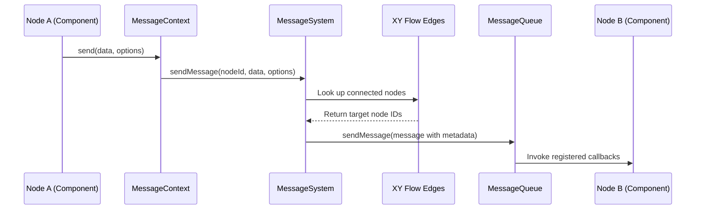
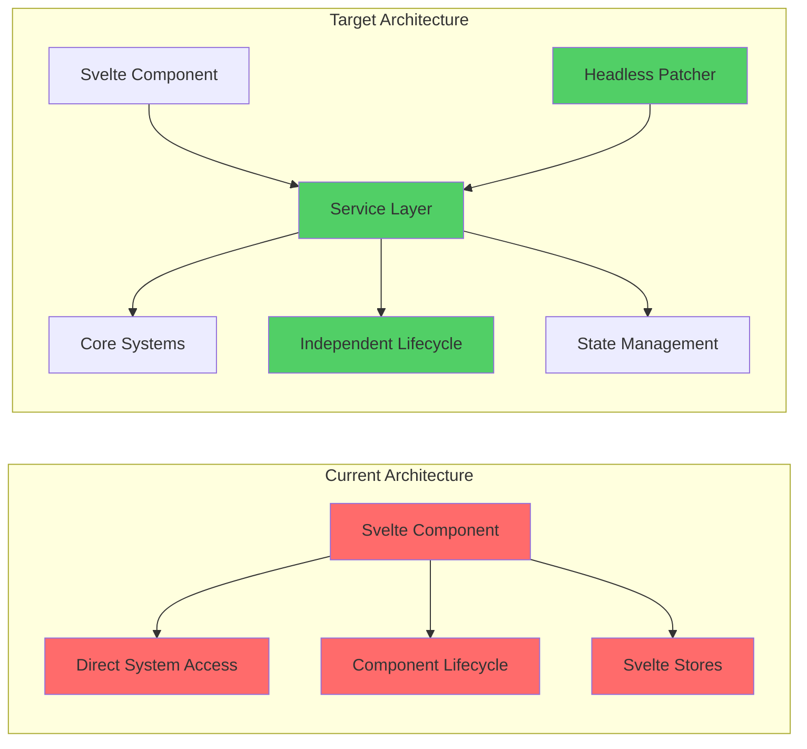
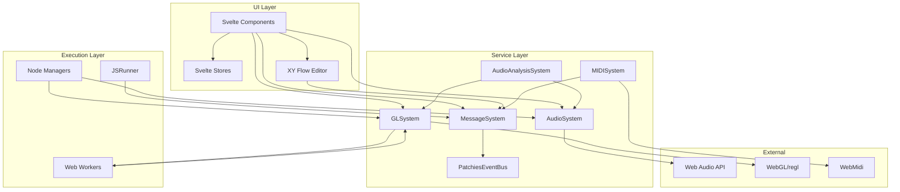
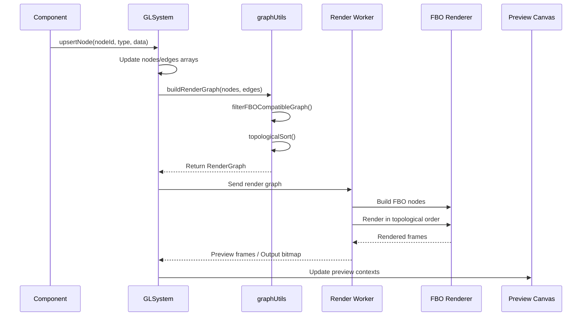
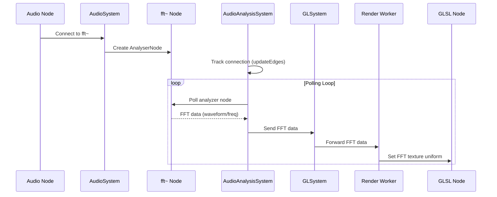
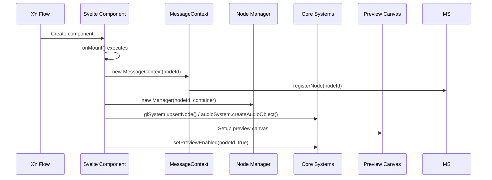

# Current Architecture Documentation

This document provides a comprehensive overview of the Patchies codebase architecture, detailing all systems, services, managers, and their interactions. This serves as a reference document for understanding the current implementation before refactoring to the modular architecture described in spec 47.

**Last Updated**: 2025-01-27

## Table of Contents

1. [Overview](#overview)
2. [Core Systems (Singletons)](#core-systems-singletons)
3. [Node Managers (Per-Node Instances)](#node-managers-per-node-instances)
4. [Rendering System](#rendering-system)
5. [Message Context System](#message-context-system)
6. [Object System](#object-system)
7. [State Management](#state-management)
8. [Save-Load System](#save-load-system)
9. [Supporting Systems](#supporting-systems)
10. [Svelte Component Coupling Analysis](#svelte-component-coupling-analysis)
11. [Architecture Patterns](#architecture-patterns)
12. [Integration Points](#integration-points)
13. [Lifecycle Management](#lifecycle-management)

---

## Overview

Patchies is a visual programming environment for creating interactive audio-visual patches on the web. The architecture is built on SvelteKit 5 with TypeScript, using XY Flow for the node editor interface.

### High-Level Architecture Patterns

- **Singleton Pattern**: Core systems use singleton pattern for global access
- **Event-Driven Architecture**: PatchiesEventBus provides type-safe event system
- **Manager Pattern**: Node-specific managers handle lifecycle and execution
- **Worker-Based Execution**: Heavy tasks run in Web Workers (rendering, Python, Assembly)
- **Store-Based Reactive State**: Svelte stores manage reactive UI state
- **Component Lifecycle Binding**: Node lifecycle tied to Svelte component lifecycle (onMount/onDestroy)

### Key Design Decisions

- **Tight Coupling to Svelte**: Currently, node lifecycle is directly tied to Svelte component lifecycle, preventing headless operation
- **Direct Singleton Access**: Components directly call `getInstance()` on systems, creating tight coupling
- **Mixed Concerns**: UI components directly interact with business logic systems
- **No Abstraction Layer**: No service layer between components and core systems

### Technology Stack

- **Framework**: SvelteKit 5 with TypeScript
- **Node Editor**: @xyflow/svelte
- **Audio**: Web Audio API, Tone.js, Elementary Audio, Csound, ChucK
- **Video**: WebGL via regl, Hydra, P5.js, Canvas API
- **Code Editing**: CodeMirror 6
- **Styling**: Tailwind CSS 4 with Zinc color scheme

---

## Core Systems (Singletons)

Core systems are singleton classes that provide system-wide functionality. They are accessed directly via `getInstance()` throughout the codebase.

### MessageSystem

**Location**: `src/lib/messages/MessageSystem.ts`

**Purpose**: Max/MSP-style message routing between nodes. Enables inter-node communication through XY Flow edges.

**Key Concepts**:

- `MessageQueue`: Per-node message queue with callback management
- Edge-based routing: Messages flow through XY Flow edges
- Handle-based targeting: Messages target specific inlets/outlets via handle IDs
- Automatic cleanup: Intervals and animation frames cleaned up on node deletion

**Core Methods**:

```typescript
// Node registration
registerNode(nodeId: string): MessageQueue
unregisterNode(nodeId: string): void

// Edge management
updateEdges(edges: Edge[]): void

// Message sending
sendMessage(fromNodeId: string, data: any, options?: SendMessageOptions): void

// Timer management (with automatic cleanup)
createInterval(callback: () => void, ms: number): number
clearInterval(intervalId: number): void
createAnimationFrame(callback: () => void): number
clearAnimationFrame(animationFrameId: number): void

// Connection queries
getConnectedSourceNodes(targetNodeId: string, sourceOutletHandle?: string): string[]
```

**Integration Points**:

- Used by all nodes via `MessageContext` wrapper
- Receives edge updates from `FlowCanvasInner` component
- Messages include metadata: `source`, `inlet`, `outlet`, `inletKey`, `outletKey`

**Internal State**:

- `messageQueues`: Map of nodeId → MessageQueue
- `intervals`: Map of intervalId → timeout reference
- `animationFrames`: Map of animationFrameId → rafId
- `deletedNodes`: Set of deleted node IDs (prevents messages from deleted nodes)
- `edges`: Array of XY Flow edges
- `connections`: Legacy Map of nodeId → connected nodeIds

**Message Flow**:



1. Node calls `messageContext.send(data, options)`
2. `MessageContext.send()` calls `MessageSystem.sendMessage()`
3. System looks up connected nodes from edges
4. For each connection, creates Message with metadata
5. Delivers message to target node's MessageQueue
6. MessageQueue invokes all registered callbacks

### PatchiesEventBus

**Location**: `src/lib/eventbus/PatchiesEventBus.ts`

**Purpose**: Type-safe event system for system-wide notifications. Decouples components and enables features like undo/redo, node lifecycle events, and real-time collaboration.

**Key Concepts**:

- Type-safe event listeners using TypeScript discriminated unions
- Event type registry: All events defined in `events.ts`
- Per-type listener arrays

**Core Methods**:

```typescript
dispatch<E extends PatchiesEvent>(event: E): void
addEventListener<T extends PatchiesEvent['type']>(
  type: T,
  listener: (event: PatchiesTypedEventListener<T>) => void
): void
removeEventListener<T extends PatchiesEvent['type']>(
  type: T,
  listener: (event: PatchiesTypedEventListener<T>) => void
): void
```

**Event Types** (from `src/lib/eventbus/events.ts`):

```typescript
type PatchiesEvent =
  | GLPreviewFrameCapturedEvent
  | PyodideConsoleOutputEvent
  | PyodideSendMessageEvent
  | NodePortCountUpdateEvent;
```

**Event Definitions**:

- `GLPreviewFrameCapturedEvent`: Preview frame capture completed
- `PyodideConsoleOutputEvent`: Python console output (stdout/stderr)
- `PyodideSendMessageEvent`: Python node sending message
- `NodePortCountUpdateEvent`: Dynamic port count changes (e.g., from Hydra/Canvas workers)

**Integration Points**:

- GLSystem dispatches preview frame captured events
- PyodideSystem dispatches console output and send message events
- Render workers dispatch port count update events
- Components listen for events to update UI state

**Usage Pattern**:

```typescript
const eventBus = PatchiesEventBus.getInstance();
eventBus.addEventListener("nodePortCountUpdate", (event) => {
  // Handle port count update
});
```

### AudioSystem

**Location**: `src/lib/audio/AudioSystem.ts`

**Purpose**: Web Audio API management and audio node lifecycle. Manages the audio graph, node creation/destruction, and audio parameter access.

**Key Concepts**:

- `PsAudioNode`: Internal representation of audio nodes with type and Web Audio node
- Audio graph connections: Manages connections between audio nodes
- AudioParam access: Provides typed access to AudioParams for modulation
- Time-based scheduling: Integrates with TimeScheduler for scheduled events

**Core Methods**:

```typescript
// Audio node lifecycle
createAudioObject(nodeId: string, objectType: PsAudioType, params?: unknown[]): void
removeAudioObject(nodeId: string): void

// Audio graph management
connect(sourceId: string, targetId: string, paramName?: string, sourceHandle?: string | null): void
validateConnection(sourceId: string, targetId: string, paramName?: string): boolean

// AudioParam access
getAudioParam(nodeId: string, name: string): AudioParam | null

// Node-specific creation methods
createOsc(nodeId: string, params: unknown[]): void
createGain(nodeId: string, params: unknown[]): void
createAnalyzer(nodeId: string, params: unknown[]): AnalyserNode
// ... many more node type creators

// Message sending to audio nodes
send(nodeId: string, key: string, message: unknown): void

// Output management
setOutputGain(value: number): void
getOutputGain(): number
```

**Supported Node Types**:

- Basic: `osc~`, `gain~`, `dac~`, `+~`, `mic~`
- Filters: `lowpass~`, `highpass~`, `bandpass~`, `allpass~`, `notch~`, `lowshelf~`, `highshelf~`, `peaking~`
- Effects: `compressor~`, `delay~`, `pan~`, `convolver~`, `waveshaper~`
- Analysis: `fft~`
- Advanced: `expr~`, `dsp~`, `tone~`, `elem~`, `csound~`, `chuck`, `sampler~`, `soundfile~`
- Routing: `merge~`, `split~`

**Internal State**:

- `nodesById`: Map of nodeId → PsAudioNode
- `timeScheduler`: TimeScheduler instance for scheduled events
- `outGain`: GainNode for output volume control
- `workletInitialized`: Boolean flag for expression processor worklet
- `dspWorkletInitialized`: Boolean flag for DSP worklet

**Integration Points**:

- Used by audio node components (ObjectNode, ToneNode, ElementaryAudioNode, etc.)
- Connected to AudioAnalysisSystem for FFT analysis
- Receives edge updates from FlowCanvasInner to manage audio graph connections
- TimeScheduler handles time-based audio parameter automation

**Connection Logic**:

- Validates connections using `canAudioNodeConnect()` from `audio-node-group.ts`
- Handles special cases: sampler~ input, tone~/elem~/csound~ input nodes, split~ channel routing
- Supports AudioParam connections for modulation

### GLSystem

**Location**: `src/lib/canvas/GLSystem.ts`

**Purpose**: Video rendering pipeline and FBO (Frame Buffer Object) management. Coordinates rendering of visual nodes (GLSL, Hydra, Canvas, P5, SwissGL) through a Web Worker.

**Key Concepts**:

- Render graph: Built from XY Flow nodes/edges, topologically sorted
- FBO rendering: Frame buffer objects for video chaining
- Preview contexts: ImageBitmapRenderingContext for each node preview
- Worker communication: All rendering happens in renderWorker

**Core Methods**:

```typescript
// Node lifecycle
upsertNode(id: string, type: RenderNode['type'], data: Record<string, unknown>): boolean
removeNode(nodeId: string): void

// Uniform and texture management
setUniformData(nodeId: string, uniformName: string, uniformValue: UserUniformValue): void
setNodeTexture(nodeId: string, texture: ImageBitmap | null): void
setNodeBitmap(nodeId: string, bitmap: ImageBitmap): void
removeNodeBitmap(nodeId: string): void

// Preview management
setPreviewEnabled(nodeId: string, enabled: boolean): void
togglePreview(nodeId: string): void
setNodePreviewContext(nodeId: string, context: ImageBitmapRenderingContext | null): void
removePreviewContext(nodeId: string, context: ImageBitmapRenderingContext | null): void

// Playback control
start(): void
stop(): void
toggleNodePause(nodeId: string): void

// Worker communication
send<T>(type: string, data?: T): void

// Output management
setOutputEnabled(enabled: boolean): void
getOutputBitmap(): ImageBitmap | null
```

**Internal State**:

- `renderWorker`: Worker instance for rendering
- `nodes`: Array of RNode (render nodes)
- `edges`: Array of REdge (render edges)
- `renderGraph`: Current RenderGraph (cached)
- `previewCanvasContexts`: Record of nodeId → ImageBitmapRenderingContext
- `backgroundOutputCanvasContext`: ImageBitmapRenderingContext for fullscreen output
- `outputSize`: Default output resolution [width, height]
- `previewSize`: Preview resolution [width, height]
- `hashes`: Cache for detecting graph changes

**Integration Points**:

- Receives graph updates from FlowCanvasInner
- Coordinates with AudioAnalysisSystem for FFT data to workers
- Uses IpcSystem for output window communication
- Dispatches events via PatchiesEventBus (preview frames, port count updates)

**Render Graph Building**:

- Calls `buildRenderGraph()` from `graphUtils.ts`
- Filters FBO-compatible nodes (glsl, hydra, swgl, canvas, img)
- Performs topological sort for correct render order
- Finds output node (connected to bg.out)

**Worker Message Handling**:

- `animationFrame`: Rendered output bitmap
- `previewFrame`: Preview frame for specific node
- `sendMessageFromNode`: Messages from worker back to main thread
- `setPortCount`: Dynamic port count changes
- `previewFrameCaptured`: Preview frame capture completion

### AudioAnalysisSystem

**Location**: `src/lib/audio/AudioAnalysisSystem.ts`

**Purpose**: FFT analysis and audio data distribution. Provides audio analysis data (waveform, frequency) to visual nodes for audio-reactive visuals.

**Key Concepts**:

- Analyzer nodes: Web Audio AnalyserNode instances
- FFT data formats: Waveform or frequency, integer or float arrays
- GLSL inlet metadata: Maps GLSL uniform names to analyzer nodes
- Polling system: Regularly polls analyzer nodes and sends data to workers

**Core Methods**:

```typescript
// Analysis data access
getAnalysisForNode(
  consumerNodeId: string,
  props?: AudioAnalysisProps
): AudioAnalysisValue | null

// Edge management (updates FFT connection cache)
updateEdges(edges: Edge[]): void

// FFT enablement
enableFFT(nodeId: string): void
disableFFT(nodeId: string): void

// Worker message handling
handleRenderWorkerMessage(data: unknown): void

// GLSL inlet registration
registerGlslInlet(nodeId: string, inletMeta: GlslFFTInletMeta[]): void
```

**Internal State**:

- `fftConnectionCache`: Map of consumerNodeId → analyzerNodeId
- `fftEnabledNodes`: Set of nodes with FFT enabled
- `requestedFFTFormats`: Map of nodeId → Set of format strings
- `fftPollingInterval`: Interval ID for FFT polling
- `glslInlets`: Map of GLSL nodeId → GlslFFTInletMeta[]
- `onFFTDataReady`: Callback for sending FFT data to workers

**Analysis Types**:

- `wave`: Time-domain waveform data
- `freq`: Frequency-domain FFT data

**Analysis Formats**:

- `int`: Uint8Array (0-255 range)
- `float`: Float32Array (-1 to 1 range)

**Integration Points**:

- Gets analyzer nodes from AudioSystem
- Sends FFT data to GLSystem for worker distribution
- Tracks FFT node connections via edge updates
- GLSL nodes register inlets for automatic FFT distribution

**FFT Connection Discovery**:

- Scans edges to find connections from fft~ nodes
- Caches connections for performance
- Supports explicit analyzer node ID or automatic discovery

### MIDISystem

**Location**: `src/lib/canvas/MIDISystem.ts`

**Purpose**: MIDI I/O management via WebMidi library. Handles MIDI device enumeration, input listening, and output message sending.

**Key Concepts**:

- WebMidi integration: Uses webmidi library for device access
- Channel filtering: Supports specific channel or 'all' channels
- Event routing: Routes MIDI events to nodes via MessageSystem
- Launchpad support: Special handling for Novation Launchpad devices

**Core Methods**:

```typescript
// Initialization
initialize(): Promise<void>

// Device management
getInputs(): Input[]
getOutputs(): Output[]
getInputById(deviceId: string): Input | undefined
getOutputById(deviceId: string): Output | undefined

// Input listening
startListening(nodeId: string, config: MIDIInputConfig): void
stopListening(nodeId: string): void

// Output sending
sendMessage(nodeId: string, config: MIDIOutputConfig): void
```

**MIDI Input Config**:

```typescript
interface MIDIInputConfig {
  deviceId?: string;
  channel?: number;
  events?: (
    | "noteOn"
    | "noteOff"
    | "controlChange"
    | "programChange"
    | "pitchBend"
  )[];
}
```

**MIDI Output Config**:

```typescript
type MIDIOutputConfig = {
  deviceId?: string;
  channel?: number;
} & (
  | { event: "noteOn"; note: number; velocity: number }
  | { event: "noteOff"; note: number; velocity: number }
  | { event: "controlChange"; control: number; value: number }
  | { event: "programChange"; program: number }
  | { event: "pitchBend"; control: number; value: number }
  | { event: "raw"; data: number[] }
);
```

**Internal State**:

- `inputListeners`: Map of nodeId → NodeListeners
- `isInitialized`: Boolean flag
- `webmidi`: WebMidi instance
- `lpx`: Launchpad instance (singleton)

**Integration Points**:

- Updates MIDI stores with device lists
- Routes MIDI events to nodes via MessageSystem.sendMessage()
- Components (MIDIInputNode, MIDIOutputNode) call startListening/sendMessage
- Listens for device connect/disconnect events to update device lists

**Event Routing**:

- MIDI input events are converted to messages and sent via MessageSystem
- Message format: `{ type: 'noteOn', note: number, velocity: number, channel: number, ... }`

### AssemblySystem

**Location**: `src/lib/assembly/AssemblySystem.ts`

**Purpose**: VASM (Visual Assembly) virtual machine execution. Manages assembly code execution in a Web Worker for the VASM machine.

**Key Concepts**:

- Worker-based execution: Runs in separate worker thread
- Machine state inspection: Can inspect registers, memory, machine state
- Memory regions: Tracks memory regions with colors for visualization
- Request/response pattern: Uses ID-based request tracking

**Core Methods**:

```typescript
// Code execution
executeCode(code: string, nodeId: string): Promise<void>

// Machine inspection
inspectMachine(nodeId: string): Promise<InspectedMachine>
inspectRegister(nodeId: string, registerName: string): Promise<InspectedRegister>
inspectMemory(nodeId: string, startAddress: number, length: number): Promise<Uint8Array>

// Highlighting (for UI synchronization)
addHighlighter(nodeId: number, callback: (lineNo: number) => void): void
removeHighlighter(nodeId: number): void
```

**Internal State**:

- `worker`: AssemblyWorker instance
- `initialized`: Boolean flag
- `lastId`: Counter for request IDs
- `pendingRequests`: Map of requestId → { resolve, reject }
- `eventBus`: EventTarget for machine events
- `highlighters`: Map of machineId → highlight callback
- `highlightMaps`: Map of machineId → line number maps
- `machineColors`: Map of machineId → color

**Integration Points**:

- Used by AssemblyMachine component
- Updates memory region stores for visualization
- Workers handle execution and state inspection

### PyodideSystem

**Location**: `src/lib/python/PyodideSystem.ts`

**Purpose**: Python code execution via Pyodide. Manages Python interpreter instances in a Web Worker.

**Key Concepts**:

- Worker-based execution: Runs in separate worker thread
- Per-node instances: Each Python node has its own instance
- Console output routing: Routes stdout/stderr to EventBus
- Message sending: Python code can send messages via EventBus

**Core Methods**:

```typescript
// Instance management
create(nodeId: string): Promise<void>
delete(nodeId: string): Promise<void>
has(nodeId: string): boolean

// Code execution
executeCode(nodeId: string, code: string): Promise<void>
```

**Internal State**:

- `worker`: PyodideWorker instance
- `lastId`: Counter for request IDs
- `nodeInstances`: Set of active node IDs
- `eventBus`: PatchiesEventBus instance

**Integration Points**:

- Used by PythonNode component
- Dispatches events: `pyodideConsoleOutput`, `pyodideSendMessage`
- Components listen to EventBus for console output and messages

**Worker Messages**:

- `createInstance`: Create Python interpreter for node
- `deleteInstance`: Destroy Python interpreter for node
- `executeCode`: Execute Python code in node's interpreter

### IpcSystem

**Location**: `src/lib/canvas/IpcSystem.ts`

**Purpose**: Inter-process communication for output window. Manages communication with popup window for fullscreen output display.

**Key Concepts**:

- Output window: Popup window for fullscreen rendering
- Bitmap transfer: Transfers ImageBitmap to output window via postMessage
- Window lifecycle: Tracks output window state

**Core Methods**:

```typescript
openOutputWindow(): void
sendRenderOutput(bitmap: ImageBitmap): void
```

**Internal State**:

- `outputWindow`: Window reference or null

**Integration Points**:

- Used by GLSystem to send rendered output
- BackgroundOutputCanvas component opens/closes window
- GLSystem checks `ipcSystem.outputWindow` to determine output destination

---

## Node Managers (Per-Node Instances)

Node managers are classes instantiated per-node to handle node-specific lifecycle and execution. They are created in component `onMount` and destroyed in `onDestroy`.

### P5Manager

**Location**: `src/lib/p5/P5Manager.ts`

**Purpose**: Manages P5.js sketch lifecycle and execution for P5 nodes.

**Key Methods**:

```typescript
updateCode(config: P5SketchConfig): Promise<void>
destroy(): void
```

**Responsibilities**:

- Creates and manages P5.js Sketch instance
- Handles code updates and sketch re-initialization
- Integrates with GLSystem for bitmap output
- Uses JSRunner for code execution
- Manages container element lifecycle

**Integration Points**:

- Used by P5CanvasNode component
- Sends bitmaps to GLSystem via `glSystem.setNodeBitmap()`
- Uses MessageContext for message handling
- Integrates with JSRunner for sandboxed execution

### ChuckManager

**Location**: `src/lib/audio/ChuckManager.ts`

**Purpose**: Manages ChucK audio execution via WebChuck.

**Key Methods**:

```typescript
runCode(code: string): Promise<void>
stop(): void
destroy(): void
```

**Integration Points**:

- Used by ChuckNode component
- Integrates with AudioSystem for audio node creation
- Uses MessageContext for message handling

### ToneManager

**Location**: `src/lib/audio/ToneManager.ts`

**Purpose**: Manages Tone.js integration for tone~ nodes.

**Key Methods**:

```typescript
updateCode(code: string): void
sendMessage(key: string, message: unknown): void
destroy(): void
```

**Integration Points**:

- Used by ToneNode component
- Integrates with AudioSystem
- Uses MessageContext for message handling

### ElementaryAudioManager

**Location**: `src/lib/audio/ElementaryAudioManager.ts`

**Purpose**: Manages Elementary Audio integration for elem~ nodes.

**Key Methods**:

```typescript
updateCode(code: string): void
sendMessage(key: string, message: unknown): void
onSetPortCount?: (inletCount: number, outletCount: number) => void
destroy(): void
```

**Integration Points**:

- Used by ElementaryAudioNode component
- Integrates with AudioSystem
- Can dynamically update port counts
- Uses MessageContext for message handling

### CsoundManager

**Location**: `src/lib/audio/nodes/CsoundManager.ts`

**Purpose**: Manages Csound integration for csound~ nodes.

**Key Methods**:

```typescript
updateCode(code: string): void
sendMessage(key: string, message: unknown): void
destroy(): void
```

**Integration Points**:

- Used by CsoundNode component
- Integrates with AudioSystem
- Uses MessageContext for message handling

### LiveMusicManager

**Location**: `src/lib/music/LiveMusicManager.ts`

**Purpose**: Manages live music scheduling and playback.

**Integration Points**:

- Used for time-based music scheduling
- Integrates with audio systems

### JSRunner

**Location**: `src/lib/js-runner/JSRunner.ts`

**Purpose**: JavaScript code execution with module support. Provides sandboxed execution environment with curated APIs.

**Key Methods**:

```typescript
executeJavaScript(
  nodeId: string,
  code: string,
  options?: JSRunnerOptions
): Promise<unknown>
```

**Key Features**:

- Module bundling: Uses Rollup for bundling npm imports
- Sandboxed execution: Provides controlled API access via `with` statement
- Module caching: Caches loaded modules
- Dependency waiting: Waits for module dependencies before execution

**Integration Points**:

- Used by P5Manager for P5.js code execution
- Used by JSBlockNode and JSCanvasNode components
- Provides MessageContext APIs to user code (send, onMessage, setInterval, etc.)

**Module System**:

- Supports `npm:` imports (e.g., `import { something } from 'npm:package-name'`)
- Bundles dependencies using Rollup
- Transforms imports to async `esm()` calls
- Caches modules per node to avoid collision

---

## Rendering System

The rendering system handles video node rendering, FBO chains, and preview management.

### graphUtils

**Location**: `src/lib/rendering/graphUtils.ts`

**Purpose**: Utilities for building and analyzing render graphs from XY Flow nodes/edges.

**Key Functions**:

```typescript
// Filter FBO-compatible nodes and edges
filterFBOCompatibleGraph(
  nodes: RNode[],
  edges: REdge[]
): { nodes: RenderNode[]; edges: RenderEdge[] }

// Topological sort for render order
topologicalSort(nodes: RenderNode[]): string[]

// Build complete render graph
buildRenderGraph(nodes: RNode[], edges: REdge[]): RenderGraph

// Find preview nodes (visible in UI)
findPreviewNodes(renderGraph: RenderGraph): string[]

// Find output node (connected to bg.out)
findOutputNode(nodes: RNode[], edges: REdge[]): string | null
```

**Render Graph Building Process**:

1. Filter to FBO-compatible node types (glsl, hydra, swgl, canvas, img)
2. Filter edges to only connect compatible nodes
3. Build input/output relationships from edges
4. Parse inlet indices from target handles for video connections
5. Perform topological sort to determine render order
6. Detect circular dependencies (throws error)

**FBO-Compatible Types**:

- `glsl`: GLSL fragment shaders
- `hydra`: Hydra live coding visuals
- `swgl`: SwissGL shaders
- `canvas`: Canvas-based rendering
- `img`: Image/video sources (P5, video files, etc.)

### Render Workers

**Location**: `src/workers/rendering/`

**renderWorker.ts**: Main rendering worker coordinator

- Manages animation loop
- Coordinates between renderers
- Handles worker message routing
- Manages preview frame generation

**fboRenderer.ts**: FBO-based rendering

- Handles GLSL, Hydra, Canvas rendering
- Manages FBO chains for video chaining
- Texture management and uniform setting
- Preview frame capture

**canvasRenderer.ts**: Canvas-based rendering

- 2D canvas rendering
- Bitmap generation

**hydraRenderer.ts**: Hydra-specific rendering

- Hydra code execution
- Regl integration for Hydra

### Render Types

**Location**: `src/lib/rendering/types.ts`

**Key Types**:

```typescript
type RenderNode = {
  id: string;
  inputs: string[];
  outputs: string[];
  inletMap: Map<number, string>;
} & (
  | { type: "glsl"; data: { code: string; glUniformDefs: GLUniformDef[] } }
  | { type: "hydra"; data: { code: string } }
  | { type: "swgl"; data: { code: string } }
  | { type: "canvas"; data: { code: string } }
  | { type: "img"; data: unknown }
  | { type: "bg.out"; data: unknown }
);

interface RenderGraph {
  nodes: RenderNode[];
  edges: RenderEdge[];
  sortedNodes: string[];
  outputNodeId: string | null;
}
```

---

## Message Context System

### MessageContext

**Location**: `src/lib/messages/MessageContext.ts`

**Purpose**: Provides user-facing API for nodes. Wraps MessageSystem with convenient methods for user code.

**Key Methods**:

```typescript
// Message sending
send(data: unknown, options?: SendMessageOptions): void

// Message receiving
createOnMessageFunction(): (callback: MessageCallbackFn) => void

// Timer management
createSetIntervalFunction(): (callback: () => void, ms: number) => number
createRequestAnimationFrameFunction(): (callback: () => void) => number

// Audio analysis
createFFTFunction(): ((options: AudioAnalysisProps) => FFTAnalysis) | null

// Context for user code
getContext(): UserFnRunContext

// Cleanup
clearTimers(): void
destroy(): void
```

**UserFnRunContext Interface**:

```typescript
interface UserFnRunContext {
  send: (data: unknown, options?: SendMessageOptions) => void;
  onMessage: (callback: MessageCallbackFn) => void;
  setInterval: (callback: () => void, ms: number) => number;
  requestAnimationFrame: (callback: () => void) => number;
  noDrag: () => void;
  fft?: (options: AudioAnalysisProps) => FFTAnalysis;
  setPortCount?: (inletCount?: number, outletCount?: number) => void;
  setTitle?: (title: string) => void;
}
```

**Integration Points**:

- Created per-node in component onMount
- Provides APIs to user code via JSRunner
- Tracks intervals and animation frames for cleanup
- Integrates with AudioAnalysisSystem for FFT access

**Lifecycle**:

- Created in component onMount
- Callbacks registered via `queue.addCallback()`
- Destroyed in component onDestroy
- Automatically cleans up timers and unregisters from MessageSystem

---

## Object System

### object-definitions.ts

**Location**: `src/lib/objects/object-definitions.ts`

**Purpose**: Defines inlets/outlets for text objects. Provides type information and validation for object parameters.

**Key Types**:

```typescript
type ObjectDataType =
  | "any"
  | "message"
  | "signal"
  | "bang"
  | "float"
  | "int"
  | "string"
  | "bool"
  | "int[]"
  | "float[]"
  | "analysis"
  | "marker";

interface ObjectInlet {
  name?: string;
  type?: ObjectDataType;
  description?: string;
  isAudioParam?: boolean;
  precision?: number;
  maxPrecision?: number;
  defaultValue?: unknown;
  options?: unknown[];
  minNumber?: number;
  maxNumber?: number;
  maxDisplayLength?: number;
  validator?: (value: unknown) => boolean;
  formatter?: (value: unknown) => string | null;
}

interface ObjectOutlet {
  name?: string;
  type?: ObjectDataType;
  description?: string;
}

interface ObjectDefinition {
  inlets: ObjectInlet[];
  outlets: ObjectOutlet[];
  description?: string;
  tags?: string[];
}
```

**Usage**:

- ObjectNode component uses definitions to render inlets/outlets
- AudioSystem uses definitions for inlet validation
- Provides type hints and validation for object parameters

**Integration Points**:

- Used by ObjectNode for UI generation
- Used by AudioSystem for connection validation
- Used by message validation system

---

## State Management

### Stores

**canvas.store.ts**:

```typescript
isBackgroundOutputCanvasEnabled: Writable<boolean>;
hasSomeAudioNode: Writable<boolean>;
```

**renderer.store.ts**:

```typescript
isGlslPlaying: Writable<boolean>;
previewVisibleMap: Writable<Record<NodeId, boolean>>;
```

**midi.store.ts**:

```typescript
midiInputDevices: Writable<MIDIDevice[]>
midiOutputDevices: Writable<MIDIDevice[]>
midiInitialized: Writable<boolean>
updateMIDIInputDevices(inputs: Input[]): void
updateMIDIOutputDevices(outputs: Output[]): void
```

**editor.store.ts**:

```typescript
useVimInEditor: Writable<boolean>; // Editor vim mode preference
```

**ui.store.ts**:

```typescript
isBottomBarVisible: Writable<boolean>;
isFpsMonitorVisible: Writable<boolean>;
isAiFeaturesVisible: Writable<boolean>;
```

**Usage Pattern**:

- Components subscribe to stores using `$store` reactive syntax
- Systems update stores to trigger UI updates
- Stores provide reactive state management

---

## Save-Load System

### serialize-patch.ts

**Location**: `src/lib/save-load/serialize-patch.ts`

**Purpose**: Serializes patches to JSON format for saving and loading.

**PatchSaveFormat**:

```typescript
type PatchSaveFormat = {
  name: string;
  version: string;
  timestamp: number;
  nodes: Node[];
  edges: Edge[];
};
```

**Key Functions**:

```typescript
serializePatch({ name, nodes, edges }): string
```

**Features**:

- Version tracking: `PATCH_SAVE_VERSION = '0.0.1'`
- JSON serialization of XY Flow nodes and edges
- Timestamp for conflict resolution

**Integration Points**:

- Used by FlowCanvasInner for autosave
- Used by load-patch-from-url.ts for loading patches
- Local storage autosave system

---

## Supporting Systems

### TimeScheduler

**Location**: `src/lib/audio/TimeScheduler.ts`

**Purpose**: Audio time-based message scheduling. Handles set, trigger, and release messages for AudioParams.

**Key Methods**:

```typescript
processMessage(param: AudioParam, message: ScheduledMessage): void
```

**Message Types**:

- `set`: Set value at specific time
- `trigger`: Attack-decay-sustain envelope
- `release`: Release envelope

**Integration Points**:

- Used by AudioSystem for time-based audio parameter automation
- Processes scheduled messages in audio time domain

### P2PManager

**Location**: `src/lib/p2p/P2PManager.ts`

**Purpose**: Peer-to-peer collaboration. Manages WebTorrent-based P2P connections for real-time collaboration.

**Key Methods**:

```typescript
initialize(): Promise<void>
subscribeToChannel(channel: string, handler: P2PMessageHandler): () => void
sendToChannel(channel: string, data: unknown): void
getPeerCount(): number
```

**Integration Points**:

- Used by NetSendNode and NetRecvNode
- Provides channel-based messaging for collaboration

### node-types.ts

**Location**: `src/lib/nodes/node-types.ts`

**Purpose**: Node type registry. Maps node type strings to Svelte components.

**Usage**:

- Used by XY Flow to render nodes
- Central registry for all node types
- Exports `nodeTypes` object and `nodeNames` array

---

## Svelte Component Coupling Analysis

This section documents how Svelte components interact with systems, highlighting coupling points that need to be addressed for headless operation.

### Coupling Patterns

#### 1. Direct Singleton Access

**Pattern**: Components directly call `getInstance()` on systems.

**Examples**:

```typescript
// In component script
let glSystem = GLSystem.getInstance();
let audioSystem = AudioSystem.getInstance();
let messageSystem = MessageSystem.getInstance();
```

**Impact**: Tight coupling - components directly depend on singleton implementations.

**Components Using This Pattern**:

- P5CanvasNode: `GLSystem.getInstance()`
- HydraNode: `GLSystem.getInstance()`
- JSCanvasNode: `GLSystem.getInstance()`
- GLSLCanvasNode: `GLSystem.getInstance()`
- SwissGLNode: `GLSystem.getInstance()`
- ObjectNode: `AudioSystem.getInstance()`
- ToneNode: `AudioSystem.getInstance()`
- ElementaryAudioNode: `AudioSystem.getInstance()`
- CsoundNode: `AudioSystem.getInstance()`
- MIDIInputNode: `MIDISystem.getInstance()`
- MIDIOutputNode: `MIDISystem.getInstance()`
- FlowCanvasInner: `GLSystem.getInstance()`, `AudioSystem.getInstance()`, `MessageSystem.getInstance()`

#### 2. Lifecycle Binding to Svelte

**Pattern**: Node lifecycle is tied to Svelte component `onMount`/`onDestroy`.

**Examples**:

```typescript
onMount(() => {
  messageContext = new MessageContext(nodeId);
  glSystem.upsertNode(nodeId, "glsl", { code });
  // ... initialization
});

onDestroy(() => {
  messageContext.destroy();
  glSystem.removeNode(nodeId);
  // ... cleanup
});
```

**Impact**: Nodes cannot exist without Svelte components, preventing headless operation.

**All Node Components Use This Pattern**:

- Every node component creates/destroys resources in lifecycle hooks
- Managers (P5Manager, etc.) are created in onMount and destroyed in onDestroy

#### 3. Direct System Method Calls

**Pattern**: Components directly call system methods.

**Examples**:

```typescript
// In component
glSystem.upsertNode(nodeId, "hydra", { code });
audioSystem.createAudioObject(nodeId, "osc~", [440]);
glSystem.setPreviewEnabled(nodeId, true);
audioSystem.send(nodeId, "frequency", 880);
```

**Impact**: Business logic is mixed with UI components.

**Common System Methods Called from Components**:

- `GLSystem`: `upsertNode`, `removeNode`, `setPreviewEnabled`, `toggleNodePause`, `setNodeBitmap`, `sendMessageToNode`
- `AudioSystem`: `createAudioObject`, `removeAudioObject`, `send`, `connect`
- `MIDISystem`: `startListening`, `stopListening`, `sendMessage`
- `MessageSystem`: `updateEdges` (from FlowCanvasInner)

#### 4. Store Subscriptions

**Pattern**: Components subscribe to Svelte stores for reactive state.

**Examples**:

```typescript
const isPlaying = $derived($isGlslPlaying);
const previewVisible = $derived($previewVisibleMap[nodeId]);
```

**Impact**: UI state management is tightly coupled to components.

**Stores Used**:

- `renderer.store`: `isGlslPlaying`, `previewVisibleMap`
- `canvas.store`: `isBackgroundOutputCanvasEnabled`, `hasSomeAudioNode`
- `midi.store`: Device lists, initialization state

#### 5. XY Flow Integration

**Pattern**: Components use XY Flow hooks and update node data directly.

**Examples**:

```typescript
const { updateNodeData } = useSvelteFlow();
const updateNodeInternals = useUpdateNodeInternals();

updateNodeData(nodeId, { code: newCode });
updateNodeInternals(nodeId);
```

**Impact**: Node state management is tied to XY Flow component system.

**XY Flow APIs Used**:

- `useSvelteFlow()`: `updateNodeData`, `addNodes`, `addEdges`, `deleteElements`
- `useUpdateNodeInternals()`: Update node handles/ports
- Node props: `id`, `data`, `selected` from XY Flow

#### 6. Event Bus Subscriptions

**Pattern**: Components subscribe to EventBus for system events.

**Examples**:

```typescript
const eventBus = glSystem.eventBus;
eventBus.addEventListener("nodePortCountUpdate", handlePortCountUpdate);
```

**Impact**: Event handling is mixed with UI components.

**Events Components Listen To**:

- `nodePortCountUpdate`: HydraNode, JSCanvasNode, CanvasNode
- `pyodideConsoleOutput`: PythonNode
- `pyodideSendMessage`: PythonNode

#### 7. Canvas/DOM Element Access

**Pattern**: Components create and manage DOM elements for rendering.

**Examples**:

```typescript
let previewCanvas = $state<HTMLCanvasElement | undefined>();
previewBitmapContext = previewCanvas.getContext("bitmaprenderer")!;
glSystem.previewCanvasContexts[nodeId] = previewBitmapContext;
```

**Impact**: Rendering setup is tied to component DOM lifecycle.

**Components Using Canvas Elements**:

- GLSLCanvasNode, HydraNode, JSCanvasNode, SwissGLNode: Preview canvases
- P5CanvasNode: P5 container element
- BackgroundOutputCanvas: Background output canvas

### Component-System Interaction Matrix

| Component           | MessageSystem   | GLSystem | AudioSystem | MIDISystem   | EventBus | Stores | XY Flow |
| ------------------- | --------------- | -------- | ----------- | ------------ | -------- | ------ | ------- |
| P5CanvasNode        | ✓ (via Context) | ✓        | -           | -            | -        | -      | ✓       |
| HydraNode           | ✓ (via Context) | ✓        | -           | ✓ (Analysis) | ✓        | ✓      | ✓       |
| GLSLCanvasNode      | ✓ (via Context) | ✓        | -           | ✓ (Analysis) | -        | ✓      | ✓       |
| JSCanvasNode        | ✓ (via Context) | ✓        | -           | ✓ (Analysis) | ✓        | ✓      | ✓       |
| SwissGLNode         | ✓ (via Context) | ✓        | -           | -            | -        | ✓      | ✓       |
| ObjectNode          | ✓ (via Context) | -        | ✓           | -            | -        | -      | ✓       |
| ToneNode            | ✓ (via Context) | -        | ✓           | -            | -        | -      | ✓       |
| ElementaryAudioNode | ✓ (via Context) | -        | ✓           | -            | -        | -      | ✓       |
| CsoundNode          | ✓ (via Context) | -        | ✓           | -            | -        | -      | ✓       |
| MIDIInputNode       | ✓ (via Context) | -        | -           | ✓            | -        | ✓      | ✓       |
| MIDIOutputNode      | ✓ (via Context) | -        | -           | ✓            | -        | ✓      | ✓       |
| FlowCanvasInner     | ✓               | ✓        | ✓           | -            | -        | ✓      | ✓       |

### Decoupling Requirements for Headless Operation



To enable headless operation, the following decoupling is needed:

1. **Abstraction Layer**: Create service interfaces that components and headless code can both use
2. **Lifecycle Management**: Move node lifecycle out of Svelte components into a headless patcher system
3. **State Management**: Separate UI state from business logic state
4. **Event System**: Make event system work independently of components
5. **Renderer Integration**: Abstract canvas/DOM access for headless rendering
6. **Store Alternatives**: Provide non-Svelte state management for headless mode

---

## Architecture Patterns

### System Architecture Overview



### Singleton Pattern

**Usage**: All core systems use singleton pattern for global access.

**Benefits**:

- Single instance guarantee
- Global access from anywhere
- Simple initialization

**Drawbacks**:

- Tight coupling
- Difficult to test (hard to mock)
- No dependency injection
- Makes headless operation difficult (everything assumes Svelte environment)

**Systems Using Singleton**:

- MessageSystem
- PatchiesEventBus
- AudioSystem
- GLSystem
- AudioAnalysisSystem
- MIDISystem
- AssemblySystem
- PyodideSystem
- IpcSystem
- P2PManager

### Manager Pattern

**Usage**: Node-specific managers handle lifecycle and execution.

**Pattern**:

```typescript
class NodeManager {
  constructor(nodeId: string, container?: HTMLElement) {
    // Initialize
  }

  updateCode(code: string): void {
    // Update execution
  }

  destroy(): void {
    // Cleanup
  }
}
```

**Managers**:

- P5Manager
- ChuckManager
- ToneManager
- ElementaryAudioManager
- CsoundManager
- LiveMusicManager

### Event-Driven Architecture

**Usage**: PatchiesEventBus provides decoupled event communication.

**Benefits**:

- Loose coupling between components
- Type-safe events
- Easy to add new event types

**Limitations**:

- Events still flow through Svelte components in many cases
- No event replay/history system

### Worker-Based Execution

**Usage**: Heavy tasks run in Web Workers.

**Workers**:

- Render Worker: Video rendering (GLSL, Hydra, Canvas)
- Pyodide Worker: Python execution
- Assembly Worker: VASM execution

**Benefits**:

- Non-blocking main thread
- Better performance
- Isolation

### Store-Based Reactive State

**Usage**: Svelte stores provide reactive state management.

**Benefits**:

- Reactive updates
- Simple API
- Good for UI state

**Drawbacks**:

- Tied to Svelte
- Not suitable for headless operation
- Business logic state mixed with UI state

---

## Integration Points

### MessageSystem ↔ MessageContext ↔ Nodes

**Flow**:

1. Node component creates MessageContext in onMount
2. MessageContext registers with MessageSystem
3. User code (via JSRunner) gets MessageContext APIs
4. User code calls `send()` or `onMessage()`
5. MessageContext forwards to MessageSystem
6. MessageSystem routes to connected nodes
7. Target nodes receive via MessageQueue callbacks

### GLSystem ↔ Render Worker ↔ FBO Renderer

**Flow**:



1. Component calls `glSystem.upsertNode()`
2. GLSystem updates node/edge arrays
3. GLSystem rebuilds render graph
4. GLSystem sends graph to render worker
5. Render worker builds FBO nodes
6. Render worker renders in topological order
7. Rendered frames sent back to main thread
8. GLSystem updates preview contexts or output window

### AudioSystem ↔ AudioAnalysisSystem ↔ GLSystem (FFT)

**Flow**:



1. Audio node connects to fft~ node
2. AudioAnalysisSystem tracks connection
3. AudioAnalysisSystem polls analyzer node
4. FFT data sent to GLSystem
5. GLSystem forwards to render worker
6. Render worker sets FFT textures for GLSL nodes

### MIDISystem ↔ MessageSystem (Event Routing)

**Flow**:

1. MIDIInputNode calls `midiSystem.startListening()`
2. MIDISystem attaches WebMidi event listeners
3. MIDI events received
4. MIDISystem converts to messages
5. MIDISystem sends via MessageSystem
6. Target nodes receive MIDI messages

### Stores ↔ Components (Reactive State)

**Flow**:

1. System updates store (e.g., `isGlslPlaying.set(true)`)
2. Svelte reactivity triggers component updates
3. Components re-render based on store values

### FlowCanvasInner ↔ Systems (Global Coordination)

**Flow**:

1. FlowCanvasInner mounts
2. Calls `glSystem.start()` and `audioSystem.start()`
3. Listens for edge updates from XY Flow
4. Updates MessageSystem edges
5. Updates GLSystem nodes/edges
6. Coordinates autosave
7. On destroy, cleans up all nodes

---

## Lifecycle Management

### Current Lifecycle (Tied to Svelte Components)

**Node Creation Flow**:



**Node Creation Steps**:

1. XY Flow creates node component
2. Component `onMount` executes
3. Component creates MessageContext
4. Component creates manager (if needed)
5. Component registers with systems (GLSystem, AudioSystem, etc.)
6. Component sets up preview canvas (if visual node)
7. Component initializes node state

**Node Update**:

1. User edits code/data
2. Component receives prop update
3. Component calls manager `updateCode()` or system method
4. System/manager updates execution
5. Component may update preview/UI

**Node Deletion**:

1. User deletes node in XY Flow
2. Component `onDestroy` executes
3. Component calls manager `destroy()`
4. Component unregisters from systems
5. Component cleans up MessageContext
6. Component removes preview canvas
7. Systems clean up node resources

### Problems with Current Approach

1. **Cannot Run Headless**: Lifecycle tied to Svelte components
2. **No Sub-Patching**: Nodes only run when visible in top-level patch
3. **Tight Coupling**: Components directly manage business logic
4. **No Abstraction**: No way to create/manage nodes without Svelte
5. **State in Components**: Node state stored in component props/data

### Required Changes for Headless

1. **Patcher Class**: Headless patcher manages node lifecycle
2. **Node Classes**: Nodes as classes, not just Svelte components
3. **Service Layer**: Abstraction layer between UI and business logic
4. **Lifecycle Events**: System-level lifecycle events, not just component hooks
5. **State Management**: Node state in patcher, not components

---

## Summary

The current architecture is tightly coupled to Svelte components, with node lifecycle directly tied to component lifecycle. Core systems use singleton pattern for global access, which makes them easy to use but difficult to decouple. The architecture works well for the current use case but needs significant refactoring to support:

1. **Headless Operation**: Running patches without UI
2. **Sub-Patching**: Nodes running in nested patches
3. **Modular Architecture**: Dynamic module loading
4. **Plugin System**: Third-party extensions
5. **Testing**: Unit and integration tests

The modular architecture described in spec 47 will address these limitations by introducing:

- Service abstraction layer
- Headless patcher system
- Object definition system
- Lifecycle management independent of Svelte
- Plugin/module system

This document serves as the baseline reference for that refactoring effort.
