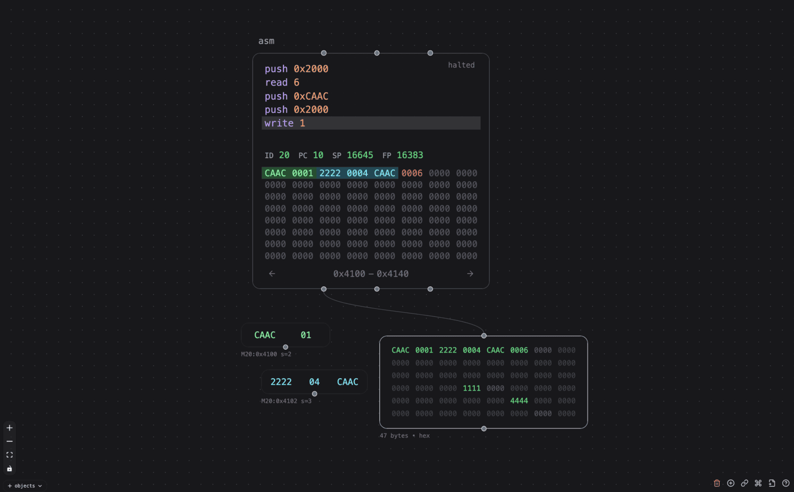

# Visual Assembly Module (`asm`)

This is the source code for the virtual machine that powers the `asm` object in Patchies. This was part of the [visual assembly canvas](https://github.com/heypoom/visual-assembly-canvas) project before it was ported to Patchies.


It gives you a simple stack machine with these features:

- 50 [stack machine assembly instructions](./src/op/mod.rs) you can use.
  - quick list of instructions: `"noop" | "push" | "pop" | "load_string" | "load" | "store" | "write" | "read" | "dup" | "swap" | "over" | "rotate" | "nip" | "tuck" | "pick" | "inc" | "dec" | "add" | "sub" | "mul" | "div" | "mod" | "jump" | "jump_zero" | "jump_not_zero" | "equal" | "not_equal" | "less_than" | "less_than_or_equal" | "greater_than" | "greater_than_or_equal" | "print" | "call" | "return" | "send" | "receive" | "and" | "or" | "xor" | "not" | "left_shift" | "right_shift" | "sleep_tick" | "sleep_ms" | "halt" | "eof"`
- Supports labels and loops, conditionals, function call stacks, sleeping, and I/O:
  - define label with `<label-name>:` and jump to it with `jump <label-name>`.
  - define strings with `.string key "value"` and load it with `load_string key`.
  - define const values with `.value key value` and use it e.g. `push key`
  - `send <port> <length>` sends top N stack values to the given port (0-3).
  - `receive` waits for one input value from the message inlet, and pushes it onto the stack.
  - `sleep_tick <ticks>` sleeps for N clock ticks.
  - `sleep_ms <ms>` sleeps for N milliseconds.
  - `write <length>` pops the memory address from the stack and write N values to the address.
  - `read <length>` pops the memory address from the stack and read N values from the address onto the stack.
  - `print` pops the string until the null terminator and prints it to the console.
  - `call <label-name>` calls the function via the label.
  - `return` returns to the caller function, usually used in a function body.
  - `load <address>` pushes the value at the memory address onto the stack.
  - `store <address>` pops the value from the stack and store it at the memory address.
  - `halt` stops the program until reset.
- Memory space: 65,535 cells of unsigned 16-bit integer.
  - See the [memory segments definition](./src/mem/segments.rs) on how the memory space is laid out.
- Automatic clock: use the play and pause buttons (or its messages) to start and stop automatic clocking.
  - The clock speed can be adjusted via `Delay (ms)` in the settings menu, or send a `setDelayMs` message.
- Manual clock: send a `{type: 'bang'}` message to step the program by one instruction.
  - This is slower than automatic clocking, but useful for debugging.
- Adjustable instructions per cycle.
  - Default is 1 instructions. You can set it to higher number of instructions per cycle (e.g. 20) to speed up the program significantly.
  - Set this in the settings menu via the `Step By` option, or send a `setStepBy` message.
- Highlights the current line of instruction being executed.
- Visualize memory cells in real-time with color-coding.
  - Drag your mouse over the memory cells to make a memory region.
  - Then, press `Alt` on your keyboard, and drag the memory region onto the canvas.
  - This will create the memory visualizer object (`asm.value`) that shows the memory cells in real-time.
  - Click on the settings menu to change the memory region and color scheme.
- Can send the following messages:

  - `number` or `number[]` when the `send` instruction is executed.
    - `send 0 1` will send one number to outlet 0.
    - `send 1 3` will send array of three numbers to outlet 1.
  - `{type: 'read', address: number, count: number}` when `read` instruction is ran onto a mapped address (e.g. `0x2000`)
    - used for `asm.mem`
  - `{type: 'write', address: number, data: number[]}` when `write` instruction is ran onto a mapped address (e.g. `0x2000`)
    - used for `asm.mem`
  - `{type: 'override', data: number[]}` when override operation is triggered.

- Shortcuts
  - `Shift + Enter` in the code editor auto-runs the program.
- Messages:
  - `{type: 'bang'}`: step the program by one instruction
  - `{type: 'set', code: <string>}`: load the assembly code
  - `{type: 'run'}`: reload the program and step N times
  - `{type: 'play'}`: start automatic clocking
  - `{type: 'pause'}`: pause automatic clocking
  - `{type: 'toggle'}`: toggle automatic clocking
  - `{type: 'reset'}`: reset the program
  - `{type: 'step'}`: step the program by one instruction
  - `{type: 'setDelayMs', value: <number>}`: set the delay between automatic clock ticks in milliseconds
  - `{type: 'setStepBy', value: <number>}`: set the number of instructions to step by on each (manual and auto) tick
  - `number` or `array of number`: send the number(s) to the program.
    - use the `receive` instruction to tell the machine to wait for one input.

## Memory Cell Module (`asm.mem`)

Use the `asm.mem` memory object to store external memory cells. This is helpful when the 65k internal memory space is not enough, or you want to store values that persist even when the `asm` object is reset, or you want to share memory cells between multiple `asm` objects.



- It responds to `read`, `write`, `load` and `store` instructions from `asm`. These instructions can read and write from the virtual memory space:

  ```asm
  ; reads 5 values from outlet 0's first memory cell (0x2000)
  push 0x2000
  read 5

  ; reads 3 values from outlet 0's 5th memory cell (0x2005)
  push 0x2005
  read 3

  ; writes 1 value (0xCAAC) to outlet 0's first memory cell (0x2000)
  push 0xCAAC
  push 0x2000
  write 1

  ; writes 2 value (20, 40) to outlet 0's 5th memory cell (0x2005)
  push 20
  push 40
  push 0x2005
  write 2
  ```

- Supports both hex and decimal display formats.
- Supports grid and text batch editing modes.
- Initial values can be set with the GUI
- Can set number of rows to display.

The virtual machine is written in Rust and compiled to WebAssembly, and runs on the web worker to avoid blocking the main thread. It is still in very early-stage of porting and extremely unoptimized, so expect it to be quite slow. I will optimize it soon.
